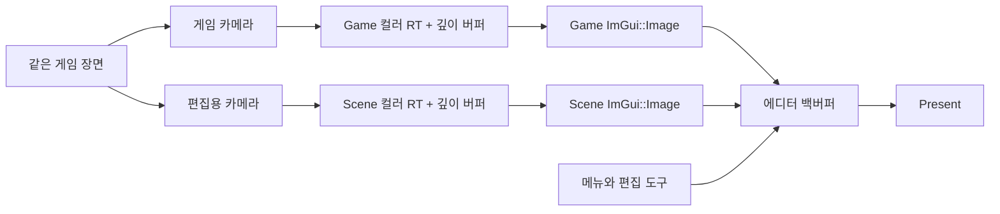
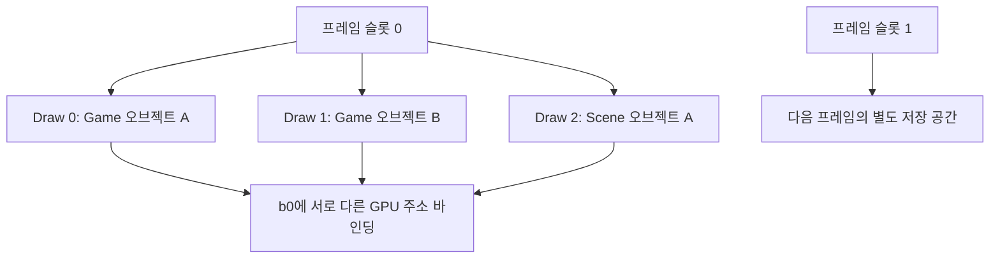

이전 글: <mention-page url="https://app.notion.com/p/3400b1ffa61e8054a80bc1d4b575b515"/>

이전 단계에서는 CPU가 기록하는 프레임과 GPU가 실행하는 프레임의 순서를 맞췄습니다. 이번에는 그 위에 **텍스처 → 렌더 타깃 → Scene / Game 패널**을 연결합니다. DX11에서 만들었던 편집 화면의 역할은 유지하고, 그림을 저장하고 표시하는 경로를 DX12 방식으로 바꾸는 작업입니다.

기준 코드는 [49e04e5 — 프레임 동기화·에디터 렌더링](https://github.com/eazuooz/YamYam_Engine/commit/49e04e5e875f04cfb792ea8a71e10667be78ad41)와 [ce56f16 — PSO·표시용 SRV](https://github.com/eazuooz/YamYam_Engine/commit/ce56f16dd7a40fd2b4bf03c680790e5b637c7530)입니다. 아래 코드 블록은 두 번째 커밋의 실제 소스에서 필요한 부분을 발췌했습니다. 생략된 주변 코드는 파일 링크에서 확인할 수 있습니다.

## 1. 우리가 만들려는 에디터

게임을 제작할 때는 물체를 배치하는 화면과 플레이어가 보는 화면이 필요합니다. Scene에서는 편집용 카메라로 장면을 살펴보고, Game에서는 게임 카메라의 결과를 확인합니다. 두 화면을 같은 프로그램 안에서 다루는 것이 이번 작업의 목표입니다.

### 참고 화면: Godot의 편집기


출처: [Godot 공식 문서 — First look at Godot’s interface](https://docs.godotengine.org/en/stable/getting_started/introduction/first_look_at_the_editor.html), 2026-09-15 열람. 외부 엔진의 참고 화면입니다. 중앙 작업 화면, Scene 트리, Inspector, FileSystem과 하단 도구의 역할을 비교하기 위해 사용했습니다. Godot의 Scene 도크는 노드 목록이며, 우리 엔진의 Scene 뷰와 이름만 보고 같은 기능으로 보면 안 됩니다.

### 현재 화면: YamYam Engine

<image src="file-upload://3dc0b1ff-a61e-812f-a38e-00b2708c728b"></image>

2026-09-15 실제 Debug 실행 화면. Game 패널을 띄워 Scene과 함께 확인했습니다. 두 검은 영역 안의 스프라이트는 각각의 카메라 렌더 결과입니다. 작은 스프라이트는 현재 테스트 씬의 배치이며, 완성된 게임 장면을 뜻하지 않습니다.

<table header-row="true" fit-page-width="true">
<tr><td>사용 목적</td><td>Godot에서 참고할 부분</td><td>YamYam의 현재 상태와 목표</td></tr>
<tr><td>장면 편집</td><td>중앙 2D / 3D 작업 화면</td><td>Scene 패널 + 독립 EditorCamera + 전용 렌더 타깃 연결</td></tr>
<tr><td>실행 결과 확인</td><td>Game 화면</td><td>게임 카메라 결과를 Game 패널에 표시</td></tr>
<tr><td>오브젝트 선택·속성 편집</td><td>Scene 도크 + Inspector</td><td>Hierarchy·Inspector 패널은 있으나 전체 편집 기능의 완성을 뜻하지 않음</td></tr>
<tr><td>파일·로그 관리</td><td>FileSystem + 하단 패널</td><td>Project·Console을 확장해 제작 흐름을 갖추는 것이 목표</td></tr>
</table>

비교 기준은 화면의 역할입니다. Godot의 내부 렌더러가 아래 DX12 코드와 같은 구조라고 가정하지 않습니다.

## 2. 화면을 먼저 텍스처에 그린다

렌더 타깃(Render Target, RT)은 GPU가 그림을 써 넣을 목적지입니다. 윈도우의 백버퍼에 바로 그리면 프로그램 전체 화면에만 출력됩니다. Scene과 Game을 ImGui 패널 안에 넣으려면 각 뷰의 그림을 별도 텍스처에 먼저 저장한 뒤, 그 텍스처를 패널에 표시해야 합니다.



현재 코드의 분리 단위는 **Scene 뷰와 Game 뷰**입니다. 등록된 게임 카메라 각각에 RT를 하나씩 만드는 구조는 아닙니다. 여러 게임 카메라가 있다면 Game용 타깃에 순서대로 렌더링합니다.

## 3. Texture와 descriptor는 무엇이 다른가?

`ID3D12Resource`에는 실제 픽셀 데이터가 있습니다. Descriptor는 GPU에게 그 리소스를 어떤 용도로 사용할지 설명하는 정보입니다. 같은 컬러 텍스처를 그릴 때는 RTV로, 읽을 때는 SRV로 참조합니다.

<table header-row="true" fit-page-width="true">
<tr><td>이름</td><td>하는 일</td><td>이번 코드에서 사용</td></tr>
<tr><td>RTV</td><td>컬러 렌더링 출력 대상으로 연결</td><td>Scene / Game 컬러 텍스처에 그리기</td></tr>
<tr><td>DSV</td><td>깊이·스텐실 출력 대상으로 연결</td><td>앞뒤 가림을 판단하는 깊이 버퍼</td></tr>
<tr><td>SRV</td><td>셰이더에서 리소스 읽기</td><td>스프라이트 샘플링, ImGui 이미지 표시</td></tr>
<tr><td>UAV</td><td>셰이더의 일반적인 읽기·쓰기</td><td>생성 인터페이스는 있으나 이 화면 표시 경로에서는 사용하지 않음</td></tr>
</table>

`GraphicDevice_DX12`는 엔진과 ImGui가 함께 쓰는 shader-visible SRV/UAV 힙을 관리합니다. 슬롯 수는 4096개이며, 오프스크린 RTV와 DSV는 각각 256개입니다. `DescriptorAllocator`가 빈 인덱스를 배정하고 반납된 인덱스를 재사용합니다. 핸들 간격은 하드코딩하지 않고 디바이스에서 얻습니다.

**CPU 핸들**은 descriptor를 만들거나 RTV·DSV를 바인딩할 때 사용합니다. **GPU 핸들**은 셰이더가 사용할 descriptor 위치를 가리킵니다. `ImGui::Image`에 넘겨야 하는 것은 GPU SRV 핸들이며, 텍스처 포인터나 CPU RTV 핸들이 아닙니다.

파일 텍스처는 DirectXTex로 WIC/DDS/TGA를 읽고, 현재 지원 범위인 2D 이미지의 mip 0을 RGBA8로 준비합니다. Upload 버퍼에서 Default 힙 텍스처로 복사한 뒤 `PIXEL_SHADER_RESOURCE` 상태로 전환합니다. 이 로더는 업로드 완료를 기다리므로 임시 Upload 버퍼가 먼저 해제되지 않습니다. 비동기 스트리밍 로더를 완성한 단계는 아닙니다.

### 셰이더에 전달할 자리를 정한다

[yaGraphicDevice_DX12.cpp · 실제 코드 발췌](https://github.com/eazuooz/YamYam_Engine/blob/ce56f16dd7a40fd2b4bf03c680790e5b637c7530/YamYamEngine_CORE/yaGraphicDevice_DX12.cpp#L255)

```c++
CD3DX12_DESCRIPTOR_RANGE textureRange;
textureRange.Init(D3D12_DESCRIPTOR_RANGE_TYPE_SRV, 1, 0);
CD3DX12_ROOT_PARAMETER rootParams[2] = {};
rootParams[0].InitAsConstantBufferView(0); // b0: per-draw transform
rootParams[1].InitAsDescriptorTable(1, &textureRange, D3D12_SHADER_VISIBILITY_PIXEL); // t0
CD3DX12_STATIC_SAMPLER_DESC sampler(0, D3D12_FILTER_MIN_MAG_MIP_POINT,
    D3D12_TEXTURE_ADDRESS_MODE_CLAMP, D3D12_TEXTURE_ADDRESS_MODE_CLAMP, D3D12_TEXTURE_ADDRESS_MODE_CLAMP);
```

`b0`에는 변환 행렬, `t0`에는 텍스처, `s0`에는 샘플러를 연결합니다. Root parameter 번호와 HLSL 레지스터 번호는 별도 개념입니다. 이 코드에서는 root parameter 0이 b0, root parameter 1이 t0 테이블을 담당합니다. 텍스처를 실제로 연결하는 부분은 다음과 같습니다.

[yaTexture.cpp · 실제 코드 발췌](https://github.com/eazuooz/YamYam_Engine/blob/ce56f16dd7a40fd2b4bf03c680790e5b637c7530/YamYamEngine_CORE/yaTexture.cpp#L136)

```c++
void Texture::Bind(eShaderStage, UINT)
{
    assert(mSrv && mState == D3D12_RESOURCE_STATE_PIXEL_SHADER_RESOURCE);
    auto heap = GetDevice()->GetSrvHeap();
    auto list = GetDevice()->GetCommandList();
    list->SetDescriptorHeaps(1, heap.GetAddressOf());
    list->SetGraphicsRootDescriptorTable(1, mSrv.Gpu);
}
```

## 4. 상수 버퍼는 프레임별·Draw별로 공간을 나눈다

World / View / Projection 행렬은 오브젝트와 카메라마다 다릅니다. 하나의 GPU 주소에 값을 계속 덮어쓰면, CPU가 여러 Draw를 기록한 후 GPU가 읽을 때 마지막 값만 남을 수 있습니다. Fence로 이전 프레임을 기다리는 것만으로는 **같은 프레임 안에서의 덮어쓰기**가 해결되지 않습니다.

현재 `TransformCB` 데이터는 행렬 3개로 192바이트입니다. 각 Draw의 시작 주소는 256바이트 간격으로 배치합니다. 두 프레임 슬롯이 각각 Upload 페이지를 소유하고, 한 페이지를 채우면 다음 페이지를 추가합니다. 이 데이터 크기에서는 64 KiB 페이지 하나에 256번의 Draw가 들어갑니다.



[yaConstantBuffer.cpp · 실제 코드 발췌](https://github.com/eazuooz/YamYam_Engine/blob/ce56f16dd7a40fd2b4bf03c680790e5b637c7530/YamYamEngine_CORE/yaConstantBuffer.cpp#L50)

```c++
void ConstantBuffer::SetData(const void* data)
{
    if (!data || !mSize) throw std::runtime_error("Invalid constant buffer data");
    auto& frame = mFrames[GetDevice()->GetFrameIndex()];
    const size_t pageIndex = frame.NextDraw / mDrawsPerPage;
    const size_t offset = (frame.NextDraw % mDrawsPerPage) * mStride;
    if (pageIndex == frame.Pages.size() && !AddPage(frame))
        throw std::runtime_error("Constant buffer upload page allocation failed");
    auto& page = frame.Pages[pageIndex];
    memcpy(page.Mapped + offset, data, mSize);
    mCurrentAddress = page.Resource->GetGPUVirtualAddress() + offset;
    ++frame.NextDraw;
}
```

`BeginFrame()`은 재사용할 프레임의 GPU 완료를 기다린 뒤 `NextDraw`를 0으로 돌립니다. `Bind()`는 방금 할당한 `mCurrentAddress`를 root CBV에 기록합니다. 여기서 말하는 상수 버퍼 분리는 **메모리 영역과 수명의 분리**입니다. World·카메라 데이터가 서로 다른 HLSL cbuffer로 나뉜 것은 아니며, 현재는 하나의 TransformCB에 함께 들어갑니다.

## 5. Scene 카메라로 별도 RT에 그리기

`RenderTarget`은 컬러 텍스처와 깊이 텍스처를 묶습니다. `Bind()`에서 컬러를 `RENDER_TARGET`으로 전환하고, RTV·DSV를 설정하고, 화면을 지우고, 타깃 크기에 맞는 viewport와 scissor를 지정합니다. 렌더링이 끝나면 `Unbind()`에서 컬러를 `PIXEL_SHADER_RESOURCE`로 바꿉니다.

[yaRenderTarget.cpp · 실제 코드 발췌](https://github.com/eazuooz/YamYam_Engine/blob/ce56f16dd7a40fd2b4bf03c680790e5b637c7530/YamYamEngine_CORE/yaRenderTarget.cpp#L107)

```c++
void RenderTarget::Unbind()
{
    GetDevice()->GetCommandList()->OMSetRenderTargets(0, nullptr, FALSE, nullptr);
    for (auto* texture : mAttachments) texture->Transition(D3D12_RESOURCE_STATE_PIXEL_SHADER_RESOURCE);
}
```

Scene 패널은 독립적인 `EditorCamera`를 소유합니다. 편집용 카메라를 게임 씬의 카메라 목록에 등록하지 않으므로, Scene을 움직였다고 게임 카메라 구성이 바뀌지 않습니다. 카메라 투영 행렬의 화면 비율도 현재 RT의 크기를 사용합니다.

[guiSceneWindow.cpp · 실제 코드 발췌](https://github.com/eazuooz/YamYam_Engine/blob/ce56f16dd7a40fd2b4bf03c680790e5b637c7530/Editor_Window/guiSceneWindow.cpp#L90)

```c++
auto* frameBuffer = mEditorCamera->GetRenderTarget();
frameBuffer->RequestResize(UINT(panelSize.x), UINT(panelSize.y));
frameBuffer->Bind();
auto* scene = ya::SceneManager::GetActiveScene();
ya::renderer::RenderSceneFromCamera(scene, mEditorCamera);
ya::renderer::RenderSceneFromCamera(ya::SceneManager::GetDontDestroyOnLoad(), mEditorCamera);
frameBuffer->Unbind();

const auto texture = frameBuffer->GetDisplaySRV();
ImGui::Image(ImTextureID(texture.ptr), panelSize);
```

이 짧은 구간에 연결 순서가 모두 있습니다. 패널 크기를 요청하고 → RT에 그린 뒤 → 읽기 상태로 바꾸고 → GPU SRV 핸들을 `ImGui::Image`에 넘깁니다. 화면에 보이지 않는 Scene 패널은 앞부분의 검사에서 렌더링을 생략합니다.

## 6. Game 뷰와 크기 변경의 시점

게임은 `Application::Render()`에서 먼저 `renderer::FrameBuffer`에 그립니다. 이후 에디터 UI가 그 결과를 표시합니다. 따라서 Game 패널을 그리는 순간 RT를 즉시 교체하면 방금 그린 텍스처를 잃을 수 있습니다. `RequestResize()`로 크기만 저장하고 다음 `Bind()`에서 반영하도록 바꿨습니다.

[guiEditorApplication.cpp · 실제 코드 발췌](https://github.com/eazuooz/YamYam_Engine/blob/ce56f16dd7a40fd2b4bf03c680790e5b637c7530/Editor_Window/guiEditorApplication.cpp#L348)

```c++
// Game was rendered earlier in this frame: apply the new size on
// its next Bind, keeping this frame's displayed texture intact.
FrameBuffer->RequestResize(UINT(panelSize.x), UINT(panelSize.y));
ImGui::Image(ImTextureID(FrameBuffer->GetDisplaySRV().ptr), panelSize);
```

Game은 보통 다음 프레임의 Bind에서, Scene은 자기 렌더 패스 직전의 Bind에서 크기를 적용합니다. 너비·높이가 0이거나 8192를 넘는 요청은 무시합니다. 교체된 이전 텍스처를 GPU가 읽고 있을 수 있으므로 해제 시점도 Fence와 연결해야 합니다. 이 부분은 다음 글에서 이어집니다.

Game 입력은 패널이 보이고, 포커스가 있고, 마우스가 올라왔을 때 활성화합니다. 에디터에서 메뉴나 Scene을 조작하는 동안 게임 오브젝트까지 동시에 움직이는 일을 줄이기 위한 연결입니다.

## 7. 여기까지 완성된 연결

Scene / Game의 독립된 렌더 결과, 텍스처 샘플링, Draw별 상수 버퍼, ImGui GPU SRV 연결이 동작합니다. 게임 전용 실행 경로는 백버퍼에 직접 렌더링하며, 에디터 모드에서 오프스크린 Game RT를 사용합니다.

다음 글에서는 화면이 보이는 것에 더해 **불투명·컷아웃·반투명의 결과가 올바른지**, **ImGui가 완성된 색을 다시 섞지 않는지**, **창 크기를 바꿔도 GPU 리소스가 안전한지**를 확인합니다.
