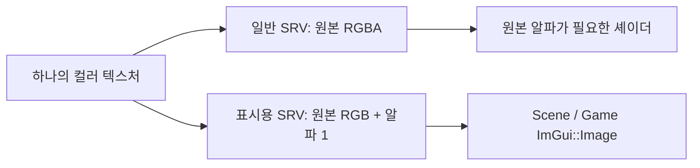
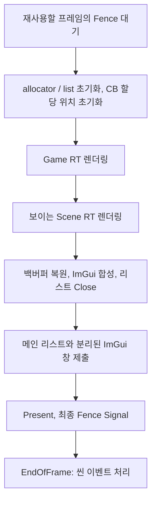

이전 글의 Texture·RenderTarget·상수 버퍼 연결을 바탕으로, DX11에서 구현했던 렌더링 순서를 DX12의 PSO에 연결합니다. 기준은 [ce56f16 커밋](https://github.com/eazuooz/YamYam_Engine/commit/ce56f16dd7a40fd2b4bf03c680790e5b637c7530)입니다. 코드 블록은 해당 커밋의 실제 소스 발췌이며, 설명용 계산은 별도로 표시했습니다.

<image src="file-upload://3dc0b1ff-a61e-8187-a7a6-00b283ddf60d"></image>

2026-09-15 실제 에디터의 Scene 패널. 이 화면은 RT와 ImGui 연결을 확인하는 캡처입니다. 알파·깊이·정렬의 정확성은 화면을 눈으로 보는 것과 별도로 GPU 픽셀 읽기 테스트로 검증했습니다.

## 1. DX11에서 만들었던 순서를 되살린다

그리는 순서는 그대로 유지합니다. **Opaque → CutOut → Transparent** 순으로 목록을 처리하며, 매번 현재 카메라 위치를 기준으로 정렬합니다. 같은 장면을 반대쪽에서 보는 카메라는 반투명 오브젝트의 앞뒤 순서도 달라질 수 있기 때문입니다.

<table header-row="true" fit-page-width="true">
<tr><td>모드</td><td>정렬</td><td>RGB 블렌딩</td><td>깊이 비교 / 기록</td><td>알파 처리</td></tr>
<tr><td>Opaque: 불투명</td><td>가까운 것부터</td><td>끔</td><td>LessEqual / 켬</td><td>알파가 0이어도 셰이더에서 버리지 않음</td></tr>
<tr><td>CutOut: 잘라내기</td><td>가까운 것부터</td><td>끔</td><td>LessEqual / 켬</td><td>알파가 0.01보다 작은 픽셀 버림</td></tr>
<tr><td>Transparent: 반투명</td><td>먼 것부터</td><td>SrcAlpha / InvSrcAlpha</td><td>Always / 끔</td><td>낮은 알파도 블렌딩에 사용</td></tr>
</table>

현재 Transparent의 `Always`는 예전 엔진의 동작을 복구한 설정입니다. 불투명 물체 뒤에 있는 반투명 오브젝트도 그 위에 합성됩니다. 일반적인 3D 반투명 렌더러가 흔히 사용하는 깊이 검사와 차이가 있으므로, 이후 정책을 바꿀 때는 이 동작을 의도적으로 변경해야 합니다.

[yaRenderer.cpp · 실제 코드 발췌](https://github.com/eazuooz/YamYam_Engine/blob/ce56f16dd7a40fd2b4bf03c680790e5b637c7530/YamYamEngine_CORE/yaRenderer.cpp#L346)

```c++
CollectRenderables(scene, opaqueList, cutoutList, transparentList);

SortByDistance(opaqueList, cameraPos, true);
SortByDistance(cutoutList, cameraPos, true);
SortByDistance(transparentList, cameraPos, false);

RenderRenderables(opaqueList, viewMatrix, projectionMatrix);
RenderRenderables(cutoutList, viewMatrix, projectionMatrix);
RenderRenderables(transparentList, viewMatrix, projectionMatrix);
```

정렬 기준은 오브젝트 위치와 카메라 위치 사이의 거리입니다. 교차하는 삼각형이나 큰 반투명 메시까지 완벽하게 해결하는 픽셀 단위 정렬은 아닙니다. 또한 현재 정렬은 `RenderSceneFromCamera()`에 전달된 씬의 목록 안에서 이루어집니다.

## 2. Material이 공유 Shader의 상태를 바꾸면 안 된다

이전 연결은 Material의 모드를 바꾸면서 Shader의 blend·depth 설정도 변경하는 방식이었습니다. 두 Material이 같은 Shader를 공유하면 한쪽 변경이 다른 쪽에도 영향을 줄 수 있습니다. DX12에서는 이미 생성한 PSO에 그 상태가 들어 있으므로, 멤버 값만 바꾸는 것으로 실제 GPU 설정이 바뀌지도 않습니다.

현재 Material은 자신의 모드만 기억합니다. 그릴 때 그 모드를 Shader에 전달해 맞는 PSO를 선택합니다.

[yaMaterial.cpp · 실제 코드 발췌](https://github.com/eazuooz/YamYam_Engine/blob/ce56f16dd7a40fd2b4bf03c680790e5b637c7530/YamYamEngine_CORE/yaMaterial.cpp#L48)

```c++
void Material::SetRenderingMode(const graphics::eRenderingMode mode)
{
	if (mode < graphics::eRenderingMode::Opaque || mode >= graphics::eRenderingMode::End)
		throw std::invalid_argument("Invalid material rendering mode");
	// A shader can be shared by materials with different rendering modes.
	// Select its PSO at draw time instead of changing shared shader defaults.
	mMode = mode;
}
```

[yaMaterial.cpp · 실제 코드 발췌](https://github.com/eazuooz/YamYam_Engine/blob/ce56f16dd7a40fd2b4bf03c680790e5b637c7530/YamYamEngine_CORE/yaMaterial.cpp#L36)

```c++
void Material::BindShader()
{
	if (mShader)
		mShader->Bind(mMode);
}
```

`Shader`는 rasterizer·blend·depth 조합을 키로 PSO를 보관합니다. 일반적인 세 모드는 로딩할 때 준비하고, 추가 조합은 첫 사용 때 생성해 캐시합니다. 모드를 바꿀 때 기존 PSO를 지우지 않으므로 이미 기록된 GPU 명령이 참조하던 PSO도 유지됩니다.

[yaShader.cpp · 실제 코드 발췌](https://github.com/eazuooz/YamYam_Engine/blob/ce56f16dd7a40fd2b4bf03c680790e5b637c7530/YamYamEngine_CORE/yaShader.cpp#L132)

```c++
void Shader::Bind(eRenderingMode mode)
{
    switch (mode)
    {
    case eRenderingMode::Opaque:
        Bind(mRasterizerState, eBlendState::Opaque, eDepthStencilState::LessEqual);
        break;
    case eRenderingMode::CutOut:
        Bind(mRasterizerState, eBlendState::Cutout, eDepthStencilState::LessEqual);
        break;
    case eRenderingMode::Transparent:
        Bind(mRasterizerState, eBlendState::Transparent, eDepthStencilState::Always);
        break;
    default:
        throw std::invalid_argument("Invalid rendering mode");
    }
}
```

기본 rasterizer는 양면을 그리는 `SolidNone`입니다. Wireframe이나 다른 culling 상태도 캐시 키에 포함합니다. 엔진이 하나의 PSO만 전역으로 바꿔 가며 쓰는 구조에서, Shader가 필요한 PSO를 소유하는 구조로 바뀌었습니다.

## 3. CutOut과 Transparent를 셰이더에서도 구분한다

CutOut은 알파가 작은 픽셀을 아예 버립니다. Transparent는 픽셀을 버리지 않고 배경과 섞습니다. 모든 모드에 무조건 `clip()`을 적용하면 아주 옅은 반투명 픽셀까지 사라집니다.

[SpriteDefaultPS.hlsl · 실제 코드 발췌](https://github.com/eazuooz/YamYam_Engine/blob/ce56f16dd7a40fd2b4bf03c680790e5b637c7530/Shaders_SOURCE/SpriteDefaultPS.hlsl#L1)

```hlsl
Texture2D sprite : register(t0);
SamplerState spriteSampler : register(s0);

struct VSOutput
{
    float4 pos : SV_Position;
    float4 color : COLOR;
    float2 uv : TEXCOORD;
};

float4 main(VSOutput input) : SV_Target
{
    float4 color = sprite.Sample(spriteSampler, input.uv) * input.color;
#if defined(YA_ALPHA_TEST)
    clip(color.a - 0.01f);
#endif
    return color;
}
```

같은 소스를 `YA_ALPHA_TEST` 정의 유무에 따라 컴파일합니다. CutOut PSO는 정의가 있는 픽셀 셰이더를 사용하고 Opaque·Transparent는 일반 셰이더를 사용합니다. 사용자 정의 픽셀 셰이더도 CutOut을 지원하려면 이 분기를 구현해야 합니다.

일반 Material의 생성 기본값은 Opaque입니다. 기존 스프라이트의 투명 영역 잘라내기를 유지하기 위해 `Sprite-Default-Material`은 명시적으로 CutOut으로 설정합니다. 반투명 스프라이트는 해당 오브젝트용 Material에 Transparent를 지정하는 방식으로 사용합니다.

## 4. ImGui에서 알파를 두 번 적용하지 않기

반투명 오브젝트를 RT에 그릴 때 이미 색이 섞였습니다. 이 RT의 알파를 그대로 ImGui에 넘기면 ImGui가 그 알파로 다시 합성할 수 있습니다.

**설명용 계산:** 빨강을 알파 0.5로 초록 배경 위에 그리면 RGB는 `(0.5, 0.5, 0)`이 됩니다. 현재 엔진의 알파 블렌드 식은 `ONE / ZERO`이므로 RT 알파에는 마지막 통과 픽셀의 0.5가 저장됩니다. 이를 ImGui가 검정 위에 다시 0.5로 섞으면 RGB가 `(0.25, 0.25, 0)`으로 어두워집니다. 이 알파 채널은 누적된 화면 커버리지가 아닙니다.

해결 방법은 **표시할 때만 알파가 1로 읽히는 SRV**입니다. 원본 컬러 텍스처의 픽셀을 수정하거나 복사하지 않습니다. 같은 리소스에 별도의 descriptor를 만들고, component mapping에서 알파만 1로 고정합니다.

[yaRenderTarget.cpp · 실제 코드 발췌](https://github.com/eazuooz/YamYam_Engine/blob/ce56f16dd7a40fd2b4bf03c680790e5b637c7530/YamYamEngine_CORE/yaRenderTarget.cpp#L56)

```c++
D3D12_GPU_DESCRIPTOR_HANDLE RenderTarget::GetDisplaySRV()
{
    if (mDisplaySrv) return mDisplaySrv.Gpu;
    if (mAttachments.empty() || mAttachments[0]->GetFormat() != DXGI_FORMAT_R8G8B8A8_UNORM)
        throw std::runtime_error("Display SRV requires an RGBA8 color attachment");
    mDisplaySrv = GetDevice()->AllocateDescriptor(D3D12_DESCRIPTOR_HEAP_TYPE_CBV_SRV_UAV);
    D3D12_SHADER_RESOURCE_VIEW_DESC desc = {};
    desc.Format = DXGI_FORMAT_R8G8B8A8_UNORM;
    desc.ViewDimension = D3D12_SRV_DIMENSION_TEXTURE2D;
    desc.Shader4ComponentMapping = D3D12_ENCODE_SHADER_4_COMPONENT_MAPPING(0, 1, 2,
        D3D12_SHADER_COMPONENT_MAPPING_FORCE_VALUE_1);
    desc.Texture2D.MipLevels = 1;
    GetDevice()->GetID3D12Device()->CreateShaderResourceView(mAttachments[0]->GetResource(), &desc, mDisplaySrv.Cpu);
    return mDisplaySrv.Gpu;
}
```

`GetDisplaySRV()`는 에디터 화면 표시용입니다. 원래 RGBA가 필요한 후속 패스는 attachment의 일반 `GetSRV()`를 사용할 수 있습니다. 이 구분 덕분에 Opaque 모드의 알파 0 픽셀도 에디터에서 사라지지 않고, 이미 합성한 색은 그대로 보입니다.



## 5. 크기가 바뀌어도 이전 텍스처를 바로 지우지 않는다

CPU가 창 크기를 변경할 때 GPU는 이전 프레임의 이미지를 읽고 있을 수 있습니다. 텍스처뿐 아니라 SRV 슬롯까지 즉시 재사용하면 이전 명령이 다른 리소스를 읽는 문제가 생깁니다.

현재는 Texture 또는 표시용 SRV를 폐기할 때 `RetireResource()`에 넘겨 보관합니다. 처음의 `UINT64_MAX`는 아직 어떤 완료 Fence가 이 자원의 사용을 덮는지 정해지지 않았다는 뜻입니다. 프레임의 명령 제출이 끝난 뒤 Fence 값을 붙이고, GPU가 그 값에 도달하면 리소스와 descriptor 슬롯을 반납합니다.

[yaGraphicDevice_DX12.cpp · 실제 코드 발췌](https://github.com/eazuooz/YamYam_Engine/blob/ce56f16dd7a40fd2b4bf03c680790e5b637c7530/YamYamEngine_CORE/yaGraphicDevice_DX12.cpp#L712)

```c++
void GraphicDevice_DX12::RetireResource(Microsoft::WRL::ComPtr<ID3D12Resource> resource,
    DescriptorHandle srv, DescriptorHandle rtv, DescriptorHandle dsv, DescriptorHandle uav)
{
    if (resource || srv || rtv || dsv || uav)
        mRetiredResources.push_back({ std::move(resource), srv, rtv, dsv, uav, UINT64_MAX });
}

void GraphicDevice_DX12::SealRetiredResources(UINT64 fenceValue)
{
    // Only a frame-completion signal covers recorded draws and platform windows.
    // A synchronous texture upload may signal in the middle of frame recording.
    for (auto& retired : mRetiredResources)
        if (retired.FenceValue == UINT64_MAX) retired.FenceValue = fenceValue;
}

void GraphicDevice_DX12::CollectRetiredResources()
{
    const UINT64 completed = mFence->GetCompletedValue();
    auto it = mRetiredResources.begin();
    while (it != mRetiredResources.end())
    {
        if (it->FenceValue == UINT64_MAX || it->FenceValue > completed) { ++it; continue; }
        mSrvAllocator.Free(it->Srv);
        mSrvAllocator.Free(it->Uav);
        mOffscreenRtvAllocator.Free(it->Rtv);
        mDsvAllocator.Free(it->Dsv);
        it = mRetiredResources.erase(it);
    }
}
```

프레임 중간의 동기식 텍스처 업로드도 Fence를 Signal할 수 있습니다. 하지만 그 Signal 뒤에 아직 제출하지 않은 Scene·ImGui 명령이 있을 수 있으므로, 업로드 완료 값을 프레임 전체의 폐기 기준으로 사용하지 않습니다. `SealRetiredResources()`는 최종 프레임 완료 Signal에서만 호출합니다.

**Resource barrier**는 GPU가 리소스를 어떤 상태로 접근할지 전환합니다. **Fence**는 CPU가 메모리·descriptor·command allocator를 언제 재사용해도 되는지 판단하는 완료 기준입니다. 둘은 서로 다른 문제를 해결합니다.

## 6. 프레임 동기화와 에디터 전체 흐름



ImGui의 별도 운영체제 창도 엔진과 같은 command queue를 사용하도록 로컬 DX12 백엔드를 수정했습니다. RT 생성 명령과 이미지 소비 명령의 제출 순서가 같은 큐에서 이어지고, 최종 Fence가 둘을 포함하도록 하기 위해서입니다. 별도 창의 allocator·swapchain 등은 ImGui 백엔드가 계속 관리합니다. 패널을 붙이는 Docking과 별도 OS 창을 만드는 Multi-Viewports는 구분해서 이해해야 합니다.

<table header-row="true" fit-page-width="true">
<tr><td>함께 바뀐 부분</td><td>변경 목적</td></tr>
<tr><td>Application::SetEditorMode</td><td>에디터의 오프스크린 Game RT 경로와 게임 전용 백버퍼 경로 선택</td></tr>
<tr><td>ImguiEditor::End</td><td>백버퍼를 다시 바인딩한 뒤 ImGui를 그리고 PRESENT 전환·Close</td></tr>
<tr><td>EndOfFrame 씬 이벤트 처리</td><td>Game과 Scene이 같은 프레임의 장면을 다룬 뒤 생성·삭제·전환 처리</td></tr>
<tr><td>로딩 경로 정리</td><td>공유 씬·리소스 컨테이너를 작업 스레드가 동시에 수정하던 경로를 주 렌더 스레드 중심으로 정리</td></tr>
<tr><td>리소스 경로·빌드 후 복사</td><td>실행 파일 기준으로 셰이더·텍스처를 찾고 Debug / Release에서 필요한 자산 제공</td></tr>
<tr><td>셰이더 컴파일 실패 검사</td><td>실패한 blob으로 PSO 생성을 진행하지 않고 원인 확인 가능</td></tr>
</table>

## 7. 무엇을 검증했는가?

2026-09-14에 Debug / Release x64 빌드와 WARP·하드웨어 smoke test를 통과했습니다. 2026-09-15에는 해당 코드의 Debug 실행 화면을 캡처하고 하드웨어 smoke test를 다시 실행했습니다. 문서 정리 중에 엔진 코드를 변경하거나 전체 빌드를 다시 수행한 것은 아닙니다.

```plain text
PASS: hardware, 8 frames, 2 frame slots, 303 draws/frame, two camera outputs,
texture upload, resize, deferred descriptor reuse, ImGui image composition,
Opaque/CutOut/Transparent pixels and depth, per-camera sorting,
shared-shader mode changes, zero D3D12 errors
```

위 출력은 줄바꿈만 정리했습니다. [DX12RenderingSmoke.cpp](https://github.com/eazuooz/YamYam_Engine/blob/ce56f16dd7a40fd2b4bf03c680790e5b637c7530/Tests/DX12RenderingSmoke.cpp)의 테스트는 GPU 결과를 읽어 색과 깊이를 검사합니다. 프레임당 303 Draw로 상수 버퍼 한 페이지를 넘는 경우, 두 카메라의 다른 정렬 결과, CutOut 경계 알파, 공유 Shader의 모드 변경, RT 리사이즈 후 descriptor 재사용, 실제 ImGui 합성까지 확인합니다.

```powershell
.\Tests\Run-DX12RenderingSmoke.ps1
.\Tests\Run-DX12RenderingSmoke.ps1 -SkipBuild -Hardware
```

첫 명령은 빌드 후 WARP로 실행하고, 두 번째는 기존 실행 파일로 하드웨어 검증을 수행합니다. 스크립트: [Run-DX12RenderingSmoke.ps1](https://github.com/eazuooz/YamYam_Engine/blob/ce56f16dd7a40fd2b4bf03c680790e5b637c7530/Tests/Run-DX12RenderingSmoke.ps1).

## 8. 다음 구현의 출발점

현재 연결이 완성됐다고 해서 에디터 전체가 완성된 것은 아닙니다. `RenderTarget::ReadPixel()`은 아직 0을 반환하므로 오브젝트 ID 기반 picking은 별도의 readback 구현이 필요합니다. MSAA RT, 전체 mip·배열·큐브 텍스처 처리, 비동기 스트리밍, Hierarchy·Inspector의 편집 완성도는 후속 작업입니다.

이제 화면에 오브젝트를 올바르게 그리는 기반을 갖췄으므로, 다음에는 **선택 → 속성 편집 → 저장·복원** 흐름을 연결해 Godot과 비교했던 제작 도구의 역할을 채워 갈 수 있습니다.
