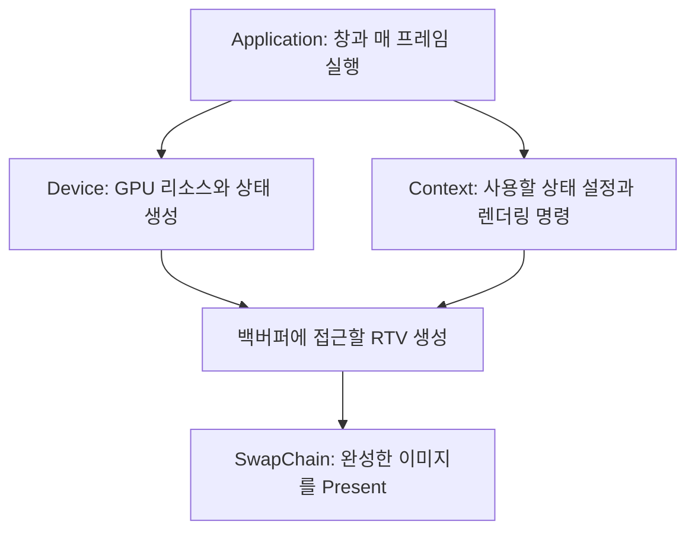

Win32로 창을 만들었다고 해서 GPU가 그 창에 그림을 그릴 준비까지 끝난 것은 아닙니다. 창은 결과를 보여 줄 자리이고, 그 안에 표시할 이미지는 별도로 준비해야 합니다. 이번에는 삼각형을 잠시 미뤄 두고 **창 전체가 지정한 배경색으로 채워지는 첫 프레임**을 만들어 보겠습니다.

배경색만 보여도 중요한 연결 세 가지를 확인할 수 있습니다. GPU 장치를 만들었고, 색을 쓸 백버퍼를 얻었으며, 그 결과를 창에 표시했다는 뜻입니다.

{{M0}}
{{M1}}

## 1. 만드는 객체와 명령을 내리는 객체를 나눕니다

엔진의 `Application`은 창의 크기와 실행 흐름을 관리하고, `GraphicDevice_DX11`은 그래픽스 객체를 보관합니다. 처음에는 다음 세 가지 역할부터 구분하면 됩니다.



`Device`는 공장을 떠올리면 쉽습니다. 텍스처, 버퍼, 셰이더 같은 객체를 만드는 API가 여기에 있습니다. `Context`는 준비한 객체 중 이번에 무엇을 사용할지 고르고, Clear나 Draw 같은 명령을 내리는 곳입니다. 한 객체를 만들었다고 곧바로 그 객체를 사용하는 것은 아니라는 점이 중요합니다.

{{M2}}

예를 들어 `device->CreateRenderTargetView(...)`는 렌더 타겟 뷰를 **생성**하고, `context->OMSetRenderTargets(...)`는 앞으로 그릴 결과의 목적지로 **선택**합니다. `context->ClearRenderTargetView(...)`는 지정한 뷰가 가리키는 영역을 한 색으로 **채우는 명령**입니다. 생성, 선택, 작업을 이렇게 나누면 함수 이름이 길어도 역할을 추측할 수 있습니다.

## 2. 백버퍼는 도화지, SwapChain은 표시할 이미지를 관리합니다

{{M3}}

그리는 도중의 이미지를 계속 표시하면 화면이 부분적으로 갱신된 모습을 볼 수 있습니다. 그래서 표시할 이미지를 백버퍼에 준비하고, 준비가 끝나면 `Present`를 호출합니다. SwapChain은 이 백버퍼들과 화면 표시를 관리합니다. 실제 표시 방식은 swap effect와 창 합성 환경에 따라 달라지므로, 모든 경우를 CPU 메모리 두 장을 직접 교환하는 동작으로 생각하지는 마세요.

백버퍼는 색을 저장하는 `ID3D11Texture2D` 리소스입니다. 하지만 파이프라인에는 텍스처 포인터를 무조건 넘기는 것이 아니라, **그 텍스처를 어떤 용도로 접근할지 설명하는 뷰**를 사용합니다. 색을 써 넣을 때 사용하는 뷰가 RTV(Render Target View)입니다.

{{M4}}

RTV 안에 백버퍼의 픽셀을 한 번 더 복사하는 것은 아닙니다. 이미 존재하는 백버퍼를 렌더링 출력으로 바라보는 방법을 만드는 것입니다. 이 구분은 나중에 같은 텍스처를 RTV로 그린 뒤 SRV로 읽어 Scene View에 표시할 때 다시 사용합니다.

{{M5}}

`SwapChain → GetBuffer → Texture2D → CreateRenderTargetView → RTV`의 순서로 읽어 보세요. 앞의 화살표는 백버퍼를 얻는 과정이고, 마지막 화살표는 그 백버퍼의 출력용 뷰를 만드는 과정입니다.

{{M6}}

## 3. 예제에서 사용할 객체를 준비합니다

아래 코드는 DX11 초기화의 흐름을 한 가지 변수 이름으로 따라가기 위한 학습 예제입니다. 이미 생성된 Win32 창 `HWND hwnd`와 0보다 큰 클라이언트 크기 `width`, `height`가 있다고 가정합니다. 실제 엔진에 넣을 때는 이 객체들을 `GraphicDevice_DX11`의 멤버로 보관하여 초기화 함수가 끝나도 유지합니다.

```c++
#include <d3d11.h>
#include <dxgi.h>
#include <wrl/client.h>
#include <stdexcept>
#pragma comment(lib, "d3d11.lib")

using Microsoft::WRL::ComPtr;

void Check(HRESULT hr)
{
    if (FAILED(hr))
        throw std::runtime_error("Direct3D initialization failed");
}

ComPtr<ID3D11Device> device;
ComPtr<ID3D11DeviceContext> context;
ComPtr<IDXGISwapChain> swapChain;
ComPtr<ID3D11RenderTargetView> rtv;
ComPtr<ID3D11DepthStencilView> dsv;
```

`ComPtr`는 COM 객체의 참조 횟수를 관리합니다. 마지막 참조를 놓으면 `Release()`가 호출되어 객체를 정리하므로, 위 멤버에 별도로 `delete`를 호출하지 않습니다. `Check`는 실패한 생성 단계에서 멈추기 위한 함수입니다. 장치 생성이 실패했는데 다음 줄에서 `device`를 사용하면, 실제 원인과 멀리 떨어진 곳에서 오류를 보게 됩니다.

### Device와 Context를 생성합니다

```c++
// 초기화 함수 내부. 위 멤버들은 아직 비어 있습니다.
UINT flags = 0;
#if defined(_DEBUG)
flags |= D3D11_CREATE_DEVICE_DEBUG;
#endif

const D3D_FEATURE_LEVEL requested[] = { D3D_FEATURE_LEVEL_11_0 };
D3D_FEATURE_LEVEL supported{};
Check(D3D11CreateDevice(
    nullptr, D3D_DRIVER_TYPE_HARDWARE, nullptr, flags,
    requested, 1, D3D11_SDK_VERSION,
    device.GetAddressOf(), &supported, context.GetAddressOf()));
```

첫 인자의 `nullptr`와 `D3D_DRIVER_TYPE_HARDWARE`는 기본 하드웨어 어댑터를 사용하겠다는 설정입니다. 뒤의 출력 인자를 통해 `device`와 immediate `context`를 함께 받습니다. 디버그 플래그는 잘못된 API 사용을 진단하는 Debug Layer를 켭니다. 개발 PC에서 해당 계층이 설치되어 있지 않다면 Windows의 Graphics Tools 설치 여부도 확인해야 합니다.

Feature Level은 사용할 API의 이름이 아니라 **장치가 제공해야 하는 기능의 기준**입니다. 여기서는 이 강의 예제에 필요한 11_0을 요구합니다. 지원하지 못하면 성공한 것처럼 진행하지 않고 초기화가 실패합니다.

{{M7}}

### 같은 어댑터의 DXGI Factory로 SwapChain을 만듭니다

```c++
ComPtr<IDXGIDevice> dxgiDevice;
ComPtr<IDXGIAdapter> adapter;
ComPtr<IDXGIFactory> factory;
Check(device.As(&dxgiDevice));
Check(dxgiDevice->GetAdapter(adapter.GetAddressOf()));
Check(adapter->GetParent(IID_PPV_ARGS(factory.GetAddressOf())));

DXGI_SWAP_CHAIN_DESC sc{};
sc.BufferDesc.Width = width;
sc.BufferDesc.Height = height;
sc.BufferDesc.Format = DXGI_FORMAT_R8G8B8A8_UNORM;
sc.SampleDesc.Count = 1;
sc.BufferUsage = DXGI_USAGE_RENDER_TARGET_OUTPUT;
sc.BufferCount = 1;
sc.OutputWindow = hwnd;
sc.Windowed = TRUE;
sc.SwapEffect = DXGI_SWAP_EFFECT_DISCARD;
Check(factory->CreateSwapChain(device.Get(), &sc,
                               swapChain.GetAddressOf()));
```

위 예제는 기존 DX11 강의와 같은 discard 방식입니다. 뒤의 DX12 강의에서 사용하는 flip 방식과 버퍼 개수 조건을 섞지 않습니다. `width × height`는 만들 이미지의 크기이고, `OutputWindow`는 그 이미지를 표시할 창입니다. `R8G8B8A8_UNORM`은 각 색 성분을 8비트로 저장하고 셰이더에서는 정규화된 값으로 다루는 형식입니다. `SampleDesc.Count=1`은 이번에는 MSAA를 사용하지 않겠다는 뜻입니다.

장치를 DXGI 인터페이스로 조회하고, 그 장치의 어댑터와 Factory를 따라가는 이유는 장치와 SwapChain이 같은 그래픽스 기반에서 만들어지도록 연결하기 위해서입니다.

### 백버퍼를 얻고 RTV를 만듭니다

```c++
ComPtr<ID3D11Texture2D> backBuffer;
Check(swapChain->GetBuffer(0, IID_PPV_ARGS(backBuffer.GetAddressOf())));
Check(device->CreateRenderTargetView(backBuffer.Get(), nullptr,
                                     rtv.GetAddressOf()));
```

`GetBuffer(0)`은 SwapChain이 소유한 백버퍼의 인터페이스를 얻습니다. 두 번째 줄에서 RTV를 만들었으므로 이제 `rtv`를 통해 이 백버퍼에 색을 쓸 수 있습니다. 뷰 생성의 설명 인자 `nullptr`는 이 리소스에 맞는 기본 뷰를 사용하겠다는 뜻입니다.

## 4. 색과 별개로 ‘어느 표면이 앞인가’를 저장합니다

배경색만 채울 때는 깊이 버퍼가 필요하지 않습니다. 하지만 다음 강의부터 여러 삼각형을 겹쳐 그리므로 여기서 깊이 버퍼까지 준비하겠습니다. 초록 삼각형을 먼저 그리고 빨강 삼각형을 나중에 그렸다고 해서, 빨강이 항상 앞에 보여서는 안 됩니다.

{{M8}}

물체 전체를 거리순으로 정렬해 그리는 방법도 있지만, 두 물체가 서로 교차하면 한쪽이 항상 앞이라고 정하기 어렵습니다. 깊이 버퍼는 각 화면 위치에서 지금까지 통과한 표면의 깊이를 보관하여 이 문제를 더 작은 단위로 판단합니다.

{{M9}}
{{M10}}

일반적인 깊이 설정에서는 더 작은 깊이값을 앞쪽으로 취급하고, 새 값이 저장된 값보다 가까울 때 색과 깊이를 갱신합니다. 여기의 깊이는 원근 변환을 거친 값이므로 월드 공간의 거리 미터 값을 그대로 저장한다고 생각하면 안 됩니다. 반투명 색을 섞는 문제는 이 비교만으로 해결되지 않아 뒤의 Blend 강의에서 순서를 함께 다룹니다.

```c++
D3D11_TEXTURE2D_DESC depth{};
depth.Width = width;
depth.Height = height;
depth.MipLevels = 1;
depth.ArraySize = 1;
depth.Format = DXGI_FORMAT_D24_UNORM_S8_UINT;
depth.SampleDesc.Count = 1;
depth.Usage = D3D11_USAGE_DEFAULT;
depth.BindFlags = D3D11_BIND_DEPTH_STENCIL;

ComPtr<ID3D11Texture2D> depthTexture;
Check(device->CreateTexture2D(&depth, nullptr,
                              depthTexture.GetAddressOf()));
Check(device->CreateDepthStencilView(depthTexture.Get(), nullptr,
                                     dsv.GetAddressOf()));
```

백버퍼와 깊이 텍스처의 크기 및 샘플 수를 맞춥니다. 픽셀 위치끼리 대응해야 하기 때문입니다. `D24_UNORM_S8_UINT`는 깊이 24비트와 스텐실 8비트를 함께 저장하는 형식입니다. `BindFlags`에는 색 출력용 RTV가 아니라 깊이·스텐실용 DSV를 만들 용도임을 적었습니다. 텍스처를 만들고 그다음 뷰를 만드는 패턴은 백버퍼와 같습니다.

## 5. 매 프레임에는 생성 대신 Clear와 Present를 합니다

```c++
// 매 프레임 호출하는 렌더링 함수 내부
ID3D11RenderTargetView* output = rtv.Get();
context->OMSetRenderTargets(1, &output, dsv.Get());

D3D11_VIEWPORT vp{};
vp.Width = static_cast<float>(width);
vp.Height = static_cast<float>(height);
vp.MinDepth = 0.0f;
vp.MaxDepth = 1.0f;
context->RSSetViewports(1, &vp);

const float clearColor[4] = { 0.15f, 0.30f, 0.55f, 1.0f };
context->ClearRenderTargetView(rtv.Get(), clearColor);
context->ClearDepthStencilView(dsv.Get(),
    D3D11_CLEAR_DEPTH | D3D11_CLEAR_STENCIL, 1.0f, 0);

// 다음 강의에서는 여기에 삼각형 Draw를 넣습니다.
Check(swapChain->Present(1, 0));
```

`OMSetRenderTargets`는 이후 Draw의 색과 깊이 목적지를 선택합니다. Viewport는 NDC 좌표를 어느 화면 영역으로 옮길지 정합니다. 이번의 Clear는 전달한 뷰 전체를 지우므로 Viewport 크기를 줄여도 배경색이 그 영역에만 채워지는 것은 아닙니다.

색을 지울 때는 RGBA 네 값을 전달합니다. 깊이를 1로 지우는 것은 일반적인 0~1 깊이 범위에서 가장 먼 값으로 시작하기 위해서입니다. 다음에 그리는 가까운 표면이 깊이 검사를 통과할 수 있습니다. 마지막 `Present(1, 0)`은 완성한 백버퍼를 표시하도록 요청하며 첫 인자는 표시 동기화 간격입니다.

## 화면으로 확인해 봅시다

실행 후 창이 푸른 배경색으로 채워지면 이번 연결은 성공한 것입니다. `clearColor`를 `{1, 0, 0, 1}`로 바꾸어 빨간색으로 변하는지 확인해 보세요. 색이 바뀌면 CPU에서 적은 값이 Context 명령을 통해 백버퍼에 쓰이고, Present를 거쳐 표시된 것입니다.

삼각형이 아직 없는 것은 정상입니다. 창이 계속 검게 보이면 먼저 초기화의 HRESULT와 Debug Layer 메시지를 확인하고, 렌더링 함수가 매 프레임 호출되는지 확인합니다. 창 크기 변경에 대응하려면 이후 `ResizeBuffers`와 RTV·DSV 재생성이 추가로 필요합니다. 이번 실습은 최초 크기에서 첫 프레임을 만드는 범위입니다.

다음 글에서는 Clear와 Present 사이에 정점 버퍼, 셰이더, Input Layout을 연결하고 `Draw(3, 0)`을 넣습니다. 이제 ‘그릴 장소’가 준비되었으므로 ‘무엇을 어떻게 그릴지’를 추가하는 단계입니다.

[Microsoft: D3D11 장치와 SwapChain 초기화](https://learn.microsoft.com/en-us/windows/win32/direct3d11/overviews-direct3d-11-devices-initialize)
