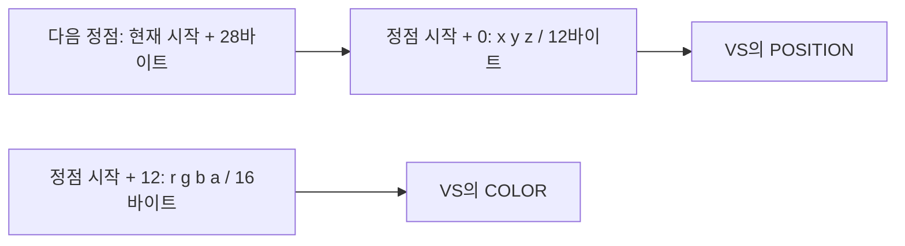

이전 글에서 백버퍼를 한 색으로 채우고 화면에 표시했습니다. 이제 Clear와 Present 사이에 삼각형 하나를 넣어 보겠습니다. 위 꼭짓점에는 초록, 오른쪽 아래에는 빨강, 왼쪽 아래에는 파랑을 주고, 세 색이 삼각형 안에서 자연스럽게 섞이도록 만드는 것이 이번 실습입니다.

세 정점만 준비했는데 면 전체에 색이 채워지는 이유를 끝까지 따라가 보세요. **C++ 배열 → GPU 정점 버퍼 → 정점 셰이더 → 보간 → 픽셀 셰이더 → 백버퍼**가 하나로 연결됩니다.

{{M0}}

## 1. 삼각형의 재료는 위치와 색입니다

GPU에 “삼각형을 그려 줘”라고만 말할 수는 없습니다. 어디에 놓을지, 꼭짓점의 색은 무엇인지 먼저 데이터로 표현해야 합니다. 이번 정점 하나에는 위치 xyz와 색 rgba를 저장하겠습니다.

{{M1}}

```c++
#include <DirectXMath.h>
#include <cstddef>

struct Vertex
{
    DirectX::XMFLOAT3 position;
    DirectX::XMFLOAT4 color;
};

const Vertex vertices[] = {
    {{ 0.0f,  0.5f, 0.0f}, {0, 1, 0, 1}}, // 위: 초록
    {{ 0.5f, -0.5f, 0.0f}, {1, 0, 0, 1}}, // 오른쪽 아래: 빨강
    {{-0.5f, -0.5f, 0.0f}, {0, 0, 1, 1}}, // 왼쪽 아래: 파랑
};
static_assert(sizeof(Vertex) == 28);
static_assert(offsetof(Vertex, color) == 12);
```

위치는 float 3개이므로 12바이트, 색은 float 4개이므로 16바이트입니다. 이 구조체에서는 정점 하나가 28바이트이고 색은 정점의 시작에서 12바이트 뒤에 있습니다. 이 숫자를 잠시 기억해 두세요. GPU가 배열을 읽는 방법을 설명할 때 그대로 사용합니다.

아직 카메라와 World 행렬은 사용하지 않습니다. 정점 셰이더에서 위치 뒤에 w=1을 붙여 클립 좌표로 출력할 예정입니다. 그래서 x·y의 -1~1 범위가 화면 안에 대응하며, `(0, 0)`은 가운데에 놓입니다. 이것은 첫 삼각형을 위한 단순한 설정입니다. 일반적인 모델의 로컬 좌표가 항상 화면 좌표인 것은 아닙니다.

## 2. 셰이더는 정점 데이터와 별개의 프로그램입니다

정점 버퍼에는 방금 만든 숫자들이 들어갑니다. 셰이더에는 그 숫자를 처리하는 명령이 들어갑니다. 데이터를 담은 버퍼와 프로그램인 셰이더를 구분해야 `CreateBuffer`와 `CreateVertexShader`가 왜 따로 필요한지 이해할 수 있습니다.

먼저 `TriangleVS.hlsl`을 다음과 같이 작성합니다.

```c++
// HLSL: TriangleVS.hlsl
struct VSInput
{
    float3 position : POSITION;
    float4 color : COLOR;
};
struct VSOutput
{
    float4 position : SV_Position;
    float4 color : COLOR;
};
VSOutput main(VSInput input)
{
    VSOutput output;
    output.position = float4(input.position, 1.0f);
    output.color = input.color;
    return output;
}
```

정점 셰이더는 정점마다 입력 위치와 색을 받습니다. 위치에는 w=1을 붙이고 색은 그대로 전달합니다. `POSITION`과 `COLOR`는 입력 데이터의 의미를 나타내는 이름이고, 출력의 `SV_Position`은 이후 래스터화에 사용할 위치라는 시스템 의미를 가집니다.

픽셀 셰이더 `TrianglePS.hlsl`은 더 짧습니다.

```c++
// HLSL: TrianglePS.hlsl
float4 main(float4 position : SV_Position,
            float4 color : COLOR) : SV_Target
{
    return color;
}
```

픽셀 셰이더의 `color`에는 꼭짓점 중 하나의 색이 그대로 들어오는 것이 아니라, 삼각형 안의 위치에 맞게 보간된 색이 들어옵니다. 초록 꼭짓점에 가까우면 초록 비중이 크고, 가운데에서는 세 색이 섞입니다. 이 예제에서는 셰이더가 색을 섞는 코드를 직접 쓰지 않아도 래스터라이저의 보간을 통해 그라데이션이 나옵니다.

### HLSL을 컴파일하고 셰이더 객체를 만듭니다

{{M2}}

그림에서 HLSL 파일과 GPU가 실행하는 셰이더 사이에 컴파일된 바이트코드가 있습니다. `ID3DBlob`은 이 바이트코드나 오류 메시지 같은 길이가 정해지지 않은 데이터를 담습니다. Blob 자체가 GPU에서 실행되는 셰이더 객체는 아닙니다.

아래 C++ 코드는 DX11 `device`가 생성된 뒤 초기화 단계에서 실행합니다. `Check(HRESULT)`는 이전 글처럼 실패 시 예외를 발생시키는 함수입니다. 셰이더·레이아웃·버퍼는 렌더링할 동안 유지되는 멤버에 보관합니다.

```c++
#include <d3dcompiler.h>
#include <wrl/client.h>
#pragma comment(lib, "d3dcompiler.lib")
using Microsoft::WRL::ComPtr;

ComPtr<ID3D11VertexShader> vertexShader;
ComPtr<ID3D11PixelShader> pixelShader;
ComPtr<ID3D11InputLayout> inputLayout;
ComPtr<ID3D11Buffer> vertexBuffer;

ComPtr<ID3DBlob> Compile(const wchar_t* file, const char* target)
{
    UINT flags = D3DCOMPILE_ENABLE_STRICTNESS;
#if defined(_DEBUG)
    flags |= D3DCOMPILE_DEBUG | D3DCOMPILE_SKIP_OPTIMIZATION;
#endif
    ComPtr<ID3DBlob> code, errors;
    HRESULT hr = D3DCompileFromFile(file, nullptr,
        D3D_COMPILE_STANDARD_FILE_INCLUDE, "main", target, flags, 0,
        code.GetAddressOf(), errors.GetAddressOf());
    if (errors)
        OutputDebugStringA(static_cast<const char*>(errors->GetBufferPointer()));
    Check(hr);
    return code;
}

// 초기화 함수 내부. 경로는 실행 시 작업 디렉터리를 기준으로 합니다.
auto vsCode = Compile(L"TriangleVS.hlsl", "vs_5_0");
auto psCode = Compile(L"TrianglePS.hlsl", "ps_5_0");
Check(device->CreateVertexShader(vsCode->GetBufferPointer(),
    vsCode->GetBufferSize(), nullptr, vertexShader.GetAddressOf()));
Check(device->CreatePixelShader(psCode->GetBufferPointer(),
    psCode->GetBufferSize(), nullptr, pixelShader.GetAddressOf()));
```

`"main"`은 파일에서 진입할 함수 이름, `vs_5_0`과 `ps_5_0`은 셰이더 단계와 대상 모델입니다. 같은 바이트코드라도 어떤 단계의 객체를 만들지 맞아야 합니다. 컴파일에 실패했다면 먼저 출력 창의 오류를 읽습니다. 파일을 못 찾은 문제와 HLSL 문법 오류를 구분할 수 있습니다.

성공한 VS 바이트코드는 다음 Input Layout 생성에도 필요합니다. 반면 셰이더 객체와 Input Layout을 모두 생성한 뒤에는 이 초기화용 Blob을 계속 멤버로 보관할 필요가 없습니다. 셰이더 재컴파일 등 추가 기능이 필요하다면 그 목적에 맞춰 보관합니다.

## 3. Input Layout은 28바이트 정점의 설명서입니다

CPU 메모리에 `position`, `color`라는 이름을 썼다고 GPU가 그 구조체 이름을 읽어 주지는 않습니다. GPU에는 “첫 12바이트는 POSITION, 그다음 16바이트는 COLOR”라고 알려 주어야 합니다.



```c++
const D3D11_INPUT_ELEMENT_DESC elements[] = {
    {"POSITION", 0, DXGI_FORMAT_R32G32B32_FLOAT,
     0, static_cast<UINT>(offsetof(Vertex, position)),
     D3D11_INPUT_PER_VERTEX_DATA, 0},
    {"COLOR", 0, DXGI_FORMAT_R32G32B32A32_FLOAT,
     0, static_cast<UINT>(offsetof(Vertex, color)),
     D3D11_INPUT_PER_VERTEX_DATA, 0},
};
Check(device->CreateInputLayout(elements, 2,
    vsCode->GetBufferPointer(), vsCode->GetBufferSize(),
    inputLayout.GetAddressOf()));
```

`R32G32B32_FLOAT`는 float 세 성분을, `R32G32B32A32_FLOAT`는 네 성분을 읽습니다. 두 항목의 InputSlot은 모두 0입니다. 위치와 색이 동일한 정점 버퍼에 함께 들어 있기 때문입니다. `InputSlotClass`는 이번 데이터가 인스턴스마다가 아니라 정점마다 바뀐다는 뜻입니다.

`offsetof`를 쓰면 구조체에서 멤버가 실제로 놓인 위치를 가져올 수 있습니다. 구조체에 UV 등을 추가하면서 예전 숫자 12나 28만 남겨 두는 실수를 줄일 수 있습니다. 다만 타입·의미와 HLSL 입력도 함께 맞춰야 합니다.

{{M3}}

Input Assembler는 바인딩된 버퍼에서 정점을 읽고 Topology에 따라 도형을 구성합니다. 이 실습에서는 0번 슬롯의 정점 버퍼 하나를 사용합니다. 다른 슬롯은 법선이나 인스턴스 데이터를 별도로 저장할 때 확장할 수 있습니다.

{{M4}}

## 4. CPU 배열을 GPU 버퍼로 만듭니다

정점 배열을 준비한 것과 GPU 리소스를 생성한 것은 다른 단계입니다. 아래에서 `vertices`를 초기 데이터로 주어 GPU가 읽을 정점 버퍼를 생성합니다.

```c++
D3D11_BUFFER_DESC desc{};
desc.ByteWidth = sizeof(vertices); // 28바이트 × 정점 3개 = 84바이트
desc.Usage = D3D11_USAGE_IMMUTABLE;
desc.BindFlags = D3D11_BIND_VERTEX_BUFFER;

D3D11_SUBRESOURCE_DATA initial{};
initial.pSysMem = vertices;
Check(device->CreateBuffer(&desc, &initial,
                           vertexBuffer.GetAddressOf()));
```

이번 삼각형의 정점은 생성 후 바꾸지 않으므로 `IMMUTABLE`을 선택했습니다. 이후 CPU에서 자주 갱신하는 버퍼를 만들 때는 `DYNAMIC`과 `Map` 같은 다른 사용법을 배웁니다. `ByteWidth`는 정점 개수 3이 아니라 **바이트 수 84**입니다. `pSysMem`은 복사할 초기 데이터의 시작 위치이며 셰이더 코드의 포인터가 아닙니다.

## 5. 준비한 객체들을 선택한 뒤 Draw를 호출합니다

{{M5}}

렌더링 함수의 Clear와 Present 사이에 아래 코드를 넣습니다. 이전 글에서 RTV·DSV·Viewport는 이미 선택했습니다. 이번에는 IA와 셰이더에 필요한 입력을 채웁니다.

```c++
context->IASetInputLayout(inputLayout.Get());
context->IASetPrimitiveTopology(D3D11_PRIMITIVE_TOPOLOGY_TRIANGLELIST);

UINT stride = sizeof(Vertex); // 다음 정점으로 이동할 바이트 수
UINT offset = 0;              // 버퍼 안에서 처음 읽을 바이트 위치
ID3D11Buffer* buffer = vertexBuffer.Get();
context->IASetVertexBuffers(0, 1, &buffer, &stride, &offset);

context->VSSetShader(vertexShader.Get(), nullptr, 0);
context->PSSetShader(pixelShader.Get(), nullptr, 0);
context->Draw(3, 0);
```

`IASetVertexBuffers`의 첫 0은 슬롯 번호이고, `offset=0`은 그 버퍼 내부의 시작 위치입니다. 서로 다른 뜻입니다. `stride=28`은 한 정점을 읽은 다음 28바이트 이동해 다음 정점을 찾으라는 정보입니다. 정점 내부에서 색을 찾는 위치는 앞서 만든 Input Layout이 설명합니다.

`Draw(3, 0)`은 0번 정점에서 시작해 세 정점을 사용한다는 뜻입니다. `TRIANGLELIST`에서는 세 정점이 독립적인 삼각형 하나를 구성합니다. 같은 정점 세 개를 `LINELIST`로 읽으면 삼각형 면이 만들어지지 않습니다. 정점의 숫자뿐 아니라 연결 규칙까지 전달해야 하는 이유입니다.

{{M6}}

Draw call은 이렇게 렌더링 작업을 요청하는 호출입니다. 오브젝트 하나가 여러 재질이나 패스를 사용하면 여러 번 호출할 수 있고, 인스턴싱에서는 여러 오브젝트를 한 번에 그릴 수도 있으므로 오브젝트 수와 항상 같지는 않습니다.

## 6. 값 하나를 바꿔 결과를 예측해 봅시다

세 정점의 색을 모두 `{1, 0, 0, 1}`로 바꾸어 버퍼를 다시 생성하면 삼각형 전체가 빨강으로 나옵니다. 보간할 세 값이 모두 같기 때문입니다. 픽셀 셰이더의 반환값을 흰색으로 고정하면 정점 색을 어떻게 바꾸어도 흰 삼각형이 됩니다. 정점 색 전달과 픽셀 색 계산을 각각 확인하는 실험입니다.

위 꼭짓점의 y를 0.5에서 0.8로 바꾸어 버퍼를 다시 만들면 위쪽으로 늘어난 삼각형이 됩니다. 반대로 색의 Input Layout 오프셋이나 stride를 잘못 주면 GPU가 엉뚱한 바이트를 읽어 위치나 색이 깨집니다. 그때는 셰이더의 색 공식보다 먼저 **구조체 크기 → 멤버 오프셋 → Input Layout → stride**를 같은 숫자로 연결했는지 확인합니다.

배경만 보인다면 생성 HRESULT와 셰이더 컴파일 메시지를 확인한 뒤, Draw가 Clear 뒤에 있는지, Viewport와 RTV가 연결되어 있는지 살펴보세요. 삼각형 정점 순서를 뒤집으면 기본 뒷면 제거 설정에 의해 보이지 않을 수도 있습니다. 이 부분은 Rasterizer와 Wireframe 강의에서 직접 비교합니다.

이제 정점 세 개로 삼각형 하나를 그렸습니다. 다음에는 사각형의 두 삼각형이 공유하는 정점을 인덱스로 재사용하고, 정점 데이터를 다시 만들지 않고도 위치를 바꾸는 상수 버퍼를 연결하겠습니다.

[Microsoft: Input Assembler](https://learn.microsoft.com/en-us/windows/win32/direct3d11/d3d10-graphics-programming-guide-input-assembler-stage)
