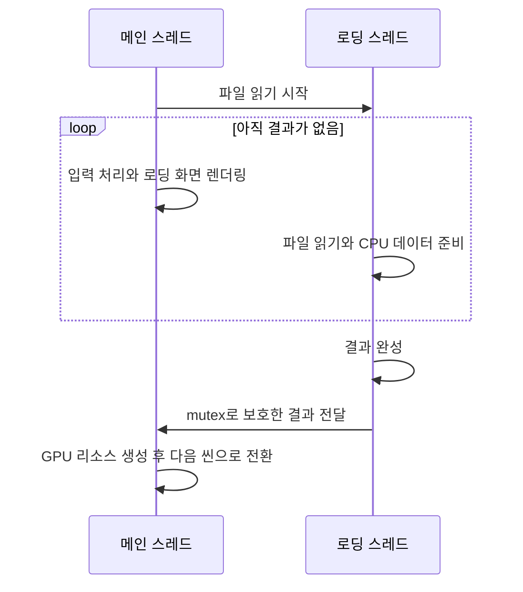

큰 이미지나 모델을 읽는 동안 창이 멈춘 경험이 있을 것입니다. 파일을 읽는 함수가 끝날 때까지 메인 루프가 돌아오지 않으면 입력 처리와 화면 갱신도 함께 멈춥니다. 로딩 씬을 보여 주려면 **메인 스레드는 화면을 계속 갱신하고, 작업 스레드는 오래 걸리는 CPU 작업을 수행하도록** 일을 나누어야 합니다.

하지만 스레드를 하나 더 만드는 것만으로 끝나지는 않습니다. 아직 완성하지 않은 데이터를 메인 스레드가 읽거나, 작업 도중 로딩 씬 객체가 사라지면 새로운 오류가 생깁니다. 이번에는 파일 하나를 별도 스레드에서 읽고, 완성된 결과를 메인 스레드로 넘기는 과정으로 수명과 동기화를 익히겠습니다.

{{M0}}

## 1. 로딩이 끝나기 전에도 메인 루프는 돌아갑니다



두 스레드는 동시에 같은 함수를 실행할 필요가 없습니다. 작업 스레드는 파일 읽기 같은 오래 걸리는 일을 하고, 메인 스레드는 짧은 프레임 작업을 반복합니다. 파일을 읽는 동안 메인 스레드가 `join()`으로 기다려 버리면 이 분리의 목적이 사라집니다.

다음 기존 캡처는 DX11 로딩 씬에서 작업 스레드를 시작했던 위치입니다. 이제 그 구조에서 공유 결과를 넘기는 부분을 안전하게 구성해 보겠습니다.

{{M1}}

## 2. 완료 bool도 공유 데이터입니다

작업 스레드에서 `done=true`를 쓰고 메인 스레드에서 일반 bool `done`을 읽으면 작아 보이는 변수라도 동기화가 필요합니다. 한쪽이 쓰는 동안 다른 쪽이 동기화 없이 읽는 데이터 경합은 C++에서 허용되는 사용법이 아닙니다. “제 PC에서는 된다”가 안전하다는 근거가 되지 않습니다.

{{M2}}

위 캡처의 완료 표시를 이해할 때는 플래그 하나만 보지 말고 **완료 결과 자체를 언제 읽어도 되는가**를 함께 보아야 합니다. 다음 예제에서는 완료 상태와 결과를 같은 mutex로 보호합니다. 작업 스레드가 읽는 동안에는 지역 변수만 사용하고, 완성된 결과를 넘기는 짧은 구간에만 잠급니다.

## 3. 작업 중간의 데이터는 지역 변수에 둡니다

먼저 CPU에서 파일 바이트를 읽는 함수입니다. 아래 예제는 C++17을 기준으로 하며, GPU 리소스나 씬 컨테이너에는 접근하지 않습니다.

```c++
#include <fstream>
#include <iterator>
#include <string>
#include <stdexcept>

std::string ReadFileBytes(const std::string& path)
{
    std::ifstream file(path, std::ios::binary);
    if (!file)
        throw std::runtime_error("Cannot open loading file");
    std::string bytes((std::istreambuf_iterator<char>(file)),
                       std::istreambuf_iterator<char>());
    if (file.bad())
        throw std::runtime_error("File read failed");
    return bytes;
}
```

`bytes`는 작업 중인 스레드의 지역 변수입니다. 메인 스레드가 이 문자열을 들여다보지 않으므로 파일을 읽는 동안 잠글 필요가 없습니다. 매 바이트를 읽을 때마다 mutex를 잡거나, 파일 전체를 읽는 긴 시간 동안 공유 mutex를 잡으면 메인 스레드가 결과 확인 단계에서 막힐 수 있습니다.

## 4. 완성된 결과만 짧게 잠가 전달합니다

```c++
#include <thread>
#include <mutex>
#include <optional>
#include <exception>
#include <utility>

class LoadingJob
{
public:
    struct Result
    {
        std::string bytes;
        std::exception_ptr error;
    };

    // 한 객체는 파일 하나를 한 번 읽는 용도입니다.
    bool Start(const std::string& path)
    {
        if (mWorker.joinable())
            return false;
        mWorker = std::thread([this, path]
        {
            Result local;
            try { local.bytes = ReadFileBytes(path); }
            catch (...) { local.error = std::current_exception(); }

            std::lock_guard<std::mutex> lock(mMutex);
            mResult = std::move(local);
            mFinished = true;
        });
        return true;
    }

    std::optional<Result> TakeResult()
    {
        std::lock_guard<std::mutex> lock(mMutex);
        if (!mFinished || mTaken)
            return std::nullopt;
        mTaken = true;
        return std::move(mResult);
    }

    ~LoadingJob()
    {
        if (mWorker.joinable())
            mWorker.join();
    }

private:
    std::thread mWorker;
    std::mutex mMutex;
    Result mResult;
    bool mFinished = false;
    bool mTaken = false;
};
```

작업 스레드는 먼저 `local`에 결과를 완성합니다. 파일 오류도 `exception_ptr`에 담습니다. 예외를 스레드 함수 밖으로 그대로 빠져나가게 두면 프로그램이 종료될 수 있기 때문에, 결과와 함께 메인 스레드에 전달하는 것입니다.

그다음 mutex를 잡고 결과를 옮긴 뒤 `mFinished=true`로 표시합니다. 메인 스레드의 `TakeResult`도 **같은 mutex**를 잡으므로 결과를 옮기는 도중을 읽지 않습니다. `lock_guard`는 함수나 범위가 끝날 때 자동으로 잠금을 해제합니다. 메인 스레드만 잠그고 쓰는 쪽은 잠그지 않는다면 이 보호는 성립하지 않습니다.

`TakeResult`에서 값이 없으면 이번 프레임에는 계속 로딩 화면을 그립니다. 값이 있으면 파일 읽기가 성공했는지 확인하고 결과를 한 번만 소비합니다. `mTaken`은 씬 전환이나 GPU 생성이 매 프레임 반복되는 것을 막습니다.

## 5. 엔진에 연결할 때는 메인 스레드의 역할을 남깁니다

`LoadingJob`을 로딩 씬의 멤버로 두고 진입 시 `Start`를 한 번 호출합니다. 이후 Update에서 `TakeResult`를 확인합니다. 다음은 엔진에 연결하는 순서를 나타낸 의사코드이며, 함수 이름은 각 프로젝트의 실제 로딩·씬 전환 API에 맞춥니다.

```text
로딩 씬 진입:
    job.Start("Resources/model.data")

매 프레임 Update:
    result = job.TakeResult()
    결과가 없으면 로딩 화면을 계속 표시
    error가 있으면 오류 화면을 표시하고 씬 전환을 중단
    성공하면 CPU 결과로 GPU 리소스를 준비
    준비가 모두 끝난 뒤 게임 씬으로 전환
```

완료 플래그가 참이라는 사실은 파일 바이트 읽기가 끝났다는 뜻입니다. 아직 GPU 업로드나 셰이더 생성이 남아 있다면 “게임 시작 준비 완료”와는 다릅니다. 이 둘을 분리해야 진행률 100%에서 다시 멈추거나, 아직 없는 텍스처를 그리는 문제가 생기지 않습니다.

현재 DX12 엔진 경로는 공유 씬·리소스 컨테이너와 렌더링 작업의 경쟁을 피하기 위해 메인 렌더 스레드에서 로딩을 처리하는 단계입니다. 이 글의 스레드 예제는 DX11 당시 설계를 이해하고 CPU 로딩을 분리하는 실습입니다. DX12의 command list나 upload 리소스를 작업 스레드에서 바로 함께 사용해도 된다는 의미는 아닙니다.

## 6. join은 ‘합치기’가 아니라 ‘종료를 기다리기’입니다

작업 스레드의 람다는 `this`를 사용합니다. 따라서 스레드가 아직 결과를 쓰는데 `LoadingJob`이 파괴되면 이미 사라진 멤버에 접근할 수 있습니다. 소멸자의 `join()`은 멤버들이 파괴되기 전에 작업 스레드가 끝날 때까지 기다립니다.

{{M3}}

`joinable()`은 반드시 “아직 실행 중”이라는 뜻이 아닙니다. 실행은 끝났더라도 아직 join하지 않은 `std::thread`는 joinable일 수 있습니다. joinable한 thread 객체를 그대로 소멸시키면 `std::terminate()`가 호출됩니다. `detach()`로 떼어내면 소멸 문제 하나는 피할 수 있지만 `this`와 공유 데이터의 수명 문제는 해결되지 않습니다.

이번 예제는 안전한 종료를 위해 기다리는 방식을 사용하므로, 큰 파일을 읽는 중 로딩 씬을 닫으면 종료 시 잠시 기다릴 수 있습니다. 사용자 취소를 지원하려면 작업이 중간중간 취소 요청을 확인하도록 추가 설계해야 합니다. mutex를 소유한 채로 join하면 작업 스레드가 그 mutex를 기다리며 끝나지 못할 수 있으므로, 소멸자는 잠금을 잡지 않은 상태로 기다립니다.

## 직접 확인해 봅시다

큰 파일을 지정하고 로딩 중 창을 움직여 보세요. 메인 루프가 별도로 돌고 있다면 로딩 화면과 입력 처리가 계속됩니다. 존재하지 않는 파일을 지정했을 때는 작업 스레드에서 프로그램이 갑자기 종료되지 않고, `Result.error`를 통해 메인 쪽 오류 처리로 이어져야 합니다.

마지막으로 로딩 중 씬이나 프로그램을 종료해 보세요. 작업 스레드가 살아 있는 채로 멤버가 파괴되지 않고 join 후 종료되는지 확인합니다. 이 세 가지 실험은 속도 측정보다 먼저, **화면 갱신·결과 전달·객체 수명**이라는 서로 다른 책임이 연결되었는지를 보여 줍니다.

[Microsoft: C++ thread](https://learn.microsoft.com/en-us/cpp/standard-library/thread-class?view=msvc-170) · [Microsoft: mutex](https://learn.microsoft.com/en-us/cpp/standard-library/mutex-class-stl?view=msvc-170)
