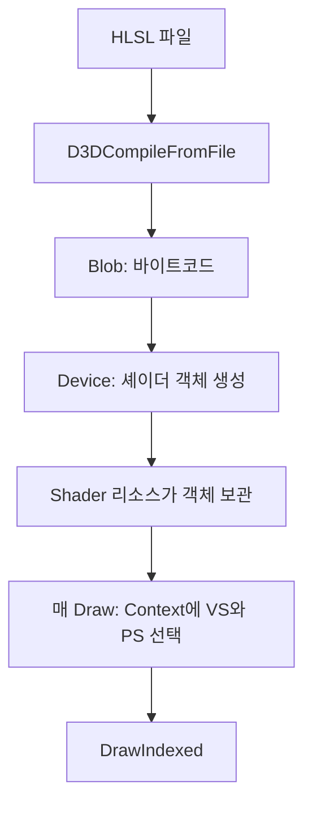

삼각형을 그릴 때 HLSL을 컴파일하고 VS·PS를 생성하는 코드를 그래픽 디바이스 초기화 함수에 넣었습니다. 그런데 사각형, 캐릭터, UI가 서로 다른 셰이더를 사용하게 되면 이 함수가 모든 HLSL 파일과 객체를 알고 있어야 합니다. 물체를 하나 추가할 때마다 그래픽 장치의 초기화 코드도 커집니다.

이번에는 **셰이더를 만드는 일과 이번 Draw에서 선택하는 일**을 `Shader` 클래스로 옮기겠습니다. 여러 물체가 같은 Shader 리소스를 참조하면, 매번 파일을 다시 컴파일하지 않고 이미 만든 GPU 프로그램을 함께 사용할 수 있습니다.

{{M0}}

## 1. Load와 Bind는 실행 시점이 다릅니다

HLSL 파일은 사람이 읽는 소스이고, 컴파일 결과인 Blob은 GPU 객체를 만들기 위한 바이트코드입니다. GPU에서 사용할 셰이더 객체까지 생성해야 로딩이 끝납니다. 반면 Draw 직전에는 이 작업을 반복하지 않고, 이미 만들어 둔 객체를 Context에 설정합니다.



아래 API 그림도 **Create는 Device, Set은 Context**라는 관점으로 읽어 보세요. 생성 성공과 바인딩 성공을 같은 한 단계로 이해하면, 셰이더를 만들었는데도 화면에 적용되지 않는 이유를 찾기 어렵습니다.

{{M1}}
{{M2}}

## 2. 클래스 하나에 담아도 VS와 PS는 다른 일을 합니다

{{M3}}

VS는 정점의 위치와 속성을 받아 클립 공간 위치 등을 출력합니다. 위치가 바뀌면 삼각형의 모양이나 화면 위치가 달라집니다. PS는 래스터화되어 전달된 입력으로 색을 계산합니다. 위치는 그대로 두고 흰색으로 출력하거나 텍스처를 읽는 효과는 PS에서 바꿀 수 있습니다.

테셀레이션의 HS·DS, 도형을 처리하는 GS 같은 선택 단계도 있습니다. 하지만 이번 `Shader` 사용 흐름은 VS·PS 두 단계부터 완성합니다. 멤버에 다른 셰이더 포인터를 선언했다고 그 단계의 컴파일과 로딩까지 구현되는 것은 아닙니다.

{{M4}}

PS가 기존 백버퍼 색을 자동으로 전달받는 것은 아닙니다. 새 색과 이미 그려진 색을 섞는 작업은 보통 Output Merger의 Blend 상태가 담당합니다. 따라서 반투명 효과를 만들 때 PS의 알파 출력과 Blend 상태를 함께 연결해야 합니다.

## 3. Shader가 GPU 객체를 소유합니다

아래는 기존 DX11 강의의 `Shader` 구조에서 이번 실습에 필요한 VS·PS 부분을 추린 선언입니다. `Resource`와 `GetDevice()`는 엔진의 기존 리소스 기반 클래스와 그래픽 장치 접근 함수를 사용합니다. 셰이더 효과를 바꾸는 새 알고리즘이 아니라, 앞 강의에서 작성한 코드를 소유 객체로 옮기는 단계입니다.

```c++
class Shader : public Resource
{
public:
    HRESULT Load(const std::wstring& path) override;
    bool CreateVertexShader(const std::wstring& fileName);
    bool CreatePixelShader(const std::wstring& fileName);
    void Bind();
    Microsoft::WRL::ComPtr<ID3DBlob> GetVSBlob() { return mVSBlob; }

private:
    Microsoft::WRL::ComPtr<ID3DBlob> mVSBlob;
    Microsoft::WRL::ComPtr<ID3DBlob> mPSBlob;
    Microsoft::WRL::ComPtr<ID3D11VertexShader> mVS;
    Microsoft::WRL::ComPtr<ID3D11PixelShader> mPS;
};
```

`mVSBlob`과 `mVS`는 같은 객체가 아닙니다. Blob은 컴파일 결과이고, `mVS`는 실제 바인딩할 DX11 셰이더 객체입니다. VS Blob을 외부에 제공하는 이유는 Input Layout을 만들 때 VS 입력 형식과 정점 레이아웃을 연결해야 하기 때문입니다. PS Blob은 재로딩 등 다른 용도로 보관할 수 있지만 Input Layout 생성에는 사용하지 않습니다.

`ComPtr`가 COM 참조를 관리하므로 멤버 각각을 소멸자에서 직접 `Release()`하지 않습니다. 상위 Resource 관리자는 `Shader`라는 리소스의 수명을 관리하고, 그 안의 ComPtr들은 각 DX11 객체의 참조 수명을 관리합니다.

## 4. 기존 생성 코드를 함수 두 개로 옮깁니다

```c++
bool Shader::CreateVertexShader(const std::wstring& fileName)
{
    return GetDevice()->CreateVertexShader(
        fileName, mVSBlob.GetAddressOf(), mVS.GetAddressOf());
}

bool Shader::CreatePixelShader(const std::wstring& fileName)
{
    return GetDevice()->CreatePixelShader(
        fileName, mPSBlob.GetAddressOf(), mPS.GetAddressOf());
}
```

여기서 `GetDevice()->CreateVertexShader(fileName,...)`는 **엔진의 래퍼 함수**입니다. 파일을 받아 컴파일하고 DX11 셰이더 객체를 만드는 기존 코드를 감쌉니다. 원본 API인 `ID3D11Device::CreateVertexShader`는 파일명이 아니라 바이트코드 포인터와 크기를 받습니다. 이름이 비슷하므로 두 함수의 인자를 섞지 않습니다.

이 래퍼의 반환값은 bool입니다. 원본 D3D11 API의 HRESULT를 검사하는 `FAILED(hr)`와 구분해야 합니다. 컴파일 실패 시 오류 Blob을 출력하고, 생성 API 실패를 false로 전달해야 이 함수도 실패를 호출자에게 알릴 수 있습니다.

로딩 흐름은 VS가 성공한 다음 PS를 생성하는 순서입니다. 다음 코드는 경로에서 파일명을 얻는 기존 규칙과 성공·실패 반환을 보여 줍니다. 실제 파일 이름 조합과 `main` 진입점, `vs_5_0`·`ps_5_0` 같은 대상 프로파일은 그래픽 장치 래퍼에서 결정합니다.

```c++
HRESULT Shader::Load(const std::wstring& path)
{
    const auto begin = path.find_last_of(L"\\/");
    const std::wstring fileName =
        (begin == std::wstring::npos) ? path : path.substr(begin + 1);

    if (!CreateVertexShader(fileName))
        return E_FAIL;
    if (!CreatePixelShader(fileName))
        return E_FAIL;
    return S_OK;
}
```

파일을 못 찾거나 HLSL에 오류가 있으면 성공한 리소스로 등록해 그리면 안 됩니다. 여기서 `E_FAIL`을 반환하는 이유가 그것입니다. `S_FALSE`는 이름에 FALSE가 있어도 실패 HRESULT가 아니므로 `FAILED(S_FALSE)`는 false가 됩니다. bool과 HRESULT 사이를 넘나드는 경계에서 의미를 맞추는 것이 중요합니다.

이 단순한 로딩은 최초 생성 흐름을 보여 줍니다. 실행 중 셰이더를 재컴파일할 때 실패해도 이전 프로그램을 계속 쓰려면 새 VS·PS를 임시 객체에 모두 성공시킨 뒤 멤버를 교체하는 구조가 추가로 필요합니다. 현재 코드가 그 재로딩 정책까지 완성한 것으로 읽지 않습니다.

## 5. Bind는 만들어 둔 셰이더를 선택합니다

```c++
void Shader::Bind()
{
    if (mVS)
        GetDevice()->BindVS(mVS.Get());
    if (mPS)
        GetDevice()->BindPS(mPS.Get());
}
```

Bind에는 파일 읽기나 컴파일이 없습니다. `BindVS`는 결국 Context의 `VSSetShader`, `BindPS`는 `PSSetShader`로 연결됩니다. 같은 셰이더로 열 개의 물체를 그려도 GPU 프로그램을 열 번 만들 필요는 없습니다.

DX11 Context의 설정은 다음에 바꾸기 전까지 남습니다. 따라서 유효하지 않은 Shader를 Bind한 뒤 “아무 셰이더도 선택되지 않았다”고 생각하면 안 됩니다. 위 함수는 null인 단계를 건너뛰므로 이전 설정이 남을 수 있습니다. 이번 흐름에서는 Load 성공을 확인한 VS·PS 쌍만 사용합니다. 뒤에 HS·DS·GS를 추가하면 사용하지 않는 선택 단계를 명시적으로 해제하는 정책도 함께 정해야 합니다.

## 6. 물체를 그리는 쪽에서는 리소스를 선택합니다

```c++
// 리소스 로딩이 성공했고 VB·IB·상수 버퍼·Input Layout을 설정한 뒤
graphics::Shader* triangle =
    Resources::Find<graphics::Shader>(L"TriangleShader");
if (triangle)
{
    triangle->Bind();
    context->DrawIndexed(3, 0, 0);
}
```

여기서 `TriangleShader`는 HLSL 함수 이름이 아니라 리소스 관리자에 등록한 키입니다. 로드한 리소스의 키와 찾는 키가 같아야 합니다. 찾지 못했을 때 바로 `triangle->Bind()`를 호출하면 그래픽스 문제가 아니라 null 포인터 접근부터 발생합니다.

이제 다른 PS로 만든 Shader를 선택해 같은 삼각형을 그려 보세요. 한 PS는 입력 색을 반환하고, 다른 PS는 `float4(1,1,1,1)`을 반환하도록 합니다. 정점 버퍼와 Draw 호출은 같아도 Shader 선택에 따라 색이 달라지면 클래스 분리가 연결된 것입니다. 위치까지 바뀌었다면 함께 선택한 VS의 변환을 확인합니다.

다음 Material 강의에서는 “어떤 셰이더와 어떤 텍스처를 함께 사용할지”를 묶습니다. Shader는 GPU 프로그램을 소유하고, Material은 물체를 표현할 프로그램과 데이터를 조합합니다. DX12에서는 셰이더와 렌더 상태를 PSO로 묶는 책임이 더해지므로, 먼저 이 생성과 선택의 구분을 확실히 익혀 두면 좋습니다.
