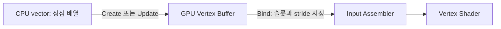

{{M0}}

삼각형과 사각형을 만들 때마다 `D3D11_BUFFER_DESC`를 채우고 `CreateBuffer`를 호출했습니다. 이제 그 코드를 `VertexBuffer` 클래스로 옮기겠습니다. 물체를 그리는 쪽은 정점 배열로 버퍼를 한 번 만든 뒤, Draw 전에 `Bind`만 호출하도록 만드는 것이 목표입니다.

클래스로 옮겨도 GPU 동작은 달라지지 않습니다. 오히려 **생성할 바이트 수, 정점 하나의 크기, 현재 그릴 정점 수**가 각각 어디에 보관되는지를 분명히 해야 합니다. 이 셋을 같은 숫자로 취급하면 작은 예제에서는 보이지 않던 오류가 생깁니다.

{{M1}}

## 1. 정점 배열과 GPU 버퍼는 별개의 저장 공간입니다

CPU의 `std::vector<Vertex>`는 원본 데이터입니다. `CreateBuffer`가 성공하면 GPU에서 사용할 리소스가 생성됩니다. 이후 CPU vector의 값을 바꾸어도 이미 만든 GPU 버퍼가 자동으로 바뀌지는 않습니다.



초기 데이터만 필요하면 GPU 버퍼 생성 후 CPU 배열을 버릴 수 있습니다. 반면 에디터 수정이나 저장을 위해 CPU 원본도 필요하다면 Mesh 쪽에서 따로 보관합니다. VertexBuffer가 소유하는 핵심은 GPU 버퍼와 그것을 읽는 데 필요한 크기 정보입니다.

## 2. 이번 클래스는 동적 버퍼 한 종류부터 다룹니다

다음은 기존 DX11 강의의 Create·Bind 구조를 따라, 생성 실패와 갱신 범위를 함께 처리한 학습 구현입니다. `Vertex`는 `XMFLOAT3 position`과 `XMFLOAT4 color`처럼 프로젝트에서 정한 정점 구조체를 사용합니다. Input Layout 역시 그 구조체와 맞아야 합니다.

```c++
#include <d3d11.h>
#include <wrl/client.h>
#include <vector>
#include <limits>
#include <cstring>

class VertexBuffer
{
public:
    bool Create(ID3D11Device* device, const std::vector<Vertex>& vertices);
    bool Update(ID3D11DeviceContext* context,
                const std::vector<Vertex>& vertices);
    void Bind(ID3D11DeviceContext* context) const;
    UINT GetCount() const { return mCount; }

private:
    Microsoft::WRL::ComPtr<ID3D11Buffer> mBuffer;
    UINT mCapacityBytes = 0;
    UINT mCount = 0;
};
```

`mCapacityBytes`는 할당한 용량이고 `mCount`는 현재 유효한 정점 수입니다. 열 개를 담을 버퍼에 여섯 개만 썼다면 용량과 그릴 개수가 달라집니다. 정점 하나의 stride는 이 클래스가 사용하는 `sizeof(Vertex)`로 결정합니다.

## 3. 생성은 크기를 검사한 뒤 한 번 수행합니다

```c++
bool VertexBuffer::Create(ID3D11Device* device,
                           const std::vector<Vertex>& vertices)
{
    if (!device || vertices.empty())
        return false;
    const auto maxBytes = (std::numeric_limits<UINT>::max)();
    if (vertices.size() > maxBytes / sizeof(Vertex))
        return false;

    D3D11_BUFFER_DESC desc{};
    desc.ByteWidth = static_cast<UINT>(vertices.size() * sizeof(Vertex));
    desc.Usage = D3D11_USAGE_DYNAMIC;
    desc.BindFlags = D3D11_BIND_VERTEX_BUFFER;
    desc.CPUAccessFlags = D3D11_CPU_ACCESS_WRITE;

    D3D11_SUBRESOURCE_DATA initial{};
    initial.pSysMem = vertices.data();
    Microsoft::WRL::ComPtr<ID3D11Buffer> next;
    if (FAILED(device->CreateBuffer(&desc, &initial, next.GetAddressOf())))
        return false;

    mBuffer = next;
    mCapacityBytes = desc.ByteWidth;
    mCount = static_cast<UINT>(vertices.size());
    return true;
}
```

`ByteWidth`는 UINT이므로 큰 `size_t`를 무조건 형변환하면 상위 비트가 잘려 작은 버퍼를 만들 수 있습니다. 곱하기 전에 최대 바이트 수를 정점 크기로 나누어 검사한 이유가 이것입니다. 정점이 없다면 0바이트 버퍼를 만들려 하지 않고 실패를 반환합니다.

`next`에 새 버퍼를 만든 뒤 성공했을 때만 멤버를 바꿉니다. 재생성에 실패했다고 기존 유효한 버퍼까지 먼저 잃지 않게 하는 순서입니다. `FAILED`로 검사하는 것은 여기서 호출한 것이 HRESULT를 반환하는 **원본 D3D11 Device API**이기 때문입니다. 기존 엔진의 bool `GetDevice()->CreateBuffer` 래퍼를 사용한다면 `if (!success)`로 검사합니다.

이번에는 Update도 실습하므로 `DYNAMIC + CPU_ACCESS_WRITE`를 사용했습니다. 생성 후 절대 바꾸지 않는 메시라면 `IMMUTABLE`과 초기 데이터를 사용하는 방식으로 범위를 줄일 수 있습니다. `DEFAULT`는 CPU 직접 Map 쓰기 대신 `UpdateSubresource`나 복사로 갱신하는 다른 경로입니다. 이름만 보고 어느 방식이 항상 빠르다고 정하지 않습니다.

## 4. Bind는 어느 배열을 어떻게 읽을지 알려 줍니다

```c++
void VertexBuffer::Bind(ID3D11DeviceContext* context) const
{
    ID3D11Buffer* buffer = mBuffer.Get();
    UINT stride = sizeof(Vertex);
    UINT offset = 0;
    context->IASetVertexBuffers(0, 1, &buffer, &stride, &offset);
}
```

첫 0은 IA 입력 슬롯 번호이고, `offset`은 버퍼 안에서 처음 읽을 바이트 위치입니다. `stride`는 다음 정점까지 이동할 바이트 수입니다. 예를 들어 Vertex가 28바이트이면 시작 위치 0, 28, 56에서 각 정점을 읽습니다. 정점 내부의 색 위치는 Input Layout이 별도로 설명합니다.

Bind를 호출했다고 삼각형이 그려지지는 않습니다. 아직 Topology, Input Layout, 셰이더, 렌더 타겟 등의 설정과 Draw가 필요합니다. 이 클래스는 그중 정점 버퍼 선택만 맡습니다. `const`는 이 VertexBuffer의 멤버를 바꾸지 않는다는 뜻이며, Context의 파이프라인 상태는 바뀝니다.

## 5. CPU 데이터를 바꾸었다면 Update를 호출합니다

```c++
bool VertexBuffer::Update(ID3D11DeviceContext* context,
                           const std::vector<Vertex>& vertices)
{
    if (!context || !mBuffer || vertices.empty() ||
        vertices.size() > mCapacityBytes / sizeof(Vertex))
        return false;

    D3D11_MAPPED_SUBRESOURCE mapped{};
    if (FAILED(context->Map(mBuffer.Get(), 0,
                            D3D11_MAP_WRITE_DISCARD, 0, &mapped)))
        return false;
    std::memcpy(mapped.pData, vertices.data(),
                vertices.size() * sizeof(Vertex));
    context->Unmap(mBuffer.Get(), 0);
    mCount = static_cast<UINT>(vertices.size());
    return true;
}
```

GPU 버퍼 크기는 vector가 커진다고 함께 늘지 않습니다. 처음 세 정점 용량으로 생성했다면 여섯 정점을 복사하기 전에 실패해야 합니다. 더 큰 용량이 필요하면 Create를 다시 호출하거나 별도의 확장 정책을 만들어야 합니다.

Map이 실패하면 `mapped.pData`에 복사하지 않습니다. 성공한 Map에 대해서만 Unmap을 호출하고, 복사가 끝난 다음 현재 정점 수를 바꿉니다. WRITE_DISCARD로 갱신했으므로 이번에 쓰지 않은 나머지 용량에 이전 값이 보존되어 있다고 가정하지 않습니다. Draw에서도 새 `mCount`만큼만 읽어야 합니다.

## 6. 화면에서 클래스의 책임을 확인합니다

```c++
// 초기화: vertices에는 삼각형의 정점 세 개가 들어 있습니다.
VertexBuffer triangle;
if (!triangle.Create(device, vertices))
    throw std::runtime_error("Vertex buffer creation failed");

// 렌더링: RTV·Viewport·Input Layout·VS·PS·TriangleList 설정 후
triangle.Bind(context);
context->Draw(triangle.GetCount(), 0);
```

위 사용 예의 `device`, `context`는 유효한 raw 인터페이스 포인터입니다. 엔진 멤버가 ComPtr라면 `.Get()`으로 전달합니다. 예외를 사용하는 코드에는 `<stdexcept>`를 포함합니다. 삼각형 객체는 초기화 지역 변수로 만들고 곧바로 없애는 것이 아니라 렌더링하는 동안 유지해야 합니다.

이제 CPU 정점의 y를 바꾸어 보세요. CPU 값만 바꾸면 화면은 그대로입니다. `triangle.Update(context, vertices)`까지 성공한 뒤 다음 Draw에서 모양이 바뀌면 CPU 데이터와 GPU 리소스가 별개라는 것을 확인할 수 있습니다.

다음에는 생성 용량보다 큰 배열을 Update에 전달해 보세요. 메모리를 넘어 쓰는 대신 false가 반환되어야 합니다. 이 검사는 Debug의 assert만으로 처리하지 않아 Release에서도 남습니다. 화면을 그리는 기능과 함께 “어떤 입력을 받아들이는가”까지 클래스의 책임으로 묶은 것입니다.

정점 버퍼만으로 사각형의 네 정점을 Triangle List `Draw(4)`로 그리면 두 삼각형이 완성되지 않습니다. 다음 IndexBuffer와 Mesh 클래스가 여섯 인덱스와 DrawIndexed를 함께 관리하도록 연결하겠습니다.
