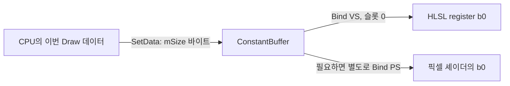

인덱스와 상수 버퍼를 직접 만들어 사각형을 그렸습니다. 이제 매번 반복하는 코드를 클래스로 묶겠습니다. IndexBuffer는 **어떤 정점 번호를 읽을지**, ConstantBuffer는 **이번 Draw에서 어떤 공통 값을 쓸지**를 책임집니다.

둘 다 내부에는 `ID3D11Buffer`를 보관하지만 서로 대신 사용할 수는 없습니다. 인덱스는 Input Assembler로, 상수는 VS·PS 같은 셰이더의 b 슬롯으로 연결됩니다. 이 목적지가 클래스 인터페이스를 다르게 만드는 이유입니다.

{{M0}}

## 1. IndexBuffer는 번호와 포맷을 한 쌍으로 보관합니다

{{M1}}

정점 네 개로 만든 사각형을 생각해 봅시다. 인덱스 `{0,1,2,0,2,3}`은 네 정점을 두 삼각형으로 연결합니다. 클래스는 이 번호 배열로 GPU 버퍼를 만들고, Bind할 때 같은 정수 크기로 읽도록 설정해야 합니다.

아래는 기존 DX11 강의의 `IndexBuffer` 생성·바인딩 흐름입니다. `desc`와 `buffer`는 버퍼 기반 클래스의 멤버이고, `GetDevice()`는 bool을 반환하는 엔진의 그래픽 장치 래퍼입니다. `UINT_MAX`에는 `<climits>`를 포함합니다.

```c++
bool IndexBuffer::Create(const std::vector<UINT>& indices)
{
    if (indices.empty() || indices.size() > UINT_MAX / sizeof(UINT))
        return false;
    desc = {};
    desc.ByteWidth = static_cast<UINT>(sizeof(UINT) * indices.size());
    desc.BindFlags = D3D11_BIND_INDEX_BUFFER;
    desc.Usage = D3D11_USAGE_DEFAULT;

    D3D11_SUBRESOURCE_DATA initial{};
    initial.pSysMem = indices.data();
    return GetDevice()->CreateBuffer(&desc, &initial, buffer.GetAddressOf());
}

void IndexBuffer::Bind() const
{
    GetDevice()->BindIndexBuffer(buffer.Get(), DXGI_FORMAT_R32_UINT, 0);
}
```

입력이 `vector<UINT>`이므로 요소 하나는 4바이트이며, 여섯 인덱스의 `ByteWidth`는 24입니다. Bind에서도 `R32_UINT`로 읽어야 같은 번호가 됩니다. 16비트 인덱스를 지원하려면 Bind의 포맷만 바꾸는 것이 아니라 입력 배열 타입과 바이트 수까지 함께 바꿔야 합니다.

`DEFAULT`와 CPUAccessFlags=0은 CPU가 이 버퍼를 직접 Map하여 쓰지 않는 경로입니다. 수정이 절대로 불가능하다는 뜻은 아닙니다. 필요한 경우 `UpdateSubresource`나 복사를 사용합니다. 이 단계에서는 초기 번호 배열을 한 번 넘겨 사용합니다.

반환값을 확인하는 부분도 클래스의 역할입니다. assert만 넣고 계속 true를 반환하면 Release에서 생성 실패를 놓칠 수 있습니다. 이 래퍼는 bool이므로 false를 그대로 올려보냅니다. 원본 `ID3D11Device::CreateBuffer`를 직접 호출할 때는 HRESULT이므로 `FAILED(hr)`로 검사합니다.

## 2. ConstantBuffer에는 크기와 슬롯이 추가로 필요합니다

{{M2}}

상수 버퍼를 사용할 때는 바이트 수뿐 아니라 어떤 셰이더 단계의 어느 슬롯에 연결할지도 알아야 합니다. 이 강의의 기존 설계는 `mSize`에 크기를, `mType`에 슬롯을 선택할 enum 값을 보관합니다.



같은 숫자 0이어도 VS의 b0와 PS의 b0는 따로 바인딩합니다. 또 `eCBType::Transform`이라는 C++ 이름만으로 HLSL 구조체가 자동 생성되지는 않습니다. enum을 슬롯 번호로 바꿔 주는 규칙과, C++·HLSL이 같은 바이트 배치를 읽는 규칙은 별개입니다.

## 3. 생성할 때 잘못된 크기를 막습니다

```c++
bool ConstantBuffer::Create(eCBType type, UINT size, void* data)
{
    if (size == 0 || size % 16 != 0 || size > 65536)
        return false;

    desc = {};
    desc.ByteWidth = size;
    desc.BindFlags = D3D11_BIND_CONSTANT_BUFFER;
    desc.Usage = D3D11_USAGE_DYNAMIC;
    desc.CPUAccessFlags = D3D11_CPU_ACCESS_WRITE;

    D3D11_SUBRESOURCE_DATA initial{};
    initial.pSysMem = data;
    if (!GetDevice()->CreateBuffer(&desc, data ? &initial : nullptr,
                                    buffer.GetAddressOf()))
        return false;

    mType = type;
    mSize = size;
    return true;
}
```

DX11 상수 버퍼의 ByteWidth는 16바이트 배수입니다. 위 함수는 이 강의에서 사용하는 최대 64 KiB 범위도 검사합니다. DX12에서 배울 CBV 주소의 256바이트 정렬과 섞지 않습니다.

초기 데이터가 있으면 `initial`을, 없으면 `nullptr`를 전달합니다. 이 둘은 성능 요령보다 **첫 Draw 전에 유효한 값이 들어 있는가**의 문제로 읽는 것이 좋습니다. 초기 데이터를 주지 않았다면 SetData를 성공시킨 뒤 바인딩하여 사용해야 합니다. mSize와 mType도 생성 성공 후 저장하여 메타데이터가 실패한 요청 값으로 바뀌지 않게 했습니다.

## 4. void 포인터가 크기를 확인해 주지는 않습니다

기존 클래스의 갱신 함수는 다음처럼 짧습니다.

```c++
void ConstantBuffer::SetData(void* data) const
{
    GetDevice()->SetDataBuffer(buffer.Get(), data, mSize);
}
```

짧다는 것과 타입에 안전하다는 것은 다릅니다. 이 함수는 data 뒤에 실제로 mSize바이트가 존재하는지 알 수 없습니다. 192바이트 Transform 버퍼에 float 한 개의 주소를 넘기면 4바이트 뒤의 다른 메모리까지 읽을 수 있습니다. 호출자는 생성할 때 사용한 전체 구조체와 같은 크기의 데이터를 넘겨야 합니다.

구조체를 `data{}`로 초기화하면 사용하지 않는 padding에도 미정 값이 남지 않게 할 수 있습니다. 하지만 그것만으로 HLSL 패킹이 자동으로 맞지는 않으므로, 멤버 offset과 행렬 저장 방식을 함께 맞춥니다.

또 기존 void 반환형은 갱신 실패를 Draw 호출자에게 알리기 어렵습니다. 다음은 오류를 전달하도록 개선할 때의 **학습용 DX11 갱신 함수**입니다. 기존 `SetDataBuffer`가 이미 이 시그니처라는 뜻은 아닙니다.

```c++
bool UploadConstants(ID3D11DeviceContext* context, ID3D11Buffer* buffer,
                     const void* data, UINT bytes)
{
    if (!context || !buffer || !data)
        return false;
    D3D11_BUFFER_DESC desc{};
    buffer->GetDesc(&desc);
    if (bytes == 0 || bytes != desc.ByteWidth)
        return false;

    D3D11_MAPPED_SUBRESOURCE mapped{};
    if (FAILED(context->Map(buffer, 0, D3D11_MAP_WRITE_DISCARD, 0, &mapped)))
        return false;
    std::memcpy(mapped.pData, data, bytes);
    context->Unmap(buffer, 0);
    return true;
}
```

이 함수는 DYNAMIC·CPU 쓰기로 생성된 상수 버퍼 전체를 갱신하는 용도이고 `<cstring>`이 필요합니다. `bytes==ByteWidth`는 목적지 전체에 값을 쓸지 검사합니다. 원본 포인터가 실제로 bytes만큼 읽을 수 있는지는 여전히 호출자가 보장해야 합니다. 더 강한 인터페이스를 만들려면 템플릿으로 T의 sizeof를 넘기게 하거나, 데이터와 길이를 함께 받는 타입을 사용할 수 있습니다.

Map에 실패하면 false를 반환하고 Draw도 진행하지 않도록 호출부까지 연결해야 합니다. WRITE_DISCARD는 이전 내용 보존을 요구하지 않는 설정이지, 갱신이 반드시 성공한다는 약속은 아닙니다.

## 5. Bind는 데이터 복사 없이 목적지만 선택합니다

```c++
void ConstantBuffer::Bind(eShaderStage stage) const
{
    GetDevice()->BindConstantBuffer(stage, mType, buffer.Get());
}

// 그래픽 장치 래퍼 내부의 VS 처리 부분
UINT slot = static_cast<UINT>(type);
mContext->VSSetConstantBuffers(slot, 1, &buffer);
```

예를 들어 Transform이 0에 대응한다면 VS의 `register(b0)`로 연결됩니다. type을 Material로 바꾸었다고 버퍼 내부가 자동으로 Material 데이터로 변환되지는 않습니다. 생성 크기·SetData로 쓴 구조체·Bind 슬롯·HLSL 선언이 한 쌍으로 맞아야 합니다.

## 6. 한 Draw의 데이터와 호출을 함께 묶어 봅시다

다음은 전형적인 엔진 사용 순서입니다. `objectData`는 해당 Transform 셰이더가 기대하는 전체 데이터이고, `indexCount`는 메시가 가진 인덱스 개수입니다.

```c++
// VB, 셰이더, Input Layout, RTV 등은 준비된 상태
indexBuffer.Bind();
transformBuffer.SetData(&objectData);
transformBuffer.Bind(eShaderStage::VS);
context->DrawIndexed(indexCount, 0, 0);
```

사각형 두 개가 서로 다른 위치에 있다면 각 Draw 직전에 그 물체의 데이터를 써야 합니다. “한 번 Bind했으니 계속 같은 데이터가 쓰일 것”이라고 생각하기 쉽지만 Bind와 SetData는 서로 다른 동작입니다. 같은 버퍼를 Bind한 상태에서도 SetData를 바꾸면 이후 Draw가 읽을 내용이 달라집니다.

직접 확인할 때는 먼저 인덱스 여섯 개 중 앞 세 개만 그려 사각형 절반이 나오는지 봅니다. 다음에는 같은 인덱스와 셰이더를 유지한 채 두 Draw의 이동값만 다르게 넣어 두 사각형이 분리되는지 봅니다. 첫 실험은 IndexBuffer 연결을, 두 번째는 ConstantBuffer의 갱신 시점을 확인합니다.

다음 Mesh 클래스는 정점·인덱스·Topology를 하나로 묶습니다. Transform은 같은 Mesh를 사용하는 물체마다 달라질 수 있으므로 별도로 갱신합니다. 어떤 데이터를 공유하고 어떤 데이터를 매 Draw마다 바꾸는지가 엔진 설계의 기준이 됩니다.

기본 원리를 다시 확인하려면 <mention-page url="https://www.notion.so/9482ff26786f483d9cefc249b0b0c9ca"/>의 사각형 두 개 실습을 함께 따라가 보세요.
