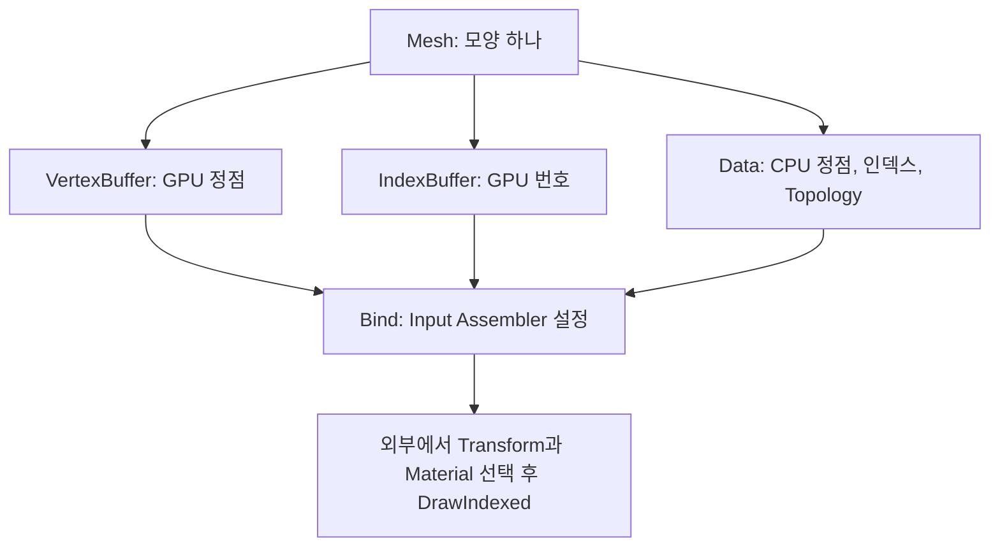

{{M0}}

화면에 같은 사각형을 열 개 그린다고 생각해 봅시다. 위치와 이미지는 달라도 사각형의 네 모서리와 두 삼각형 구성은 같습니다. 물체마다 같은 정점·인덱스를 다시 만들기보다, **모양에 해당하는 데이터를 하나의 Mesh로 묶어 공유**할 수 있습니다.

이번에는 VertexBuffer, IndexBuffer, Primitive Topology를 Mesh 안으로 옮기겠습니다. Mesh를 선택하면 모양을 그리는 데 필요한 입력들이 함께 설정되고, 물체마다 다른 Transform과 Material은 바깥에서 선택하도록 역할을 나눕니다.

## 1. Mesh는 표면을 작은 도형으로 표현한 것입니다

곡면처럼 보이는 모델도 삼각형으로 만든 Mesh에서는 작은 평면들의 조합입니다. 삼각형이 많아지면 윤곽을 더 세밀하게 근사할 수 있지만 처리할 데이터도 늘어납니다. 폴리곤은 다각형이라는 뜻이며, 이 강의의 렌더링에서는 주로 삼각형을 사용합니다.

{{M1}}

정점은 단지 위치 점이 아닙니다. 같은 위치라도 면마다 법선이나 UV가 다르면 별도의 정점으로 저장할 수 있습니다. 그러므로 “모서리 위치가 몇 개인가”와 “GPU 정점이 몇 개인가”가 항상 같지는 않습니다.

## 2. 정점 목록과 연결 규칙을 함께 읽습니다

아래처럼 삼각형 세 개를 각각 정점 세 개로 나열하면, 공유하는 모서리의 데이터가 중복됩니다.

{{M2}}

인덱스를 사용하면 정점 버퍼에는 재사용할 정점 속성을 담고, 인덱스 버퍼에는 삼각형마다 참조할 번호를 담습니다. 인덱스를 쓴다고 Topology가 별도의 `IndexedTriangleList` 값으로 바뀌는 것은 아닙니다. **Topology는 Triangle List 그대로이고, 호출을 Draw에서 DrawIndexed로 바꿉니다.**

{{M3}}

예를 들어 정점 다섯 개를 공유하는 삼각형 세 개에 정점당 48바이트, 인덱스당 4바이트를 쓴다면 중복 저장은 `9×48=432`바이트, 인덱스 사용은 `5×48+9×4=276`바이트입니다. 인덱스 배열도 계산에 넣어 비교합니다. 실제 절약량은 정점 크기와 공유 정도에 따라 달라집니다.

Triangle Strip은 연속된 정점으로 삼각형을 이어 만드는 다른 연결 방식입니다. 띠 모양 도형에서 정점 참조 수를 줄일 수 있습니다.

{{M4}}

Strip에서는 연속되는 삼각형의 정점 순서를 해석하는 규칙이 List와 다릅니다. 같은 배열에서 Topology만 바꾸면 동일한 그림이 나오리라고 기대할 수 없습니다. 이번 Mesh 실습은 범위를 분명히 하기 위해 **32비트 인덱스를 쓰는 Triangle List**로 진행합니다. Strip·인스턴싱·LOD는 그 구조가 필요해졌을 때 확장합니다.

## 3. CPU 원본과 GPU 버퍼를 Mesh 안에 나눠 보관합니다



기존 DX11 강의의 핵심 구조는 아래와 같습니다. `graphics::VertexBuffer`와 `IndexBuffer`는 엔진의 `GetDevice()`를 사용하는 래퍼입니다. 앞 글의 원본 D3D11 Device를 인자로 받는 학습 예제와 호출 방식을 섞지 않습니다.

```c++
class Mesh : public Resource
{
public:
    struct Data
    {
        D3D11_PRIMITIVE_TOPOLOGY mTopology =
            D3D11_PRIMITIVE_TOPOLOGY_TRIANGLELIST;
        std::vector<graphics::Vertex> vertices;
        std::vector<UINT> indices;
    };

    bool CreateVB(const std::vector<graphics::Vertex>& vertices);
    bool CreateIB(const std::vector<UINT>& indices);
    void Bind();

private:
    graphics::VertexBuffer mVB;
    graphics::IndexBuffer mIB;
    Data mData;
};
```

`mData.vertices`는 CPU 배열이고 `mVB`는 GPU 리소스입니다. 데이터를 두 군데 보관하는 이유는 CPU에서 다시 읽거나 수정할 가능성을 남기기 위해서입니다. 렌더링만 필요하다면 초기화 뒤 CPU 원본을 비우는 설계도 가능합니다. 원본을 보관한다고 저장 기능이나 충돌 검사 기능까지 자동으로 구현되는 것은 아닙니다.

## 4. 생성 함수는 버퍼 클래스에 일을 맡깁니다

```c++
bool Mesh::CreateVB(const std::vector<graphics::Vertex>& vertices)
{
    if (!mVB.Create(vertices))
        return false;
    mData.vertices = vertices;
    return true;
}

bool Mesh::CreateIB(const std::vector<UINT>& indices)
{
    for (UINT index : indices)
        if (index >= mData.vertices.size())
            return false;
    if (!mIB.Create(indices))
        return false;
    mData.indices = indices;
    return true;
}
```

위 코드는 기존 CreateVB·CreateIB 흐름에 성공 확인과 인덱스 범위 검사를 넣은 학습용 정리입니다. 이 순서에서는 VB를 먼저 생성합니다. 정점 네 개가 있으면 사용할 수 있는 번호는 0~3입니다. 인덱스에 4를 넣으면 다섯 번째 정점을 읽으려는 요청이므로 IB 생성 전에 거릅니다.

GPU 버퍼 생성이 실패했는데 CPU 백업만 새 데이터로 바꾸면, CPU가 알고 있는 모양과 GPU가 가지고 있는 모양이 달라질 수 있습니다. 그래서 각 생성이 성공한 뒤 그에 대응하는 CPU 배열을 보관합니다. VB와 IB를 모두 한 번에 교체하는 재로딩이 필요하다면 두 버퍼를 임시 객체에 완성한 뒤 Mesh 전체를 교체하는 정책을 더할 수 있습니다.

## 5. Bind는 모양의 입력만 선택합니다

```c++
void Mesh::Bind()
{
    mVB.Bind();
    mIB.Bind();
    graphics::GetDevice()->BindPrimitiveTopology(mData.mTopology);
}
```

호출 세 줄을 묶은 이유는 실수를 줄이기 위해서입니다. 다른 물체를 그리다가 사각형 VB만 바꾸고 이전 물체의 IB를 남겨 두면 엉뚱한 번호로 정점을 연결할 수 있습니다. Mesh를 선택할 때 함께 움직여야 하는 상태를 한 함수로 묶었습니다.

그래도 Bind만으로 화면에 그림이 생기지는 않습니다. Mesh는 셰이더나 텍스처, 카메라 변환, 렌더 타겟을 모두 소유하지 않습니다. 그 데이터까지 한 Mesh에 고정하면 같은 사각형을 다른 이미지나 위치로 재사용하기 어려워집니다.

## 6. 사각형 하나를 만들어 연결해 봅시다

다음 코드는 정점 구조체에 `pos`, `color`가 있는 DX11 엔진의 형태를 사용합니다. UV가 추가된 버전이라면 UV도 채우고 Input Layout과 셰이더 입력에 연결합니다.

```c++
std::vector<graphics::Vertex> vertices(4);
vertices[0].pos = Vector3(-0.5f,  0.5f, 0.0f);
vertices[1].pos = Vector3( 0.5f,  0.5f, 0.0f);
vertices[2].pos = Vector3( 0.5f, -0.5f, 0.0f);
vertices[3].pos = Vector3(-0.5f, -0.5f, 0.0f);
for (auto& vertex : vertices)
    vertex.color = Vector4(1, 1, 1, 1);

std::vector<UINT> indices = {0, 1, 2, 0, 2, 3};
Mesh rectangle;
if (!rectangle.CreateVB(vertices) || !rectangle.CreateIB(indices))
    throw std::runtime_error("Rectangle mesh creation failed");
```

`Vector3`·`Vector4`는 프로젝트의 SimpleMath 타입 별칭이며 예외를 쓰는 코드에는 `<stdexcept>`가 필요합니다. `rectangle`은 이후 Draw에서 사용할 수 있도록 리소스나 소유 객체에 보관합니다. 생성 함수의 지역 변수로만 두었다가 함수 종료와 함께 사라지게 하지 않습니다.

렌더링 쪽에서는 다음 순서로 연결합니다. 아래의 `shader`, `transform`은 앞 강의에서 준비한 셰이더와 상수 버퍼이고, `objectData`는 해당 셰이더가 기대하는 전체 변환 데이터입니다.

```c++
// RTV·DSV·Viewport·Input Layout은 해당 렌더 패스에 맞게 설정
rectangle.Bind();
shader.Bind();
transform.SetData(&objectData);
transform.Bind(eShaderStage::VS);
context->DrawIndexed(static_cast<UINT>(indices.size()), 0, 0);
```

여기서 그릴 개수는 정점 네 개가 아니라 인덱스 여섯 개입니다. 이 강의 단계는 호출부가 개수를 전달합니다. 이후 Mesh가 인덱스 개수를 제공하거나 Render 함수를 소유하도록 확장하면, 다른 메시의 개수를 실수로 넘기는 것도 줄일 수 있습니다.

## 7. 같은 Mesh를 두 물체에서 공유해 봅시다

위 Bind를 유지한 채 왼쪽 물체의 변환을 넣고 Draw, 오른쪽 물체의 변환을 넣고 Draw를 호출합니다. 사각형의 정점과 인덱스는 한 벌인데 위치가 다르게 보이면 **모양을 나타내는 Mesh와 배치를 나타내는 Transform이 분리된 것**입니다.

반대로 CPU의 `vertices[0].pos`만 바꾸고 GPU 갱신을 하지 않으면 화면은 그대로입니다. Mesh의 `mData`를 수정해도 마찬가지입니다. CPU 원본과 GPU 버퍼 사이에 Update나 재생성 호출이 있어야 실제 모양이 바뀝니다.

Save·Load 함수의 선언을 만들어 두는 것과 파일 저장·로드를 완성하는 것도 다릅니다. 이 강의 단계에서 저장 포맷은 구현 범위 밖입니다. 데이터를 파일에 쓰려면 버전, 정점 형식, 개수와 범위 검사를 정해야 하므로, 빈 구현을 성공으로 반환하는 대신 미구현 상태를 분명히 표현하는 편이 좋습니다.

다음 Texture와 Material 강의에서는 같은 사각형 Mesh 위에 서로 다른 이미지를 올립니다. Mesh의 모양을 고치지 않고 재질만 바꾸어 다른 물체처럼 보이게 만드는 단계입니다.
