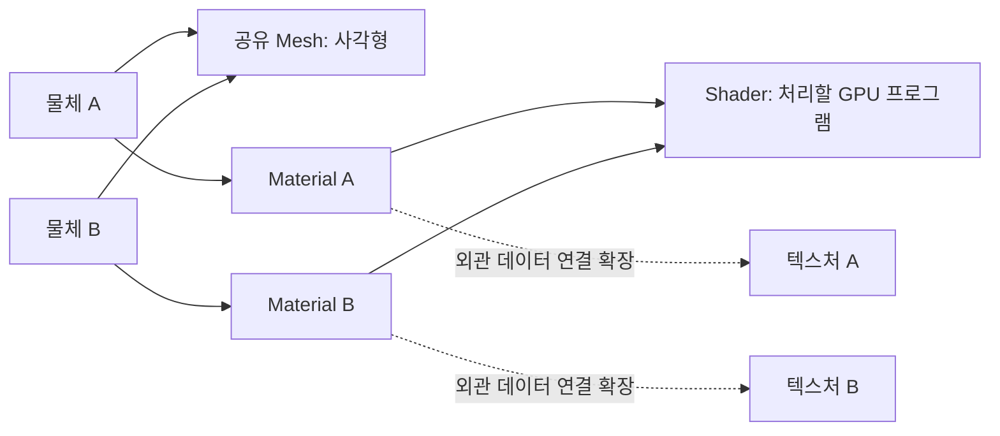

{{M0}}
{{M1}}
{{M2}}

같은 사각형 Mesh에 나무 그림을 붙이기도 하고 캐릭터 그림을 붙이기도 합니다. 모양은 같은데 외관을 바꾸려면 어떤 데이터를 교체해야 할까요? 반대로 새 텍스처 셰이더로 바꾼 뒤 그림이 깨졌다면, 텍스처 파일만 확인하면 될까요?

이번에는 이 두 질문을 함께 다룹니다. **Material은 어떤 셰이더와 데이터를 함께 선택할지 정하고, Input Layout은 정점의 바이트를 셰이더 입력으로 어떻게 읽을지 정합니다.** Texture를 추가하는 순간 둘의 연결을 모두 확인해야 합니다.

## 1. Material은 외관을 구성하는 선택을 모읍니다

게임에서 말하는 Material은 실제 물체의 재질을 흉내 낼 수도 있지만, 항상 물리 기반 조명이 필요한 것은 아닙니다. 텍스처를 그대로 표시하는 Unlit 스프라이트에도 Material을 둘 수 있습니다. 이번 출발점은 복잡한 금속·거칠기 계산보다, 어떤 Shader를 사용할지 묶는 것입니다.



나중에 같은 셰이더를 쓰면서 다른 텍스처만 선택할 수 있고, 같은 텍스처를 다른 셰이더로 표현할 수도 있습니다. 그래서 Shader 하나와 Material 하나가 항상 1:1로 대응해야 하는 것은 아닙니다.

## 2. 기존 DX11 단계는 Shader 참조부터 연결합니다

아래는 기존 Material 선언의 핵심입니다. `Data::albedo`에는 이미지 경로가 들어가지만, 경로 문자열을 저장하는 것과 GPU Texture를 로드하여 바인딩하는 것은 다른 작업입니다.

```c++
class Material : public Resource
{
public:
    struct Data { std::wstring albedo; };
    void SetShader(graphics::Shader* shader) { mShader = shader; }
    void Bind();

private:
    Data mData;
    graphics::Shader* mShader = nullptr;
};

void Material::Bind()
{
    if (mShader)
        mShader->Bind();
}
```

이 단계의 실동작은 Shader 선택입니다. albedo 경로를 읽어 Texture를 찾고 t0에 연결하는 코드, 렌더 모드에 맞춰 Blend·Depth를 선택하는 코드 등은 이후에 추가할 책임입니다. 선언만 보고 PBR이나 재질 저장·불러오기가 이미 완성되었다고 생각하지 않습니다.

`mShader`는 리소스 관리자가 소유한 Shader를 참조합니다. Material이 임의로 삭제하면 같은 Shader를 쓰는 다른 Material도 영향을 받습니다. 리소스 관리자가 Material 사용 중 Shader의 수명을 유지하는 구조로 연결합니다.

```c++
// 초기화: 등록된 Shader를 찾은 뒤 Material에 연결합니다.
auto* shader = Resources::Find<graphics::Shader>(L"TriangleShader");
if (!shader)
    throw std::runtime_error("TriangleShader was not loaded");
material.SetShader(shader);

// 렌더링: 이 Material이 선택한 Shader를 적용합니다.
material.Bind();
```

리소스를 찾는 이름은 등록한 키와 같아야 합니다. 그리고 Bind 이후에는 셰이더가 요구하는 정점 입력과 상수·텍스처도 준비되어야 합니다. 셰이더만 바꾸면 나머지 데이터도 자동으로 맞춰지지는 않습니다. 이 지점에서 Input Layout이 필요합니다.

## 3. UV를 구조체에 넣었는데 왜 셰이더가 읽지 못할까요?

기존 정점은 위치 12바이트와 색 16바이트, 합계 28바이트였습니다. 여기에 UV 8바이트를 추가하면 아래 예제의 정점은 36바이트가 됩니다. C++은 이 구조를 알지만 GPU는 단순한 버퍼 바이트만 받습니다. 새로 생긴 마지막 8바이트가 UV라는 설명을 추가해야 합니다.

{{M3}}

```c++
#include <DirectXMath.h>
#include <cstddef>

struct VertexColorUV
{
    DirectX::XMFLOAT3 position; // offset 0
    DirectX::XMFLOAT4 color;    // offset 12
    DirectX::XMFLOAT2 uv;       // offset 28
};
static_assert(sizeof(VertexColorUV) == 36);
static_assert(offsetof(VertexColorUV, uv) == 28);
```

여기서는 각 멤버가 이 위치에 놓입니다. 다른 정점 타입으로 바꾸거나 정렬 지정자를 붙이면 다시 확인해야 합니다. Input Layout은 구조체의 C++ 변수 이름이 아니라 **바이트 위치·형식·HLSL semantic**을 연결합니다.

## 4. 세 요소를 VS 입력에 대응시킵니다

```c++
const D3D11_INPUT_ELEMENT_DESC elements[] = {
    {"POSITION", 0, DXGI_FORMAT_R32G32B32_FLOAT, 0,
     static_cast<UINT>(offsetof(VertexColorUV, position)),
     D3D11_INPUT_PER_VERTEX_DATA, 0},
    {"COLOR", 0, DXGI_FORMAT_R32G32B32A32_FLOAT, 0,
     static_cast<UINT>(offsetof(VertexColorUV, color)),
     D3D11_INPUT_PER_VERTEX_DATA, 0},
    {"TEXCOORD", 0, DXGI_FORMAT_R32G32_FLOAT, 0,
     static_cast<UINT>(offsetof(VertexColorUV, uv)),
     D3D11_INPUT_PER_VERTEX_DATA, 0},
};
```

이 배열의 요소 수는 3입니다. 정점이 세 개라는 뜻이 아니라, 정점 하나에서 읽을 속성이 POSITION·COLOR·TEXCOORD 세 개라는 뜻입니다. 사각형 정점 네 개를 사용해도 이 배열의 요소 수는 여전히 3입니다.

InputSlot은 모두 0입니다. 세 속성이 한 버퍼에 함께 들어 있기 때문입니다. SemanticIndex가 0이므로 TEXCOORD0에 대응합니다. 나중에 TEXCOORD1을 추가하면 같은 이름과 다른 인덱스로 구별합니다. 일반 정점 데이터는 PER_VERTEX_DATA와 StepRate=0을 사용합니다. 인스턴스 데이터의 StepRate는 같은 요소를 몇 인스턴스 동안 쓸지 정하는 값이며, 총 그릴 인스턴스 개수가 아닙니다.

HLSL 입력도 세 항목을 받도록 맞춥니다. 다음은 카메라 변환을 생략하고 입력 위치를 클립 좌표로 사용하는 작은 실습 셰이더입니다.

```c++
// HLSL: Vertex Shader
struct VSInput
{
    float3 position : POSITION;
    float4 color : COLOR;
    float2 uv : TEXCOORD0;
};
struct VSOutput
{
    float4 position : SV_Position;
    float4 color : COLOR;
    float2 uv : TEXCOORD0;
};
VSOutput main(VSInput input)
{
    VSOutput output;
    output.position = float4(input.position, 1);
    output.color = input.color;
    output.uv = input.uv;
    return output;
}
```

정점의 UV가 출력에 전달되어야 래스터라이저가 삼각형 내부에서 UV를 보간해 PS로 보냅니다. Input Layout만 추가하고 VS에서 UV를 출력하지 않으면 텍스처를 읽을 좌표가 다음 단계로 이어지지 않습니다.

## 5. Layout 생성에는 왜 VS Blob이 필요할까요?

```c++
// device는 유효한 ID3D11Device*, shader는 로딩에 성공한 Shader입니다.
auto vsCode = shader->GetVSBlob();
if (!vsCode)
    throw std::runtime_error("Missing VS bytecode");

Microsoft::WRL::ComPtr<ID3D11InputLayout> layout;
HRESULT hr = device->CreateInputLayout(elements, 3,
    vsCode->GetBufferPointer(), vsCode->GetBufferSize(),
    layout.GetAddressOf());
if (FAILED(hr))
    throw std::runtime_error("Input layout creation failed");
```

VS 바이트코드에는 어떤 입력을 받는지 나타내는 입력 시그니처가 있습니다. CreateInputLayout은 우리가 적은 요소 설명과 그 시그니처를 함께 사용합니다. PS Blob을 넘기거나, UV가 필요한 VS에 다른 레이아웃을 연결하면 생성과 실행 과정에서 문제가 드러납니다. `<d3d11.h>`, `<wrl/client.h>`, `<stdexcept>`를 포함하고 HRESULT를 확인합니다.

생성 성공은 실제 정점 버퍼의 stride까지 모두 자동 검증했다는 뜻이 아닙니다. 버퍼를 바인딩할 때도 새 크기를 사용해야 합니다.

```c++
UINT stride = sizeof(VertexColorUV); // 36
UINT offset = 0;
ID3D11Buffer* buffer = vertexBuffer.Get();
context->IASetInputLayout(layout.Get());
context->IASetVertexBuffers(0, 1, &buffer, &stride, &offset);
```

옛 stride인 28을 남기면 다음 정점을 읽을 때 이전 정점의 UV 위치에서 출발합니다. 그 결과 색뿐 아니라 도형 위치까지 깨질 수 있습니다. 구조체·Layout·stride·VS 입력을 한 줄로 이어서 확인해야 하는 이유입니다.

## 6. Material을 바꾸는 실험과 Layout을 확인하는 실험

Texture와 Sampler가 연결된 픽셀 셰이더에서 `Sample`한 색에 정점 색을 곱하면, 정점 색이 모두 흰색일 때 원본 이미지를 그대로 표시할 수 있습니다.

```c++
// HLSL: Pixel Shader의 핵심 부분
Texture2D imageTexture : register(t0);
SamplerState imageSampler : register(s0);
float4 main(float4 position : SV_Position, float4 color : COLOR,
            float2 uv : TEXCOORD0) : SV_Target
{
    return imageTexture.Sample(imageSampler, uv) * color;
}
```

먼저 동일한 Mesh에 서로 다른 Shader를 선택한 Material을 적용해 보세요. 한쪽은 UV를 색으로 출력하고, 다른 쪽은 이미지를 Sample하도록 합니다. 위치는 같고 내부 표현만 바뀌면 Material의 프로그램 선택이 연결된 것입니다.

UV 확인용 PS가 `float4(uv,0,1)`을 반환하도록 했을 때 왼쪽에서 오른쪽으로 빨강, 위에서 아래로 초록이 증가한다면 UV 전달은 정상입니다. 이 상태에서 Sample할 때만 검다면 t0 SRV와 s0 Sampler, 파일 로드를 살펴봅니다. UV부터 깨진다면 텍스처 파일보다 정점 메모리와 Layout을 먼저 확인합니다.

이제 외관을 고르는 Material과 정점 해석을 담당하는 Input Layout을 구분할 수 있습니다. 다음 SpriteRenderer는 이 재료들을 GameObject의 Transform과 함께 묶어 실제 Draw까지 연결합니다.

[Microsoft: Input Element의 각 필드](https://learn.microsoft.com/en-us/windows/win32/api/d3d11/ns-d3d11-d3d11_input_element_desc)
