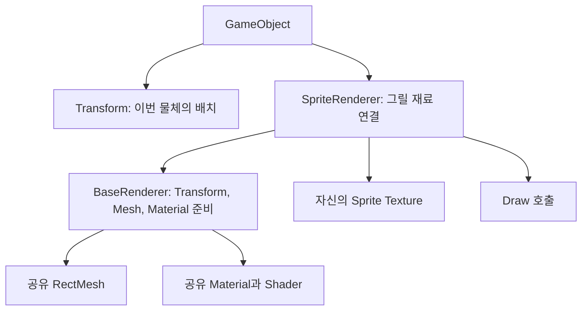

{{M0}}
{{M1}}

Mesh, Shader, Texture, Material, Transform을 각각 만들었습니다. 이제 캐릭터 오브젝트 하나를 화면에 표시할 때 이 재료들을 누가 연결해야 할까요? GameObject마다 DirectX 코드를 직접 작성하면 같은 준비 순서가 여러 곳에 반복됩니다. **SpriteRenderer 컴포넌트가 공통 렌더링 준비를 수행하고, 자신의 이미지를 선택한 뒤 Draw를 호출하도록** 연결하겠습니다.

스프라이트를 GPU에 그리는 기본 모양은 사각형 Mesh입니다. 네 정점에 UV를 넣고 두 삼각형으로 연결한 뒤, 픽셀 셰이더가 텍스처를 읽습니다. ‘2D 이미지’도 우리가 앞에서 만든 정점·상수 버퍼와 셰이더 경로를 그대로 사용합니다.

## 1. GameObject, Renderer, 리소스의 책임을 나눕니다



두 캐릭터가 같은 Mesh와 Material을 공유해도 Transform과 Sprite Texture는 서로 다를 수 있습니다. 그렇다고 SpriteRenderer가 Mesh를 복사하거나 공유 리소스를 삭제하면 안 됩니다. 리소스 관리자가 공통 재료를 소유하고, Renderer는 그것을 참조하는 구조입니다.

{{M2}}

이 엔진의 SpriteRenderer는 `Component`를 직접 새로 구현하는 대신 **`BaseRenderer`를 상속**합니다. BaseRenderer는 다른 종류의 렌더러에서도 필요한 Transform·Mesh·Material 연결을 맡고, SpriteRenderer는 스프라이트 이미지 선택을 더합니다.

## 2. Initialize에서 기본 Mesh와 Material을 찾습니다

다음은 DX11 시점부터 이어진 실제 초기화 코드입니다. 등록한 리소스 키를 통해 공통 사각형과 기본 재질을 가져옵니다.

```c++
void SpriteRenderer::Initialize()
{
    BaseRenderer::Initialize();
    Mesh* mesh = Resources::Find<Mesh>(L"RectMesh");
    Material* material = Resources::Find<Material>(L"Sprite-Default-Material");
    SetMesh(mesh);
    SetMaterial(material);
}
```

Initialize에서 매번 사각형을 새로 만들지 않습니다. 이미 생성된 `RectMesh`를 찾습니다. Mesh와 Material이 먼저 로드되고 Renderer가 초기화되는 순서여야 합니다. 키가 틀리거나 리소스가 아직 준비되지 않았다면 기대한 재료를 얻을 수 없습니다.

이 함수는 자기 Sprite Texture까지 고르지는 않습니다. `SetSprite`로 캐릭터·배경 등 오브젝트에 맞는 텍스처를 지정합니다. 공통 재료와 오브젝트별 선택을 나눈 것입니다.

## 3. Render를 호출하는 카메라의 행렬을 받습니다

[DX11 기준 코드: 8b4ed4a의 SpriteRenderer](https://github.com/eazuooz/YamYam_Engine/blob/8b4ed4a/YamYamEngine_SOURCE/yaSpriteRenderer.cpp)

```c++
void SpriteRenderer::Render(const Matrix& view, const Matrix& projection)
{
    BaseRenderer::Render(view, projection);
    if (mSprite)
        mSprite->Bind(eShaderStage::PS, (UINT)eTextureType::Sprite);
    BaseRenderer::Draw();
}
```

짧지만 순서가 중요합니다. 먼저 BaseRenderer가 공통 입력을 준비하고, 그다음 스프라이트 텍스처를 바인딩한 뒤 Draw합니다. Draw 이후 텍스처를 선택하면 이미 제출한 Draw의 입력을 뒤늦게 바꾸는 것이 되므로 이번 물체에 적용되지 않습니다.

함수 인자의 `view`, `projection`은 **이번 물체를 보는 카메라**의 행렬입니다. 전역 MainCamera의 행렬을 함수 안에서 고정해 읽으면, Scene 카메라로 그려도 Game 카메라 시점이 적용될 수 있습니다. 카메라별로 Render를 호출하면서 행렬을 전달하면 같은 Sprite를 다른 시점에서 그릴 수 있습니다.

## 4. BaseRenderer 안의 세 연결을 따라갑니다

[DX11 기준 코드: BaseRenderer](https://github.com/eazuooz/YamYam_Engine/blob/8b4ed4a/YamYamEngine_SOURCE/yaBaseRenderer.cpp)

```c++
void BaseRenderer::Render(const Matrix& view, const Matrix& projection)
{
    Transform* tr = GetOwner()->GetComponent<Transform>();
    if (tr)
        tr->Bind(view, projection);
    if (mMesh)
        mMesh->Bind();
    if (mMaterial)
        mMaterial->BindShader();
}

void BaseRenderer::Draw()
{
    if (mMesh)
        graphics::GetDevice()->DrawIndexed(mMesh->GetIndexCount(), 0, 0);
}
```

Transform은 소유 GameObject에서 가져옵니다. 같은 Mesh를 사용해도 이 값이 물체마다 다르므로 각각 Draw 전에 갱신합니다. Mesh::Bind는 VB·IB·Topology를 선택합니다. Material::BindShader는 외관을 계산할 셰이더를 선택합니다. 마지막 Draw는 Mesh가 가진 실제 인덱스 개수를 사용하므로 사각형이라면 여섯 인덱스를 읽습니다.

이 단계의 Material API는 앞의 최초 클래스 설계에서 더 진행된 `BindShader`를 사용합니다. 이름이 바뀌어도 ‘외관에 사용할 프로그램을 선택한다’는 책임은 이어집니다. DX12에서는 이 경로에 PSO 선택도 연결됩니다.

## 5. Transform이 셰이더에 보내는 것은 세 행렬입니다

현재 저장소에서도 Transform은 다음과 같이 World와 전달받은 카메라 행렬을 한 데이터에 담습니다.

```c++
graphics::TransformCB cbData = {};
cbData.World = mWorldMatrix;
cbData.View = view;
cbData.Projection = projection;

graphics::ConstantBuffer* cb = renderer::constantBuffers[CBSLOT_TRANSFORM];
cb->SetData(&cbData);
cb->Bind(eShaderStage::All);
```

World는 이 물체가 장면 어디에 놓였는지, View는 이번 카메라를 기준으로 어떻게 볼지, Projection은 카메라의 시야와 원근을 어떻게 표현할지 나타냅니다. 정점 셰이더는 한 정점에 이 변환을 차례로 적용합니다.

```c++
// HLSL: 현재 ConstantBuffers.hlsli의 선언
cbuffer Transform : register(b0)
{
    row_major matrix WorldMatrix;
    row_major matrix ViewMatrix;
    row_major matrix ProjectionMatrix;
}

// SpriteDefaultVS.hlsl의 위치 계산 부분
float4 pos = mul(float4(input.pos, 1.0f), WorldMatrix);
float4 viewPos = mul(pos, ViewMatrix);
float4 projPos = mul(viewPos, ProjectionMatrix);
output.pos = projPos;
output.color = input.color;
output.uv = input.uv;
```

현재 기준 코드는 C++의 행렬을 그대로 복사하고 HLSL에서 `row_major`로 읽으며, 벡터를 왼쪽에 두어 곱합니다. 여기에 근거 없이 Transpose를 한 번 더 넣으면 같은 변환이 아닙니다. 저장 순서와 곱셈 방향을 대응 코드끼리 확인해야 합니다. 이 강의의 목적은 행렬 공식을 다시 유도하는 것보다 **물체의 World와 카메라의 View·Projection이 이번 Draw에 함께 전달되는 위치**를 찾는 것입니다.

[현재 Transform 코드](https://github.com/eazuooz/YamYam_Engine/blob/ce56f16dd7a40fd2b4bf03c680790e5b637c7530/YamYamEngine_CORE/yaTransform.cpp) · [대응 HLSL 상수 선언](https://github.com/eazuooz/YamYam_Engine/blob/ce56f16dd7a40fd2b4bf03c680790e5b637c7530/Shaders_SOURCE/ConstantBuffers.hlsli)

## 6. 현재 DX12 코드에서는 이미지가 없을 때도 입력을 정합니다

앞의 DX11 코드에서 mSprite가 없으면 텍스처 바인딩을 건너뜁니다. Context나 command list의 이전 입력이 남아 있으면, 다음 스프라이트가 앞서 사용한 이미지를 읽는 문제가 생길 수 있습니다. 현재 구현은 이미지가 없을 때 `DefaultWhiteTexture`를 선택합니다.

```c++
// ce56f16: 현재 SpriteRenderer::Render
void SpriteRenderer::Render(const Matrix& view, const Matrix& projection)
{
    BaseRenderer::Render(view, projection);
    Texture* texture = mSprite ? mSprite
        : Resources::Find<Texture>(L"DefaultWhiteTexture");
    if (texture)
        texture->Bind(eShaderStage::PS, UINT(eTextureType::Sprite));
    BaseRenderer::Draw();
}
```

기본 흰 텍스처가 리소스 초기화에서 생성되어 있다는 전제입니다. 흰색을 곱하면 정점 색을 그대로 유지할 수 있어, 이미지가 없는 경우의 기본 입력으로 사용할 수 있습니다. 이미지가 필요 없다는 이유로 상태를 선택하지 않는 것과는 동작이 다릅니다.

현재 DX12 픽셀 셰이더는 `t0`의 이미지와 `s0`의 Sampler를 읽습니다. 실제 사용 중인 `SpriteDefaultPS.hlsl`의 선언을 기준으로 C++ 바인딩 경로를 따라갑니다.

```c++
// HLSL: 현재 SpriteDefaultPS.hlsl의 핵심
Texture2D sprite : register(t0);
SamplerState spriteSampler : register(s0);

float4 main(VSOutput input) : SV_Target
{
    float4 color = sprite.Sample(spriteSampler, input.uv) * input.color;
#if defined(YA_ALPHA_TEST)
    clip(color.a - 0.01f);
#endif
    return color;
}
```

`VSOutput`은 VS가 전달한 위치·색·UV를 받는 입력 구조체입니다. Sample 결과에 정점 색을 곱하고 반환합니다. CutOut용 컴파일에서 `YA_ALPHA_TEST`가 켜지면 알파가 0.01보다 작은 부분은 버립니다. 반투명 색을 섞는 작업과 일부 픽셀을 아예 버리는 작업이 다른 이유는 다음 렌더 상태 강의에서 그림으로 비교합니다.

현재 BaseRenderer::Draw는 DX12의 `DrawIndexedInstanced(indexCount,1,0,0,0)`으로 연결됩니다. 인스턴스 개수 1이므로 이 호출 하나가 여러 Sprite를 자동으로 배치하는 기능은 아닙니다.

[현재 SpriteRenderer](https://github.com/eazuooz/YamYam_Engine/blob/ce56f16dd7a40fd2b4bf03c680790e5b637c7530/YamYamEngine_CORE/yaSpriteRenderer.cpp) · [현재 Sprite PS](https://github.com/eazuooz/YamYam_Engine/blob/ce56f16dd7a40fd2b4bf03c680790e5b637c7530/Shaders_SOURCE/SpriteDefaultPS.hlsl)

## 같은 Sprite로 연결을 확인해 봅시다

같은 RectMesh와 Material을 쓰는 오브젝트 두 개에 서로 다른 Texture를 지정합니다. 위치만 바꾸면 이미지는 그 물체를 따라 움직이고, Texture만 교체하면 사각형의 모양은 유지한 채 그림이 바뀌어야 합니다. 다음에는 Scene 카메라만 움직여 Game 화면과 시점이 분리되는지 확인합니다. 각각 Transform, Texture, 카메라 행렬 전달을 확인하는 실험입니다.

Tint, Flip, Sprite Atlas, 9-slice 같은 기능은 이 기본 흐름 위에 추가할 수 있습니다. 예를 들어 Tint를 넣으려면 CPU 색 데이터와 대응 상수 버퍼, PS의 곱셈을 연결해야 하고, Atlas는 선택 영역에 맞게 UV를 바꾸어야 합니다. 함수 이름이나 필드만 추가한다고 렌더링이 바뀌지는 않습니다. 먼저 이번 글의 **공통 재료 준비 → 이미지 선택 → Draw**가 완성되었는지 확인한 뒤 필요한 기능을 하나씩 늘려 가겠습니다.
