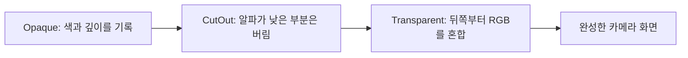

{{M0}}
{{M1}}

반투명한 빨강 사각형을 파랑 사각형 앞에 그린다고 생각해 봅시다. 픽셀 셰이더에서 알파를 0.5로 반환하기만 하면 뒤의 파랑이 자동으로 비칠까요? 삼각형의 정점 순서를 뒤집었더니 사라지는 현상도 같은 이유일까요?

이번에는 셰이더 바깥의 세 상태를 연결합니다. **Rasterizer는 도형의 면과 채우는 방식을, Depth/Stencil은 통과할 위치를, Blend는 새 색과 기존 색을 섞는 방식을** 정합니다. 서로 다른 문제이므로 각각 값을 바꿔 화면으로 확인하겠습니다.

## 1. Rasterizer: 이 삼각형을 면으로 채울까요, 선으로 볼까요?

정점 셰이더가 클립 위치를 출력하면 래스터라이저는 클리핑, w로 나누는 원근 나눗셈, 화면 좌표 변환, 커버리지 계산으로 이어갑니다. 클립 좌표 `(x,y,z,w)`의 xyz를 w로 나누며, Direct3D의 가시 NDC 범위는 x·y가 -1~1, z가 0~1입니다. 정점 사이의 UV와 색도 픽셀 셰이더 입력으로 보간됩니다.

래스터라이저의 기본 알고리즘을 HLSL로 작성하는 것은 아니지만 상태는 선택할 수 있습니다. 아래는 일반적인 면 채우기와 뒷면 제거 상태를 만드는 DX11 예제입니다. 유효한 `device`·`context`와 HRESULT를 검사하는 `Check` 함수가 있다고 가정합니다.

```c++
D3D11_RASTERIZER_DESC rs{};
rs.FillMode = D3D11_FILL_SOLID;
rs.CullMode = D3D11_CULL_BACK;
rs.FrontCounterClockwise = FALSE;
rs.DepthClipEnable = TRUE;

Microsoft::WRL::ComPtr<ID3D11RasterizerState> solidBack;
Check(device->CreateRasterizerState(&rs, solidBack.GetAddressOf()));
context->RSSetState(solidBack.Get());
```

`FillMode=SOLID`는 삼각형 내부를 채웁니다. WIREFRAME은 삼각형의 변을 따라 그립니다. `CullMode=BACK`은 설정한 앞면 방향과 반대인 면을 제거합니다. 위 설정에서는 화면상 시계 방향 정점 순서가 앞면입니다. 왼손·오른손 좌표계를 선택했다는 사실만으로 winding이 자동 결정되는 것은 아닙니다.

여기서 뒷면 제거와 깊이 검사를 구분해야 합니다. 종이를 뒤집었을 때 그 면을 버릴지는 CullMode의 문제이고, 앞에 놓인 다른 종이가 가렸는지는 Depth의 문제입니다. Wireframe으로 바꾸어도 깊이 검사가 켜져 있으면 뒤쪽 선이 가려질 수 있습니다.

상태 객체는 생성 후 불변입니다. `rs.FillMode`만 바꾸어도 이미 만든 solidBack이 바뀌지는 않습니다. 다른 desc로 새 상태를 만들고 그 객체를 선택해야 합니다. Wireframe 강의에서 같은 사각형을 SOLID와 WIREFRAME으로 비교합니다.

{{M2}}

## 2. Output Merger: 계산한 색이 그대로 저장되는 것은 아닙니다

{{M3}}

픽셀 셰이더가 색을 반환해도 깊이·스텐실 조건을 통과하지 못하면 그 색은 렌더 타겟에 반영되지 않을 수 있습니다. 통과한 경우에는 Blend 설정에 따라 기존 색과 섞고, 쓰기 마스크가 허용하는 성분에 기록합니다. 깊이 검사가 실제 GPU에서 PS보다 먼저 수행될 수 있는 경우도 있으므로, 아래 설명은 결과를 이해하기 위한 논리적 관계입니다.

## 3. Blend: 새 색과 이미 그린 색을 섞습니다

{{M4}}
{{M5}}

새 픽셀 셰이더 출력이 Source, 렌더 타겟에 이미 저장된 색이 Destination입니다. 일반적인 비 premultiplied 알파 입력의 RGB 합성은 다음과 같습니다.

```text
새 RGB = Source.rgb × Source.a + Destination.rgb × (1 − Source.a)
```

파랑 `(0,0,1)` 위에 알파 0.5인 빨강 `(1,0,0)`을 그리면 결과는 `(0.5,0,0.5)`입니다. 새 빨강의 절반과 이미 있던 파랑의 절반을 더한 값입니다. 알파가 0이면 기존 RGB만 남고, 1이면 새 RGB가 덮습니다.

중요한 점은 **알파가 들어 있다고 이 식이 자동으로 적용되지는 않는다**는 것입니다. BlendEnable이 꺼져 있으면 PS가 반환한 RGB를 그대로 쓰며, 출력 알파는 쓰기 마스크가 허용할 경우 알파 채널에 저장될 뿐입니다.

```c++
D3D11_BLEND_DESC blend{};
auto& rt = blend.RenderTarget[0];
rt.BlendEnable = TRUE;
rt.SrcBlend = D3D11_BLEND_SRC_ALPHA;
rt.DestBlend = D3D11_BLEND_INV_SRC_ALPHA;
rt.BlendOp = D3D11_BLEND_OP_ADD;
rt.SrcBlendAlpha = D3D11_BLEND_ONE;
rt.DestBlendAlpha = D3D11_BLEND_ZERO;
rt.BlendOpAlpha = D3D11_BLEND_OP_ADD;
rt.RenderTargetWriteMask = D3D11_COLOR_WRITE_ENABLE_ALL;

Microsoft::WRL::ComPtr<ID3D11BlendState> alphaBlend;
Check(device->CreateBlendState(&blend, alphaBlend.GetAddressOf()));
context->OMSetBlendState(alphaBlend.Get(), nullptr, 0xffffffff);
```

RGB용 계수와 알파용 계수는 따로 있습니다. 위 RGB는 방금 계산한 반투명 식이고, 알파는 `Source.a×1 + Destination.a×0`이므로 **새 출력 알파가 그대로 저장**됩니다. 이것은 기존 알파까지 누적하는 SrcOver 알파 식과 다릅니다. YamYam에서 유지해 온 정책을 읽을 때 이 차이가 중요합니다.

`RenderTargetWriteMask`를 0으로 남기면 계산이 끝나도 색이 기록되지 않습니다. `0xffffffff`는 모든 샘플을 허용하는 sample mask이며 상수 투명도 값이 아닙니다. 이 예제의 blend factor는 SrcAlpha이므로 `OMSetBlendState`의 별도 BlendFactor 배열을 사용하지 않습니다.

{{M6}}

별도 Blend 상태를 설정하지 않는 기본 상태에서는 블렌딩이 꺼져 있습니다. 아래 기본값 그림과 방금 만든 알파 블렌드의 차이를 비교해 보세요.

{{M7}}

### 순서를 바꾸면 결과가 달라집니다

검정 배경에 알파 0.5인 파랑을 먼저 그리면 `(0,0,0.5)`입니다. 그 위에 알파 0.5인 빨강을 그리면 `(0.5,0,0.25)`가 됩니다. 순서를 바꾸면 `(0.25,0,0.5)`가 됩니다. 같은 두 물체인데 마지막에 그린 색의 비중이 더 큽니다.

그래서 일반적인 반투명 물체는 카메라에서 먼 것부터 가까운 것 순서로 그려 뒤의 색 위에 앞의 색을 쌓습니다. 같은 Material끼리 묶겠다고 이 순서를 바꾸면 합성 결과도 달라집니다. 물체 중심 거리 정렬은 간단한 방법이지만, 큰 메시가 서로 교차하는 경우의 정확한 픽셀 순서까지 해결하지는 못합니다.

## 4. Depth: 앞에 있는 불투명 표면이 뒤를 가립니다

색과 별도로 깊이 버퍼는 그 위치에서 통과한 표면의 깊이를 보관합니다. 일반적인 깊이 설정은 가까운 값을 작게 두고, 새 깊이가 저장된 값보다 가까울 때 통과시킵니다. 이 값은 투영된 깊이이며 월드 공간 거리 자체는 아닙니다.

{{M8}}

```c++
D3D11_DEPTH_STENCIL_DESC depth{};
depth.DepthEnable = TRUE;
depth.DepthWriteMask = D3D11_DEPTH_WRITE_MASK_ALL;
depth.DepthFunc = D3D11_COMPARISON_LESS_EQUAL;
depth.StencilEnable = FALSE;
depth.StencilReadMask = D3D11_DEFAULT_STENCIL_READ_MASK;
depth.StencilWriteMask = D3D11_DEFAULT_STENCIL_WRITE_MASK;
depth.FrontFace.StencilFailOp = D3D11_STENCIL_OP_KEEP;
depth.FrontFace.StencilDepthFailOp = D3D11_STENCIL_OP_KEEP;
depth.FrontFace.StencilPassOp = D3D11_STENCIL_OP_KEEP;
depth.FrontFace.StencilFunc = D3D11_COMPARISON_ALWAYS;
depth.BackFace = depth.FrontFace;

Microsoft::WRL::ComPtr<ID3D11DepthStencilState> opaqueDepth;
Check(device->CreateDepthStencilState(&depth, opaqueDepth.GetAddressOf()));
context->OMSetDepthStencilState(opaqueDepth.Get(), 0);
```

`DepthFunc`는 읽은 깊이를 어떻게 비교할지, `DepthWriteMask`는 통과한 깊이를 저장할지 정합니다. **검사와 쓰기는 다른 스위치**입니다. 예를 들어 반투명 물체를 불투명 벽 뒤에서는 가리되 다른 반투명 물체의 깊이를 덮어쓰지 않게 하려면, 비교는 유지하고 쓰기만 ZERO로 설정합니다.

LESS_EQUAL은 같은 깊이도 통과시킵니다. 깊이 정밀도가 부족해서 비슷한 면이 깜빡이는 Z-fighting을 자동으로 해결하는 옵션은 아닙니다. 두 면을 어떻게 배치하고 깊이 정밀도를 어떻게 사용하는지도 봐야 합니다.

### Stencil은 위치별 정수 표시를 검사합니다

Stencil은 깊이와 별개의 정수 값을 저장해 마스크로 사용할 수 있습니다. 예를 들어 첫 패스에서 선택한 물체 영역에 1을 쓰고, 두 번째 패스에서 그 영역 밖만 그리도록 검사하면 아웃라인을 구성할 수 있습니다. 비교값인 StencilRef와 Pass·Fail 때의 연산, 읽기·쓰기 마스크를 함께 정해야 합니다. 이번 기본 상태는 Stencil을 끄므로 이 마스킹을 수행하지 않습니다.

기본 상태와 비교하면 이번 예제는 깊이 비교를 LESS에서 LESS_EQUAL로 선택했다는 차이가 있습니다.

{{M9}}

## 5. Opaque, CutOut, Transparent를 하나의 화면으로 이해합니다

앞에서 만든 상태를 따로 외우기보다, 사각형 세 장을 떠올려 보겠습니다. 벽은 Opaque, 잎의 빈 공간을 뚫는 나뭇잎은 CutOut, 뒤가 비치는 유리는 Transparent입니다.



Opaque는 Blend를 끄고 깊이를 검사·기록합니다. 뒤의 벽이 먼저 그려져도 가까운 벽이 깊이 검사를 통과해 가릴 수 있습니다. 앞쪽부터 정렬하면 가려질 부분의 일을 줄일 수 있지만 실제 이득은 장면과 GPU에 따라 확인합니다.

CutOut도 남은 부분은 불투명하게 그리고 깊이를 씁니다. 대신 PS에서 알파가 낮은 픽셀을 버립니다. 현재 Sprite PS의 조건은 다음과 같습니다.

```c++
// HLSL: YA_ALPHA_TEST를 정의한 CutOut 셰이더의 처리
float4 color = sprite.Sample(spriteSampler, input.uv) * input.color;
clip(color.a - 0.01f);
return color;
```

알파가 0.01보다 작으면 `clip` 인자가 음수가 되어 해당 픽셀을 버립니다. 그 빈 공간은 뒤의 물체가 보일 수 있습니다. 남은 알파 0.5 픽셀이 자동으로 절반 투명해지는 것은 아닙니다. Blend가 꺼져 있으면 통과한 RGB는 불투명하게 기록됩니다. CutOut과 Transparent가 다른 이유입니다.

### 일반적인 3D 반투명과 YamYam의 복구 정책

일반적인 3D 유리는 깊이 비교를 유지하고 쓰기만 끈 뒤, 먼 것부터 합성합니다. 그러면 불투명 벽 뒤의 유리는 가려집니다. 그러나 **현재 YamYam DX12에서 복구한 기존 정책은 Transparent의 비교가 Always이고 깊이 쓰기가 꺼져 있습니다.** 이 정책에서는 뒤쪽 반투명도 불투명 물체 위에 겹쳐질 수 있습니다.

| 현재 YamYam 모드 | 처리 순서 | RGB Blend | 깊이 비교 | 깊이 쓰기 |
| --- | --- | --- | --- | --- |
| Opaque | 카메라에서 가까운 것부터 | 끔 | LessEqual | 켬 |
| CutOut | Opaque 뒤, 가까운 것부터 | 끔 + 알파 clip | LessEqual | 켬 |
| Transparent | 마지막, 먼 것부터 | SrcAlpha / InvSrcAlpha | Always | 끔 |

이 표는 ‘모든 3D 엔진의 정답’이 아니라 이전 DX11 동작을 살린 현재 엔진의 선택입니다. 투명 렌더링을 수정할 때는 정렬 함수만 보지 말고 PS의 clip, Blend 계수, 깊이 비교·쓰기까지 함께 비교해야 화면이 달라지는 이유를 설명할 수 있습니다.

## 6. Draw 직전 상태가 실제로 선택되었는지 봅니다

```c++
// DX11에서 하나의 렌더 패스를 준비하는 예
context->RSSetState(solidBack.Get());
context->OMSetDepthStencilState(opaqueDepth.Get(), 0);
context->OMSetBlendState(nullptr, nullptr, 0xffffffff); // 기본 불투명
// Mesh·Shader·상수·Texture 선택 후 불투명 Draw

// 반투명 패스에서는 별도로 만든 깊이 상태와 alphaBlend를 선택
// Material::Bind가 상태를 다시 바꾼다면 최종 선택 시점까지 확인합니다.
```

상태를 설정해 놓고 그 뒤 Material 바인딩이 다른 상태를 선택하면, Draw는 마지막 설정을 사용합니다. 상태 생성 코드만 맞는데 화면이 기대와 다르면 **실제 Draw 바로 앞의 바인딩 순서**를 살펴보세요. DX12에서는 이 상태 조합을 PSO에 담으므로 Material 모드에 맞는 PSO를 선택해야 합니다.

## 세 가지 실험으로 확인해 봅시다

먼저 삼각형 인덱스 순서를 뒤집고 CullMode를 BACK과 NONE으로 비교합니다. 이것은 면 방향의 실험입니다. 다음에는 같은 불투명 사각형 두 장의 Draw 순서를 바꾸어도 가까운 쪽이 보이는지 확인합니다. 이것은 깊이 검사·쓰기의 실험입니다. 마지막에는 반투명 빨강과 파랑의 Draw 순서를 뒤집어 색 비중이 달라지는지 확인합니다. 이것은 Blend의 실험입니다.

카메라가 별도 RT에 그린 결과를 ImGui::Image로 표시할 때는 RT의 알파가 UI 합성에 다시 사용된다는 점도 확인해야 합니다. 이미 섞인 RGB에 알파가 다시 곱해져 어두워지는 문제와, 현재 엔진의 표시용 SRV 처리까지는 <mention-page url="https://www.notion.so/3dc0b1ffa61e8153b02fd321cc48e655"/>에서 실제 DX12 코드로 이어갑니다.
