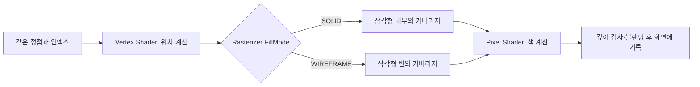

사각형을 화면에 그렸다고 생각해 봅시다. 겉으로는 파란 면 하나지만, GPU에 전달한 데이터는 보통 삼각형 두 개입니다. 면이 채워져 있을 때는 그 경계를 알아보기 어렵습니다. 모델의 정점이 잘못 연결되었거나 삼각형이 지나치게 촘촘하다면, 완성된 색상만 보고 원인을 찾기도 어렵습니다.

이번에는 **정점 데이터는 그대로 두고 삼각형의 변만 그려서**, GPU가 어떤 삼각형을 처리하고 있는지 보이게 만들어 보겠습니다. 이것이 Wireframe 모드입니다.

## 1. 사각형에서 대각선이 보이는 이유

{{WIRE_IMAGE}}

위 그림의 사각형은 v0, v1, v2, v3 네 정점을 사용합니다. 인덱스 버퍼에 `0, 1, 2, 0, 2, 3`을 넣으면 앞의 세 번호가 삼각형 하나, 뒤의 세 번호가 또 다른 삼각형 하나를 만듭니다. 두 삼각형 모두 v0와 v2를 사용하므로 사각형 가운데에 **공유하는 변**이 있습니다.

Solid 모드에서는 각 삼각형의 내부를 같은 색으로 채웁니다. 두 면이 이어져 있으니 우리 눈에는 하나의 사각형으로 보입니다. Wireframe 모드에서는 각각의 삼각형의 변을 그리므로 외곽선뿐 아니라 v0–v2 대각선도 나타납니다.

따라서 Wireframe은 “물체의 바깥 윤곽선만 그리는 기능”과 다릅니다. 모델이 삼각형으로 어떻게 나뉘어 있는지를 보여 줍니다. 캐릭터 얼굴에 선이 많이 모여 있다면 그 부분의 삼각형이 조밀하다는 뜻이고, 예상하지 못한 곳으로 긴 선이 뻗는다면 정점 위치나 인덱스 연결을 의심할 수 있습니다.

```c++
// 그림의 두 삼각형. 정점의 실제 위치는 기존 Vertex Buffer에 있습니다.
const uint32_t indices[] = { 0, 1, 2, 0, 2, 3 };
```

Wireframe을 켠다고 이 인덱스를 선 목록으로 다시 만들지는 않습니다. `TRIANGLELIST`와 같은 기존 삼각형 topology를 그대로 사용합니다.

## 2. 바꿀 곳은 Rasterizer입니다

먼저 GPU가 이 삼각형을 화면에 표시하는 과정을 짧게 따라가 보겠습니다. Vertex Shader는 정점을 화면에 투영할 수 있는 위치로 바꿉니다. 다음 Rasterizer는 변환된 삼각형이 화면의 어느 샘플을 덮는지 정합니다. Pixel Shader는 그 부분에 사용할 색을 계산합니다.



이 흐름을 보면 왜 정점 셰이더나 메시를 다시 만들 필요가 없는지 알 수 있습니다. 위치를 계산하는 과정은 같습니다. **화면에서 삼각형의 어느 부분을 그릴지**를 정하는 Rasterizer의 FillMode만 달라집니다.

Pixel Shader도 원래 셰이더를 그대로 사용할 수 있습니다. 다만 텍스처의 색이 복잡하면 선을 구별하기 어려우므로, 실습에서는 흰색이나 밝은 초록색처럼 일정한 색을 출력하면 결과가 잘 보입니다. “선을 만드는 설정”과 “그 선의 색을 정하는 셰이더”는 서로 다른 역할입니다.

## 3. Solid와 Wireframe 상태를 한 번씩 만듭니다

DX11에서는 Rasterizer 설정을 `D3D11_RASTERIZER_DESC`에 적고, Device로 상태 객체를 만듭니다. desc는 설정을 적는 CPU 구조체이고, 생성된 `ID3D11RasterizerState`는 이후 Draw에서 사용할 상태 객체입니다.

아래 코드는 이미 생성한 DX11 Device에 추가하는 실습 코드입니다. 두 상태의 차이를 보기 위해 양쪽 모두 CullMode를 NONE으로 맞추고, FillMode만 변경합니다.

```c++
#include <d3d11.h>
#include <wrl/client.h>

struct FillStates
{
    Microsoft::WRL::ComPtr<ID3D11RasterizerState> solid;
    Microsoft::WRL::ComPtr<ID3D11RasterizerState> wire;

    HRESULT Initialize(ID3D11Device* device)
    {
        D3D11_RASTERIZER_DESC desc = {};
        desc.FillMode = D3D11_FILL_SOLID;
        desc.CullMode = D3D11_CULL_NONE;
        desc.DepthClipEnable = TRUE;

        HRESULT hr = device->CreateRasterizerState(
            &desc, solid.GetAddressOf());
        if (FAILED(hr)) return hr;

        desc.FillMode = D3D11_FILL_WIREFRAME;
        return device->CreateRasterizerState(
            &desc, wire.GetAddressOf());
    }
};
```

처음 `CreateRasterizerState`를 호출할 때 desc에는 SOLID가 들어 있습니다. 그 설정으로 `solid` 객체가 만들어집니다. 그다음 CPU의 desc를 WIREFRAME으로 바꾸어 다시 호출하면 `wire` 객체가 하나 더 만들어집니다. **desc를 바꾸었다고 먼저 만든 solid 객체의 설정까지 바뀌는 것은 아닙니다.** 생성과 사용을 구별해야 하는 이유입니다.

`DepthClipEnable=TRUE`는 카메라의 깊이 범위에 대한 클리핑을 켭니다. 모든 필드를 0으로 시작하면 이 값도 FALSE가 되므로 원하는 기본 동작은 명시적으로 적습니다. 깊이를 서로 비교하는 LessEqual 같은 설정은 여기서 다루는 클리핑과 달리 DepthStencil State에 있습니다.

이 초기화 함수는 렌더러를 준비할 때 한 번 호출합니다. 매 프레임 두 객체를 새로 만들 필요는 없습니다. 성공한 객체를 보관해 두고, 다음 단계에서 어떤 객체를 사용할지만 선택합니다.

## 4. Draw 바로 전에 사용할 상태를 바꿉니다

이제 생성한 상태를 실제 렌더링에 적용하겠습니다. Device가 상태를 **생성**했다면, Context는 상태를 **바인딩**하고 Draw를 실행하는 인터페이스입니다.

```c++
void DrawQuad(ID3D11DeviceContext* context,
              const FillStates& states, bool showWireframe)
{
    // 이 호출 전에 사각형의 VB·IB·InputLayout·VS·PS와
    // viewport·RTV·DSV를 기존 렌더링 경로에서 설정합니다.
    Microsoft::WRL::ComPtr<ID3D11RasterizerState> previous;
    context->RSGetState(previous.GetAddressOf());

    context->RSSetState(showWireframe
        ? states.wire.Get() : states.solid.Get());

    context->IASetPrimitiveTopology(
        D3D11_PRIMITIVE_TOPOLOGY_TRIANGLELIST);
    context->DrawIndexed(6, 0, 0);

    context->RSSetState(previous.Get());
}
```

`RSSetState`는 이후의 Draw에 사용할 Rasterizer State를 선택합니다. 이 함수만 호출하면 화면에 아무것도 추가되지 않습니다. 바로 다음 `DrawIndexed(6, 0, 0)`이 인덱스 여섯 개를 읽고, 선택된 상태로 두 삼각형을 그립니다.

마지막 줄에서 이전 상태를 복원하는 이유도 생각해 봅시다. Context에 설정한 상태는 Draw 한 번이 끝났다고 자동으로 돌아오지 않습니다. 복원 없이 다음 오브젝트를 그리면 그 오브젝트도 선으로 나타날 수 있습니다. 위 코드는 한 사각형을 그리는 동안만 설정을 바꾸도록 했습니다.

엔진에 연결할 때는 실제 `DrawIndexed`에 가장 가까운 바인딩 순서를 확인해야 합니다. Wireframe을 설정한 뒤 Material이나 Shader의 Bind가 다시 Solid를 설정하면 마지막 설정인 Solid가 적용됩니다. 그래서 YamYam처럼 Shader가 렌더 상태를 묶어 바인딩하는 구조라면, **Shader가 상태를 선택하는 지점에 Wireframe 선택을 반영**하는 편이 흐름을 이해하기 쉽습니다.

## 5. 흰색 선을 만드는 픽셀 셰이더

아래는 실습에 사용할 수 있는 단색 HLSL Pixel Shader입니다. 이 코드가 삼각형의 변을 찾아내는 것은 아닙니다. Rasterizer가 넘겨준 부분에 흰색을 출력할 뿐입니다.

```c++
// HLSL: WireframePS.hlsl
float4 main() : SV_Target
{
    return float4(1.0f, 1.0f, 1.0f, 1.0f);
}
```

같은 셰이더로 SOLID를 선택하면 흰색으로 채워진 사각형이 나오고, WIREFRAME을 선택하면 흰색 선이 나와야 합니다. 두 결과를 비교하면 선을 만드는 역할이 Pixel Shader에 있지 않다는 것을 직접 확인할 수 있습니다.

선 색을 초록색으로 바꾸고 싶다면 반환값을 `(0, 1, 0, 1)`로 바꾸면 됩니다. 반면 선 두께를 바꾸고 싶다고 `float thickness` 상수를 추가하는 것만으로는 결과가 달라지지 않습니다. 하드웨어 Wireframe FillMode에는 이 상수를 연결할 두께 인자가 없습니다. 두께를 직접 제어하려면 변을 화면 공간의 사각형으로 만드는 등의 별도 렌더링 방법이 필요합니다.

## 6. 컬링을 끄면 뒤쪽 선도 전부 보일까요?

여기까지는 평평한 사각형이어서 가림 문제가 없었습니다. 이제 상자처럼 앞면과 뒷면이 있는 모델을 생각해 봅시다.

`CullMode=BACK`이면 뒷면으로 판정한 삼각형을 그리기 전에 제거합니다. NONE으로 바꾸면 이 단계에서는 제거하지 않으므로 그 삼각형들도 Rasterizer까지 도달합니다. 그러나 **깊이 검사가 남아 있다면 다른 면 뒤에 가려진 선은 여전히 탈락할 수 있습니다.** 컬링을 끄는 것과 물체를 투시하는 것은 같지 않습니다.

이 차이를 확인하려면 먼저 같은 모델에서 CullMode만 BACK과 NONE으로 바꾸어 비교합니다. 다음에 깊이 검사를 켠 결과와 끈 결과를 비교합니다. 한 번에 둘 다 바꾸면 어떤 설정 때문에 선이 보이기 시작했는지 알기 어렵습니다.

Wireframe을 켰는데 사각형 전체가 사라졌다면 삼각형 정점의 회전 방향과 컬링 설정도 살펴보세요. 일부 선만 가려진다면 깊이 검사도 함께 봅니다. 화면 전체가 계속 Solid라면 Draw 직전에 다른 코드가 Rasterizer State를 덮어쓰고 있는지 확인합니다. 각각 서로 다른 단계에서 일어나는 문제입니다.

## 7. 에디터의 보기 모드로 연결하기

에디터에서 체크박스를 눌렀을 때 바꿀 것은 메시 데이터가 아니라 `showWireframe` 값입니다. UI는 그 값을 편집하고 렌더러는 그 값을 읽어 상태를 선택합니다.

```c++
// 에디터가 유지하는 보기 설정
static bool showWireframe = false;
ImGui::Checkbox("Wireframe", &showWireframe);

// 사각형 렌더 패스에서 같은 값을 사용
// DrawQuad(context, fillStates, showWireframe);
```

체크박스를 해제하면 같은 정점·인덱스가 Solid 상태로 다시 그려집니다. 에디터 전체의 보기 옵션을 만들지, 선택한 오브젝트 하나에만 적용할지는 이 값을 어느 렌더 패스에 전달하는지에 따라 달라집니다.

실제 엔진에서 확인할 때는 모델의 외곽뿐 아니라 삼각형의 대각선도 보이는지 살펴보세요. 그리고 보기 모드를 되돌렸을 때 다른 오브젝트의 색과 면 표현이 함께 정상으로 돌아오는지 확인하면, 상태 선택과 복원이 올바르게 연결되었는지 알 수 있습니다.

DX12로 넘어가도 “Rasterizer의 FillMode를 선택한다”는 원리는 같습니다. 다만 DX12는 Rasterizer 설정을 PSO 안에 포함하므로, 독립된 DX11 상태 객체 대신 Wireframe 설정으로 만든 PSO를 선택합니다. 같은 원리가 API에서 어떻게 달라지는지는 <mention-page url="https://app.notion.com/p/3dc0b1ffa61e8153b02fd321cc48e655"/>에서 연결합니다.

[Microsoft: Rasterizer State 설정](https://learn.microsoft.com/en-us/windows/win32/direct3d11/d3d10-graphics-programming-guide-rasterizer-stage-getting-started)
