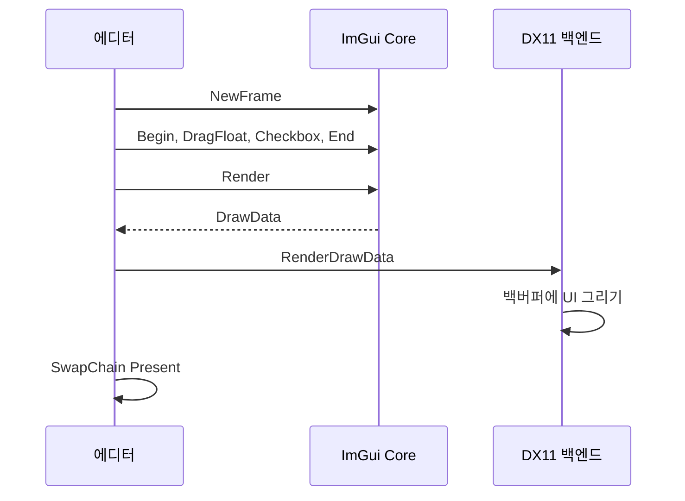

지금까지는 물체의 위치를 C++에서 바꾸고 다시 실행해 결과를 보았습니다. 이번에는 화면의 슬라이더를 움직여 값을 바꾸고, 그 결과를 같은 창에서 바로 확인하는 에디터를 만들기 시작하겠습니다. 첫 목표는 큰 편집 도구 전체가 아니라 **값을 조작할 UI가 엔진의 매 프레임 렌더링과 함께 동작하게 하는 것**입니다.

완성된 에디터의 작업 흐름을 먼저 보겠습니다. 오브젝트를 고르고, 속성을 바꾸고, 장면에서 배치를 확인한 뒤 게임 카메라 화면을 보는 흐름입니다. 아래는 이 목표를 비교하기 위한 Godot 공식 문서의 참고 화면입니다.

{{M0}}

[Godot 공식 에디터 안내](https://docs.godotengine.org/en/stable/getting_started/introduction/first_look_at_the_editor.html)의 화면입니다. 중앙 작업 영역, 노드 트리, Inspector, FileSystem을 함께 보면 여러 패널이 왜 필요한지 알 수 있습니다. Godot의 **Scene dock은 노드 트리**이며, 우리가 말하는 Scene View 카메라 화면과 같은 패널 이름으로 대응시키지 않습니다.

| 하고 싶은 일 | 참고할 역할 | YamYam에서 연결할 곳 |
| --- | --- | --- |
| 장면의 물체를 선택 | Scene 노드 트리 | Hierarchy와 선택 상태 |
| 위치·속성 수정 | Inspector | 선택 객체의 Transform·Component |
| 배치 결과를 자유롭게 관찰 | 중앙 2D/3D 작업 영역 | 편집 카메라의 Scene View |
| 플레이어 시점 확인 | 실행한 게임 화면 | 게임 카메라의 Game View |

현재 DX12에서 확인한 것은 도킹 UI와 서로 다른 카메라의 Scene/Game 결과 표시입니다. Hierarchy·Inspector의 실제 편집 연결은 이후 작업입니다. 목표 화면과 실제 구현을 비교한 캡처는 <mention-page url="https://www.notion.so/3dc0b1ffa61e814e9e8bd403ca145ebe"/>에서 볼 수 있습니다.

{{M1}}

## 1. UI를 그리는 라이브러리와 엔진 데이터는 별개입니다

ImGui는 버튼, 슬라이더, 창 같은 UI를 만들고 그릴 데이터를 생성해 줍니다. 하지만 ‘이 슬라이더는 선택한 GameObject의 위치를 바꾼다’는 관계를 자동으로 알지는 못합니다. UI에서 바뀐 값을 Transform에 반영하는 코드는 에디터가 작성해야 합니다.

아래 기존 편집기 참고 이미지도 패널의 모양보다 **어떤 데이터를 보고 어떤 작업을 하는가**의 관점으로 읽어 보세요.

<columns>
	<column ratio="50">
{{M2}}
	</column>
	<column ratio="50">
{{M3}}
	</column>
</columns>

처음에는 속성 하나를 움직여 보는 UI부터 연결합니다. 패널이 화면에 나타나는 것, 값이 다음 프레임에도 남는 것, 값이 엔진 동작에 반영되는 것은 각각 확인할 단계입니다.

## 2. Immediate Mode는 매 프레임 UI를 기술하는 방식입니다

```c++
struct EditorState
{
    float positionX = 0.0f;
    bool wireframe = false;
};

void DrawEditorUI(EditorState& state)
{
    if (ImGui::Begin("Inspector Demo"))
    {
        ImGui::DragFloat("Position X", &state.positionX, 0.1f);
        ImGui::Checkbox("Wireframe", &state.wireframe);
        ImGui::Text("Current X: %.2f", state.positionX);
    }
    ImGui::End();
}
```

이 함수를 매 프레임 호출합니다. `EditorState`는 루프 바깥의 에디터 멤버처럼 계속 살아 있는 객체로 둡니다. 함수 안에서 매번 `float positionX=0`을 새로 만들면 드래그로 바꾼 값이 다음 프레임에 다시 0이 되기 때문입니다.

ImGui는 포커스·드래그 같은 내부 상태를 관리하고, 애플리케이션은 실제 값의 수명을 관리합니다. ‘즉시 모드’가 아무 상태도 없다는 뜻은 아닙니다. `Begin`이 false를 반환하면 안쪽 위젯 제출을 생략할 수 있지만, 이 Begin에 대응하는 End는 항상 호출합니다.

이 예제는 UI 상태를 조작하는 첫 실습입니다. 아직 positionX가 특정 오브젝트에 연결되지는 않았습니다. 다음 GUI 설계 글에서 선택 객체를 찾고 `Transform::SetPosition`에 전달하도록 이어갑니다.

## 3. Core와 두 백엔드를 함께 추가합니다

ImGui는 UI 동작과 그리는 데이터를 만드는 core, 운영체제의 입력을 받는 플랫폼 백엔드, 그래픽 API로 실제 그리는 렌더러 백엔드를 나눕니다. 여기서는 **Win32 + DX11** 조합을 사용합니다.

{{M4}}

core의 `imgui.cpp`, `imgui_draw.cpp`, `imgui_widgets.cpp`, `imgui_tables.cpp`와 해당 헤더들을 프로젝트에 추가합니다. 데모 창을 사용할 경우 `imgui_demo.cpp`도 추가합니다. 백엔드는 `imgui_impl_win32.cpp`와 `imgui_impl_dx11.cpp` 및 헤더를 함께 넣습니다.

{{M5}}

헤더 경로만 등록하면 컴파일은 되더라도 구현 함수의 링크 오류가 날 수 있습니다. cpp 파일이 실제 빌드에 포함되는지 확인합니다. 도킹을 사용할 때는 그 기능이 들어 있는 버전의 core와 backend를 한 묶음으로 사용합니다. 일부 파일만 다른 버전으로 바꾸면 함수 선언과 구현이 맞지 않을 수 있습니다.

[Dear ImGui 공식 저장소와 백엔드 예제](https://github.com/ocornut/imgui)

## 4. 창과 DX11 장치를 만든 뒤 ImGui를 초기화합니다

```c++
#include "imgui.h"
#include "backends/imgui_impl_win32.h"
#include "backends/imgui_impl_dx11.h"

// hwnd, device, context는 먼저 생성한 Win32/DX11 객체입니다.
IMGUI_CHECKVERSION();
ImGui::CreateContext();
ImGuiIO& io = ImGui::GetIO();
io.ConfigFlags |= ImGuiConfigFlags_NavEnableKeyboard;
ImGui::StyleColorsDark();

if (!ImGui_ImplWin32_Init(hwnd))
    throw std::runtime_error("ImGui Win32 initialization failed");
if (!ImGui_ImplDX11_Init(device, context))
    throw std::runtime_error("ImGui DX11 initialization failed");
```

ImGui Context는 UI 상태를 보관합니다. Win32 백엔드는 창과 입력을 연결하고, DX11 백엔드는 UI를 그릴 셰이더·버퍼·텍스처 같은 그래픽 자원을 준비합니다. device·context가 ComPtr이면 `.Get()`을 전달하며, 예외를 쓰는 코드에는 `<stdexcept>`를 포함합니다. 초기화가 중간에 실패하면 성공한 앞 단계의 종료도 호출하도록 애플리케이션의 실패 경로를 연결합니다.

첫 실습은 메인 창 하나에서 동작하게 합니다. DockingEnable과 ViewportsEnable은 뒤의 도킹 강의에서 추가합니다. 도킹은 패널을 붙여 배치하는 기능이고, ImGui의 multi-viewport는 별도 운영체제 창으로 떼어내는 기능입니다. Scene/Game 카메라가 두 개라는 뜻의 다중 카메라와는 다릅니다.

## 5. 마우스·키보드 메시지를 Win32 백엔드에 전달합니다

기존 WndProc의 메시지 처리 앞쪽에 다음 전달 경로를 둡니다. ImGui 초기화 전에 Win32 메시지가 올 수도 있으므로 Context가 생성되었는지 확인합니다.

```c++
// 필요한 버전에서는 백엔드 헤더의 안내에 따라 이 선언을 둡니다.
extern IMGUI_IMPL_API LRESULT ImGui_ImplWin32_WndProcHandler(
    HWND hwnd, UINT msg, WPARAM wParam, LPARAM lParam);

// 기존 WndProc 내부의 앞부분
if (ImGui::GetCurrentContext() &&
    ImGui_ImplWin32_WndProcHandler(hwnd, msg, wParam, lParam))
    return 1;
// 이후 WM_SIZE, WM_DESTROY 등 기존 창 처리는 계속 유지합니다.
```

메시지 전달이 없으면 UI는 그려져도 클릭이나 입력이 반응하지 않을 수 있습니다. 반대로 ImGui가 마우스를 쓰고 있다고 플랫폼 백엔드로 메시지 전달 자체를 끊으면 눌림·해제 상태를 잃을 수 있습니다.

게임에도 같은 입력을 보낼지는 별도 정책입니다. 예를 들어 Inspector의 숫자 칸에 입력하는 동안 캐릭터가 움직이면 곤란합니다. `WantCaptureMouse`, `WantCaptureKeyboard`와 실제 Scene/Game 패널의 포커스·호버를 참고해 게임 입력을 보낼 대상을 정합니다. 이 값들은 ImGui가 계산하는 결과이므로 임의로 true를 써서 조작하는 방식으로 연결하지 않습니다.

## 6. UI 생성과 GPU 렌더링은 다른 호출입니다



다음은 매 프레임의 기본 흐름입니다. `state`는 루프 밖에서 유지하고, `backBufferRTV`는 이번 UI를 그릴 백버퍼 뷰입니다.

```c++
ImGui_ImplDX11_NewFrame();
ImGui_ImplWin32_NewFrame();
ImGui::NewFrame();

DrawEditorUI(state);
ImGui::Render();

context->OMSetRenderTargets(1, &backBufferRTV, nullptr);
const float clearColor[4] = {0.08f, 0.08f, 0.08f, 1.0f};
context->ClearRenderTargetView(backBufferRTV, clearColor);
ImGui_ImplDX11_RenderDrawData(ImGui::GetDrawData());
swapChain->Present(1, 0);
```

`ImGui::Render()`는 UI를 그릴 데이터를 완성합니다. 이 호출만으로 DX11 백버퍼에 그림이 생기는 것이 아닙니다. `ImGui_ImplDX11_RenderDrawData`가 DrawData를 GPU 명령으로 처리해야 화면에 보입니다. 그리고 Present가 그 결과를 창에 표시합니다.

엔진의 장면을 같은 백버퍼에 먼저 그린다면 장면 Draw 뒤에 ImGui를 그립니다. Scene/Game을 별도 RT로 그린다면 UI 렌더링 직전에 출력 타겟을 백버퍼로 되돌려야 합니다. 그렇지 않으면 에디터 UI가 Scene 텍스처 안에 그려질 수 있습니다. 이후 Scene View 강의에서 이 연결을 구현합니다.

## 7. 종료는 백엔드부터 정리합니다

```c++
ImGui_ImplDX11_Shutdown();
ImGui_ImplWin32_Shutdown();
ImGui::DestroyContext();
// 이후 애플리케이션의 DX11 장치·창 종료 흐름으로 이어갑니다.
```

ImGui가 사용하는 그래픽 장치와 창을 먼저 없애기보다, 백엔드가 가진 객체를 정리한 뒤 애플리케이션 객체를 종료합니다. 실패한 초기화 경로에서도 실제로 초기화한 단계만 정리하도록 관리합니다.

## 첫 UI에서 확인해 봅시다

Inspector Demo 창이 보이고 Position X를 드래그했을 때 Current X가 함께 바뀌는지 확인합니다. 마우스를 놓고 다음 프레임에도 값이 남아야 합니다. 창이 보이는데 입력이 안 되면 메시지 전달을, 값이 계속 초기화되면 EditorState의 수명을, 모든 UI가 안 보이면 NewFrame·RenderDrawData·백버퍼 RTV 연결을 차례로 확인합니다.

이제 UI가 엔진의 한 프레임에 들어왔습니다. 다음에는 패널들을 도킹하고, 별도 카메라가 그린 RT를 ImGui::Image에 표시하여 편집할 장면과 플레이어 화면을 나누겠습니다. DX12에서는 이 연결에 descriptor와 GPU 완료 시점 관리가 더해집니다.
