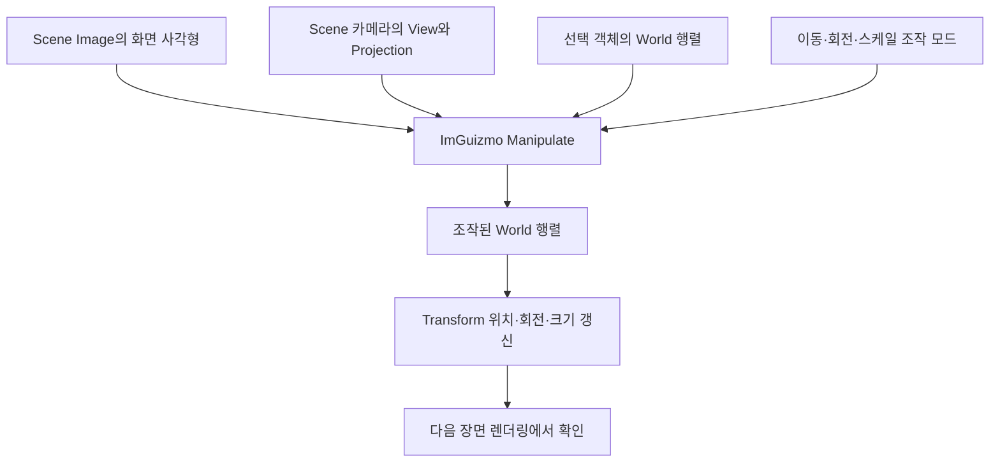

{{M0}}
{{M1}}

Inspector에서 위치 숫자를 바꾸는 대신, 화면의 빨간 화살표를 잡아 물체를 옆으로 옮기고 싶습니다. 이때 사용할 조작 도구가 기즈모입니다. ImGuizmo는 4×4 행렬을 받아 이동·회전·크기 조절용 UI를 그리고, 사용자가 조작한 결과를 행렬로 돌려줍니다.

하지만 ImGuizmo는 우리 엔진의 GameObject나 Transform 클래스를 모릅니다. **Scene 화면 위에 기즈모를 맞춰 놓는 일과, 바뀐 행렬을 실제 객체에 반영하는 일**은 에디터가 연결해야 합니다. 이번 글에서는 선택한 객체 하나를 이동하는 가장 작은 흐름부터 만들겠습니다.

## 1. 네 가지 입력이 같은 장면을 가리켜야 합니다



Scene 이미지에는 편집 카메라가 찍은 물체가 보이는데 기즈모에 Game 카메라의 행렬을 넘기면, 물체와 화살표의 위치가 달라집니다. 행렬이 맞아도 SetRect를 프로그램 창 전체 크기로 설정하면, 도킹 패널 안의 작은 Scene 이미지와 위치가 어긋납니다. 행렬 계산부터 의심하기 전에 이 입력들이 같은 화면을 가리키는지 확인합니다.

## 2. ImGui 프레임 안에 ImGuizmo를 연결합니다

프로젝트에는 같은 버전의 `ImGuizmo.h`와 `ImGuizmo.cpp`를 추가하고, 기존 ImGui 헤더를 찾을 수 있도록 include 경로를 연결합니다. 현재 YamYam에는 Editor_Window에 해당 파일이 포함되어 있습니다. 이미 포함된 파일과 다른 버전을 일부만 섞지 않습니다.

```c++
ImGui_ImplDX11_NewFrame();
ImGui_ImplWin32_NewFrame();
ImGui::NewFrame();
ImGuizmo::BeginFrame();

// Scene 창을 구성하고 Image와 기즈모를 제출합니다.

ImGui::Render();
ImGui_ImplDX11_RenderDrawData(ImGui::GetDrawData());
```

위는 DX11 프레임의 위치를 보여 주는 발췌입니다. 실제 백버퍼 선택과 Present는 기존 렌더링 루프에 있습니다. BeginFrame은 매 프레임 UI 작업을 준비하는 호출이며, 라이브러리나 GPU 리소스를 매 프레임 새로 설치하는 의미의 초기화가 아닙니다. 기즈모의 선과 핸들도 ImGui DrawList를 통해 최종 UI에 그려집니다.

## 3. 창 크기 대신 Image의 실제 사각형을 씁니다

Scene RT를 ImGui::Image로 표시한 직후에 그 이미지의 위치와 크기를 읽습니다. 다른 위젯을 먼저 호출하면 ‘마지막 Item’이 다른 위젯으로 바뀌므로 Image 바로 뒤에서 읽는 것이 중요합니다.

```c++
// ImGui::Begin("Scene") 안에서 실행합니다.
// sceneTextureID는 해당 렌더러 백엔드에 맞춰 준비한 RT 이미지 ID입니다.
const ImVec2 size = ImGui::GetContentRegionAvail();
if (size.x >= 1.0f && size.y >= 1.0f)
{
    ImGui::Image(sceneTextureID, size);
    const ImVec2 imageMin = ImGui::GetItemRectMin();
    const ImVec2 imageMax = ImGui::GetItemRectMax();

    ImGuizmo::SetDrawlist();
    ImGuizmo::SetRect(imageMin.x, imageMin.y,
        imageMax.x - imageMin.x, imageMax.y - imageMin.y);
    // 다음 절의 카메라·객체 행렬과 Manipulate를 이 안에서 연결합니다.
}
```

SetRect의 x·y는 운영체제 화면 기준 좌표이고 width·height는 그 Image의 표시 크기입니다. 타이틀 바와 창 패딩이 포함된 전체 창 크기가 아닙니다. 나중에 화면 비율 유지를 위해 검은 여백을 넣더라도, 실제 이미지를 표시한 사각형을 기준으로 해야 합니다.

DX11의 Image ID에는 백엔드가 읽는 SRV 객체가 들어가고, DX12의 현재 YamYam 경로에는 GPU SRV descriptor handle이 들어갑니다. 이것은 이미지를 보여 주는 백엔드의 차이입니다. ImGuizmo가 요구하는 화면 사각형과 CPU 행렬의 의미는 그대로입니다.

## 4. 같은 Scene 카메라와 선택 객체의 행렬을 전달합니다

```c++
// 위 Image/SetRect 코드와 같은 Scene 창 내부의 연결 부분
ya::GameObject* selected = ya::renderer::selectedObject;
if (selected)
{
    auto* transform = selected->GetComponent<ya::Transform>();
    if (transform)
    {
        const auto& view = mEditorCamera->GetViewMatrix();
        const auto& projection = mEditorCamera->GetProjectionMatrix();
        auto world = transform->GetWorldMatrix();

        ImGuizmo::SetOrthographic(false); // 이 예제의 Scene 카메라는 Perspective
        ImGuizmo::Manipulate(*view.m, *projection.m,
            ImGuizmo::TRANSLATE, ImGuizmo::WORLD,
            *world.m);

        // world의 조작 결과를 다음 절에서 Transform으로 돌려줍니다.
    }
}
```

`mEditorCamera`와 `selectedObject`는 현재 SceneWindow가 사용하는 연결점입니다. 선택 기능 자체를 ImGuizmo가 만들어 주지는 않습니다. 선택 객체가 없는 상태에서는 기즈모도 그리지 않습니다.

`world`는 선택 객체의 행렬을 복사한 값입니다. Manipulate는 이 복사본을 수정합니다. 원래 Transform 멤버는 아직 그대로이므로, 기즈모만 움직이고 물체는 따라오지 않는다면 다음의 반영 단계가 빠졌는지 확인합니다.

현재 Scene 카메라는 원근 투영이어서 SetOrthographic(false)를 사용합니다. 직교 카메라로 바꾸면 그 실제 투영 종류와 맞춰 true로 지정해야 합니다. 단순히 기즈모가 잘 보이도록 이 값을 임의로 고르는 것은 아닙니다.

## 5. 조작 결과를 위치·회전·크기로 돌려줍니다

```c++
// 위의 transform과 world가 유효한 같은 범위 안에서 실행
if (ImGuizmo::IsUsing())
{
    float position[3], rotationDegrees[3], scale[3];
    ImGuizmo::DecomposeMatrixToComponents(
        *world.m, position, rotationDegrees, scale);

    transform->SetPosition(ya::math::Vector3(position));
    transform->SetRotation(ya::math::Vector3(rotationDegrees));
    transform->SetScale(ya::math::Vector3(scale));
}
```

IsUsing은 기즈모를 조작 중인지 확인합니다. Decompose는 행렬을 세 요소로 나눠 주고, 엔진의 setter로 실제 Transform에 반영합니다. YamYam은 회전을 degree로 보관하고 World를 구성할 때 radian으로 바꿉니다. ImGuizmo의 이 분해 함수도 degree를 반환하므로, 여기서 radian으로 다시 바꾸어 setter에 넣으면 단위가 틀어집니다.

World 행렬은 Transform의 갱신 과정에서 다시 만들어집니다. 현재 SceneWindow는 장면을 먼저 RT에 그린 뒤 기즈모 조작을 반영하므로, 새 값이 장면에 나타나는 시점은 다음 Transform 갱신과 장면 렌더링 순서에 따릅니다. 값을 setter에 넣었는데 이미 그린 RT가 그 자리에서 다시 렌더링되는 것은 아닙니다.

## 6. WORLD와 LOCAL은 어떤 방향으로 움직일지 정합니다

회전한 자동차를 생각해 봅시다. WORLD 모드에서는 장면의 고정된 축을 기준으로 이동하고, LOCAL 모드에서는 자동차와 함께 회전한 축을 기준으로 이동합니다. 자동차가 향한 방향으로 밀고 싶을 때 두 모드의 차이가 눈에 보입니다.

현재 YamYam SceneWindow의 호출은 WORLD입니다. LOCAL로 바꾸는 학습 실험에서는 Manipulate의 mode 인자만 바꾸고, 회전한 물체에서 이동 축을 비교해 보세요. 이 옵션을 LOCAL로 바꾼다고 엔진의 부모·자식 Transform 계산까지 자동으로 구현되지는 않습니다.

TRANSLATE 대신 ROTATE를 넘기면 회전 핸들, SCALE을 넘기면 크기 핸들을 사용합니다. 작업 모드와 기준 좌표계는 별도의 선택입니다. 이동·회전·크기 전환 및 Ctrl 스냅 연결은 뒤의 기즈모 조작 강의에서 이어갑니다.

## 7. 화면이 어긋날 때는 바꾸기 전에 원인을 좁힙니다

첫째, 기즈모와 물체가 같은 Scene 카메라의 view·projection을 사용하는지 봅니다. 둘째, SetRect가 Image의 실제 사각형인지 봅니다. 셋째, RT 크기와 카메라의 aspect ratio가 같은 표시 비율을 반영하는지 봅니다. 여기까지 맞은 뒤 CPU 행렬의 규약을 살펴봅니다.

현재 엔진은 SimpleMath CPU 행렬을 ImGuizmo에 그대로 전달합니다. “DirectX니까 OpenGL 형태로 전치한다”는 규칙을 추가하지 않습니다. GPU HLSL에 데이터를 저장하는 규약과 ImGuizmo에 CPU 행렬을 넘기는 규약을 각각 실제 코드에서 확인해야 합니다.

이 분해 방식은 일반적인 위치·회전·크기 편집을 위한 출발점입니다. 포함된 ImGuizmo 헤더도 분해·재구성의 수치 안정성 한계를 언급합니다. 음수·비균일 스케일, shear, 부모 변환이 있는 경우까지 아무 제약 없이 왕복된다고 가정하지 않습니다. 첫 실습은 부모 없는 객체와 양의 scale로 이동 결과를 확인하는 것이 명확합니다.

## 직접 움직여 확인해 봅시다

선택한 사각형의 X축 화살표를 드래그하고 Transform의 위치가 바뀌는지 봅니다. 다음에는 Scene 창을 옆으로 도킹하거나 크기를 바꿉니다. 물체 위에 핸들이 계속 맞아야 합니다. 마지막으로 Scene 카메라만 움직였을 때 핸들이 그 카메라 시점에 맞게 따라오는지 확인합니다.

물체 대신 기즈모만 움직이면 Transform 반영을, 창을 옮겼을 때만 어긋나면 SetRect를, 카메라를 움직일 때 어긋나면 view·projection 연결을 먼저 살펴보면 됩니다. 이렇게 입력·행렬·화면 영역을 분리해서 확인하면 문제의 위치를 찾기 쉽습니다.

[현재 SceneWindow의 실제 연결 코드](https://github.com/eazuooz/YamYam_Engine/blob/ce56f16dd7a40fd2b4bf03c680790e5b637c7530/Editor_Window/guiSceneWindow.cpp) · [프로젝트에 포함된 ImGuizmo API](https://github.com/eazuooz/YamYam_Engine/blob/ce56f16dd7a40fd2b4bf03c680790e5b637c7530/Editor_Window/ImGuizmo.h) · [ImGuizmo 공식 저장소](https://github.com/CedricGuillemet/ImGuizmo)
