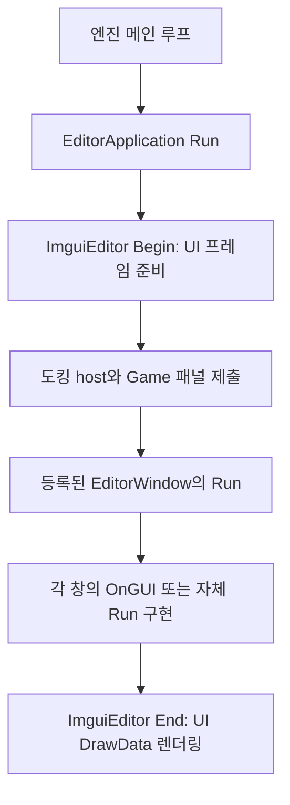

{{M0}}

ImGui 창 하나가 동작하기 시작하면 다음 문제가 생깁니다. Scene, Game, Inspector, Project의 코드를 모두 한 함수에 넣으면 어떤 창의 입력이 어떤 데이터를 바꾸는지 찾기 어렵습니다. 이번에는 **창을 실행하는 관리자, 창의 틀, 특정 데이터를 편집하는 UI**를 나누고, 선택 객체의 위치를 바꾸는 작은 Inspector를 연결해 보겠습니다.

클래스를 나누는 목적은 이름을 많이 만드는 것이 아닙니다. “새 창을 등록했는데 왜 안 보일까”, “슬라이더가 움직이는데 왜 물체는 그대로일까”라는 질문에 어느 함수를 확인해야 할지 분명하게 만드는 것입니다.

## 1. 한 프레임에서 누가 누구를 호출하는지 봅니다



EditorApplication은 창 목록과 전체 순서를 관리합니다. EditorWindow는 Scene·Inspector 같은 하나의 도구 창을 나타냅니다. Editor는 특정 데이터의 편집 UI를 구성하기 위한 기반입니다. 예를 들어 Inspector라는 창 안에 Transform용 UI와 Material용 UI를 넣으면, 창의 틀과 속성별 UI를 따로 발전시킬 수 있습니다.

현재 저장소의 실제 호출 경로는 다음과 같습니다.

```c++
void EditorApplication::Run()
{
    Update();
    OnGUI();
}

void EditorApplication::OnGUI()
{
    ImguiEditor->Begin();
    OnImGuiRender();
    ImguiEditor->End();
}

// OnImGuiRender의 창 실행 부분
for (auto& window : EditorWindows)
    window.second->Run();
```

여기서 메인 루프가 모든 객체의 OnGUI를 자동으로 찾아 호출하는 것이 아닙니다. 등록한 창에 Run을 호출하고, 그 Run이 필요한 UI 작업을 이어야 합니다. 현재 **기반 EditorWindow::Run은 비어 있습니다.** OnGUI만 재정의해 놓고 실행 연결을 만들지 않으면 그 UI는 호출되지 않습니다.

[현재 EditorApplication](https://github.com/eazuooz/YamYam_Engine/blob/ce56f16dd7a40fd2b4bf03c680790e5b637c7530/Editor_Window/guiEditorApplication.cpp) · [현재 EditorWindow](https://github.com/eazuooz/YamYam_Engine/blob/ce56f16dd7a40fd2b4bf03c680790e5b637c7530/Editor_Window/guiEditorWindow.cpp)

## 2. Run에서 창을 열고 OnGUI에서 내용을 만듭니다

다음은 현재 EditorWindow 기반 클래스에 연결할 수 있는 **학습용 창 구현**입니다. 기존 Inspector가 이미 이 코드를 가지고 있다는 뜻은 아닙니다. 클래스 선언과 실행 경로를 완성하면 창 하나가 어떻게 추가되는지 확인할 수 있습니다.

```c++
class TransformInspectorWindow : public gui::EditorWindow
{
public:
    void Run() override
    {
        if (GetState() != eState::Active)
            return;

        bool open = true;
        if (ImGui::Begin("Transform Inspector", &open))
            OnGUI();
        ImGui::End();

        if (!open)
            SetState(eState::Disable);
    }

    void OnGUI() override;
};
```

Run은 표시 여부와 Begin·End의 짝을 관리하고, OnGUI는 속성 UI만 만듭니다. 창을 닫으면 ImGui가 open을 false로 바꿉니다. 그 값을 프레임을 넘어 유지되는 State에 반영했기 때문에 다음 프레임에 창이 다시 나타나지 않습니다.

반대로 매 프레임 `bool open=true`를 만들고 SetState를 하지 않으면 닫기 버튼을 눌러도 다음 프레임에 다시 열릴 수 있습니다. 위 코드의 local bool은 그 프레임의 결과를 받는 용도이며, 실제 열린 상태는 EditorWindow의 State에 저장됩니다.

SetState는 값을 바꾸는 함수입니다. 그 호출만으로 OnEnable·OnDisable·OnDestroy가 자동 실행되는 것은 아닙니다. 그런 생명주기 콜백이 필요하면 상태 전이 함수나 관리자에서 실제 호출 경로를 작성해야 합니다.

## 3. 선택한 객체의 값을 읽고 바뀐 값만 돌려줍니다

```c++
void TransformInspectorWindow::OnGUI()
{
    ya::GameObject* selected = ya::renderer::selectedObject;
    if (!selected)
    {
        ImGui::TextUnformatted("Select an object to edit its transform.");
        return;
    }
    auto* transform = selected->GetComponent<ya::Transform>();
    if (!transform)
        return;

    auto position = transform->GetPosition();
    float xyz[3] = {position.x, position.y, position.z};
    ImGui::PushID(transform);
    if (ImGui::DragFloat3("Position", xyz, 0.1f))
        transform->SetPosition(ya::math::Vector3(xyz));
    ImGui::PopID();
}
```

앞의 ImGui 입문 예제는 EditorState에만 값을 보관했습니다. 여기서는 매 프레임 선택 객체의 실제 위치를 읽고, 사용자가 값을 바꿨을 때 Transform의 setter로 돌려줍니다. 그래서 UI를 바꾼 결과가 엔진 데이터로 이어집니다. Transform의 World 재계산과 이후 렌더링에서 화면 위치가 바뀝니다.

`DragFloat3`의 반환값은 이 위젯이 값을 바꿨는지를 확인하는 데 사용합니다. `PushID(transform)`은 같은 제목의 속성 UI가 여러 곳에 있어도 구분할 수 있는 ID 범위를 만듭니다. 이 예제는 선택 객체가 프레임 동안 유효하다는 전제입니다. 객체를 삭제할 때 selectedObject도 정리하여 해제된 객체를 계속 편집하지 않게 해야 합니다.

Hierarchy에서 클릭한 객체를 selectedObject로 전달하는 기능은 별도의 연결입니다. Inspector 안에 ‘선택 객체를 읽는다’는 코드를 넣었다고 객체 선택 UI까지 생기지는 않습니다.

## 4. 창을 관리자에 등록해야 Run에 도달합니다

```c++
// EditorApplication::Initialize 내부에 추가하는 학습 예
auto* inspector = new TransformInspectorWindow();
EditorWindows.emplace(L"TransformInspectorWindow", inspector);
```

현재 관리자는 map에 들어 있는 창을 순회합니다. 객체를 만들기만 하고 등록하지 않으면 그 창의 Run을 호출하지 않습니다. 반대로 같은 키로 중복 등록하면 새 창이 들어가지 않을 수 있으므로 생성·등록을 초기화 때 한 번 수행합니다.

등록 키 `TransformInspectorWindow`는 관리자가 찾는 이름이고, `ImGui::Begin("Transform Inspector")`는 UI 창의 ID에 사용하는 이름입니다. 도킹할 때에는 후자의 실제 ImGui 이름을 사용해야 합니다. 다음 도킹 글에서 이 연결을 이어갑니다.

현재 종료 경로는 등록된 창을 삭제합니다. 새 창도 이 소유권 규칙에 포함되므로 다른 곳에서 먼저 중복 삭제하지 않습니다. 런타임에 창을 제거하는 기능을 추가하면 map에서도 지우고 그 창을 가리키던 참조를 정리해야 합니다.

## 5. GUILayout 대신 지금 있는 ImGui로 배치합니다

현재 `GUILayout`은 빈 클래스입니다. `BeginHorizontal`, `BeginGrid` 같은 엔진 함수가 이미 구현된 것으로 사용하지 않습니다. 속성 이름과 값의 두 열이 필요하다면 ImGui Table로 바로 표현할 수 있습니다.

```c++
// 유효한 transform을 얻은 OnGUI 내부의 Position UI를 바꾸는 예
auto position = transform->GetPosition();
float xyz[3] = {position.x, position.y, position.z};

if (ImGui::BeginTable("TransformProperties", 2,
                      ImGuiTableFlags_SizingStretchProp))
{
    ImGui::TableNextRow();
    ImGui::TableSetColumnIndex(0);
    ImGui::TextUnformatted("Position");
    ImGui::TableSetColumnIndex(1);
    ImGui::SetNextItemWidth(-1.0f);
    if (ImGui::DragFloat3("##Position", xyz, 0.1f))
        transform->SetPosition(ya::math::Vector3(xyz));
    ImGui::EndTable();
}
```

첫 열에는 이름, 두 번째 열에는 편집 위젯을 놓습니다. `##Position`은 위젯의 식별자는 유지하면서 화면에 중복된 이름을 표시하지 않는 방식입니다. Table은 창의 가로 폭에 맞춰 열을 배치합니다. 같은 조합을 여러 Inspector에서 반복하게 되면 그때 공통 helper를 GUILayout에 묶을 수 있습니다.

## 6. 메뉴와 기능의 완료 상태를 구별합니다

현재 EditorApplication에는 OpenProject, NewScene, SaveScene, SaveSceneAs, OpenScene 함수가 있지만 본문은 비어 있습니다. 메뉴 버튼에서 이 함수를 호출한다고 게임 씬이 파일에 저장되는 것은 아닙니다. 창 배치를 보관하는 imgui.ini와 게임 오브젝트·컴포넌트를 저장하는 씬 파일도 다른 데이터입니다.

실제 저장을 구현할 때는 현재 씬의 데이터를 모으고, 리소스 참조를 저장 가능한 형태로 바꾸고, 파일 쓰기 성공을 확인해야 합니다. 그 이후에 UI가 저장 완료를 알립니다. 이 글에서는 창과 선택 객체 편집의 연결을 먼저 완성하고, 비어 있는 저장 기능을 작동하는 기능처럼 소개하지 않습니다.

## 한 가지 속성으로 구조를 확인해 봅시다

등록한 창이 나타나는지 확인하고, 선택 객체가 없을 때 안내가 보이는지 봅니다. 선택 객체의 Position을 바꾸면 실제 Transform이 갱신되고 이후 Scene 렌더링에서 이동해야 합니다. 창을 닫은 다음 프레임에도 닫힌 상태가 유지되는지도 확인합니다.

이 세 결과를 각각 창 등록·데이터 연결·상태 수명에 대응시키면, 새 패널을 추가할 때 복잡한 함수 목록을 외울 필요가 없습니다. 다음에는 이렇게 만든 여러 창을 하나의 DockSpace에 배치하고 Scene/Game 화면과 함께 사용하겠습니다.
