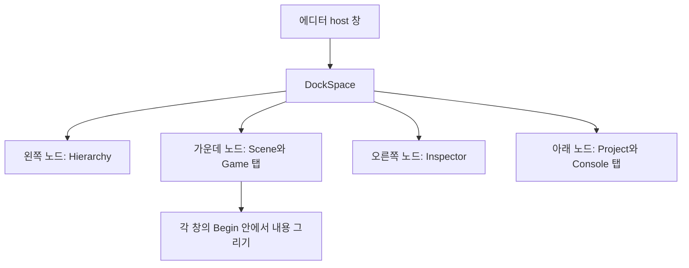

## 창의 내용과 창의 자리를 나누어 봅시다

Scene, Inspector, Console 창을 만들었는데 모두 화면 한가운데에 겹쳐 나타난다고 생각해 봅시다. 각 창의 위치를 픽셀 좌표로 고정하면 당장은 정돈되지만, 사용자가 Scene을 넓히거나 Console을 아래로 옮기기 어렵습니다. 창의 내용을 그리는 코드와 창을 배치하는 규칙을 분리해야 합니다. ImGui의 DockSpace가 그 배치 공간을 제공합니다.

{{M0}}

영상에서는 창의 제목 표시줄을 잡아 다른 영역에 붙이거나 탭으로 묶는 동작을 봅니다. 여기서 Scene의 렌더 타겟이나 Inspector의 데이터가 바뀌는 것은 아닙니다. 같은 창이 차지하는 자리와 크기가 바뀝니다. 이후 Scene View는 바뀐 **내용 영역의 크기**를 읽어 자신의 렌더 타겟을 조정합니다.

## 1. DockSpace는 창을 담는 공간입니다

DockSpace와 일반 창의 관계를 다음처럼 생각하면 됩니다. 가장 바깥의 host 창이 에디터 작업 영역을 차지하고, 그 안의 DockSpace를 여러 노드로 나눕니다. Scene과 Game을 같은 노드에 넣으면 탭으로 전환합니다.



이 배치는 우리의 기본 작업 화면을 위한 예입니다. DockSpace가 Scene 카메라를 렌더링하거나 게임 오브젝트를 저장해 주지는 않습니다. 각 창이 자기 일을 수행하고, ImGui가 그 창의 위치·크기·탭 관계를 관리합니다.

## 2. 도킹을 켜고 host 창을 매 프레임 제출합니다

저장소의 docking 지원 ImGui를 사용합니다. 컨텍스트 생성 후 초기화에서 도킹을 켭니다.

```c++
ImGuiIO& io = ImGui::GetIO();
io.ConfigFlags |= ImGuiConfigFlags_DockingEnable;
io.IniFilename = "imgui.ini";
```

`DockingEnable`은 창끼리 붙이는 기능이고 `ViewportsEnable`은 창을 별도의 OS 창으로 분리하는 기능입니다. 도킹만 실험한다면 전자부터 켜도 됩니다. 후자는 Win32·렌더러 backend가 추가 창을 생성하고 그리도록 연결해야 합니다.

다음 함수는 초기화가 끝난 뒤 `NewFrame()`과 `Render()` 사이에서 **매 프레임** 호출하는 학습용 host 예제입니다. 기존 EditorApplication의 도킹 host를 이해하기 위해 필요한 부분만 모았습니다.

```c++
void DrawDockHost()
{
    const ImGuiViewport* viewport = ImGui::GetMainViewport();
    ImGui::SetNextWindowPos(viewport->WorkPos);
    ImGui::SetNextWindowSize(viewport->WorkSize);
    ImGui::SetNextWindowViewport(viewport->ID);

    ImGuiWindowFlags flags = ImGuiWindowFlags_NoDocking
        | ImGuiWindowFlags_NoTitleBar | ImGuiWindowFlags_NoCollapse
        | ImGuiWindowFlags_NoResize | ImGuiWindowFlags_NoMove
        | ImGuiWindowFlags_NoBringToFrontOnFocus
        | ImGuiWindowFlags_NoNavFocus;

    ImGui::PushStyleVar(ImGuiStyleVar_WindowRounding, 0.0f);
    ImGui::PushStyleVar(ImGuiStyleVar_WindowBorderSize, 0.0f);
    ImGui::PushStyleVar(ImGuiStyleVar_WindowPadding, ImVec2(0, 0));
    ImGui::Begin("EditorHost", nullptr, flags);
    ImGui::PopStyleVar(3);

    const ImGuiID dockId = ImGui::GetID("MyDockSpace");
    ImGui::DockSpace(dockId, ImVec2(0, 0));
    ImGui::End();
}
```

WorkPos와 WorkSize는 OS 작업 영역을 기준으로 host를 배치합니다. 둥근 모서리·테두리·안쪽 여백을 없애면 여러 창을 담는 바탕처럼 보입니다. `NoDocking`은 **host 자체가 다른 창에 도킹되는 것**을 막습니다. 내부 DockSpace에 다른 창이 붙는 기능을 끄는 설정은 아닙니다.

이 host에서는 Begin 반환값으로 DockSpace 호출을 생략하지 않습니다. DockSpace는 붙어 있는 창들의 관계를 유지하기 위해 계속 제출해야 합니다. 숨겨진 host를 별도로 운영한다면 `KeepAliveOnly` 경로를 설계합니다. 일반 패널에서는 Begin이 false일 때 내용만 생략하고 End는 호출합니다.

호출 순서도 중요합니다. `DrawDockHost()`를 먼저 호출한 다음 Scene, Inspector 등의 `Begin()`을 호출합니다. `GetID("MyDockSpace")`는 현재 ImGui ID 범위의 영향을 받으므로 생성·분할·제출 시 같은 host 안에서 같은 이름을 사용해야 합니다.

## 3. 처음 배치할 때만 공간을 나눕니다

사용자가 창을 옮겼는데 다음 프레임에 원래 위치로 돌아간다면, 초기 배치를 매 프레임 다시 만든 경우를 의심할 수 있습니다. 기본 배치는 노드가 없을 때 만들고, 이후에는 사용자가 바꾼 상태를 유지해야 합니다.

아래는 앞 코드에서 DockSpace 호출 **직전**에 넣어 볼 기본 배치 예제입니다. DockBuilder는 `imgui_internal.h`에 있는 내부 API이므로 프로젝트에 포함된 ImGui 버전에 맞춰 사용합니다.

```c++
// #include "imgui_internal.h"
if (ImGui::DockBuilderGetNode(dockId) == nullptr)
{
    ImGui::DockBuilderAddNode(dockId, ImGuiDockNodeFlags_DockSpace);
    ImGui::DockBuilderSetNodeSize(dockId, viewport->WorkSize);

    ImGuiID center = dockId;
    ImGuiID right = ImGui::DockBuilderSplitNode(
        center, ImGuiDir_Right, 0.25f, nullptr, &center);
    ImGuiID bottom = ImGui::DockBuilderSplitNode(
        center, ImGuiDir_Down, 0.25f, nullptr, &center);
    ImGuiID left = ImGui::DockBuilderSplitNode(
        center, ImGuiDir_Left, 0.25f, nullptr, &center);

    ImGui::DockBuilderDockWindow("Inspector", right);
    ImGui::DockBuilderDockWindow("Project", bottom);
    ImGui::DockBuilderDockWindow("Console", bottom);
    ImGui::DockBuilderDockWindow("Hierarchy", left);
    ImGui::DockBuilderDockWindow("Scene", center);
    ImGui::DockBuilderDockWindow("Game", center);
    ImGui::DockBuilderFinish(dockId);
}
```

첫 분할은 전체의 오른쪽 25%를 Inspector에 줍니다. 다음 분할은 **남은 영역**의 아래 25%입니다. 모든 25%가 원래 화면의 25%인 것은 아닙니다. `center`가 매번 남은 노드로 갱신되는 과정을 따라가면 배치 비율을 예측할 수 있습니다.

`DockBuilderDockWindow("Scene", center)`의 이름은 실제 `ImGui::Begin("Scene")`과 같아야 합니다. 클래스 이름 SceneWindow를 넣어도 실제 창 이름이 Scene이면 그 창과 연결되지 않습니다. Scene과 Game을 같은 center에 넣었기 때문에 두 창은 탭이 됩니다.

현재 `ce56f16`의 `SetupInitialDockLayout()`은 정적 `first_time`으로 실행당 한 번 기본 배치를 다시 만듭니다. 위의 “노드가 없을 때만 생성” 예제는 저장한 사용자 배치를 다음 실행에서도 존중하기 위한 개선 방식입니다. **현재 코드가 이미 이 조건을 적용한 것으로 읽으면 안 됩니다.** 실제 구현은 [guiEditorApplication.cpp](https://github.com/eazuooz/YamYam_Engine/blob/ce56f16dd7a40fd2b4bf03c680790e5b637c7530/Editor_Window/guiEditorApplication.cpp)에서 비교할 수 있습니다.

## 4. 창을 닫은 상태도 프레임을 넘어 유지합니다

창 배치와 창의 표시 여부는 관련 있지만 같은 값은 아닙니다. 아래 bool을 매 프레임 true로 다시 만들면 닫기 버튼을 눌러도 다음 프레임에 창이 되살아납니다.

```c++
static bool showConsole = true;
// View 메뉴 등에서 showConsole을 다시 true로 바꿀 수 있습니다.
if (showConsole)
{
    if (ImGui::Begin("Console", &showConsole))
        ImGui::TextUnformatted("Console output");
    ImGui::End();
}
```

`imgui.ini`는 창 위치·크기·도킹 관계를 보관합니다. 게임 오브젝트의 Transform이나 Material을 저장하는 씬 파일은 별도로 구현해야 합니다. 메뉴에 “Save Scene”을 표시하거나 `MenuItem`에 “Ctrl+S”라는 문자열을 적는 것만으로 저장과 단축키 처리가 만들어지지는 않습니다.

## 직접 배치를 바꾸어 확인해 봅시다

Scene을 넓히고 Console을 Inspector 아래로 옮겨 봅니다. 프레임이 지나도 자리가 유지되면 초기 배치와 매 프레임 제출이 올바르게 분리된 것입니다. Scene과 Game을 같은 자리에 놓아 탭 전환도 확인합니다. 재실행 후 배치가 기본값으로 돌아오면 ini 경로뿐 아니라 시작 시 DockBuilder가 기존 노드를 지우는지도 확인해야 합니다.

다음 글에서는 이렇게 크기가 바뀌는 Scene 창에 카메라 결과를 넣겠습니다. DockSpace가 정한 창의 내용 영역을 받아, 그 크기로 텍스처에 렌더링하고 `ImGui::Image`로 표시하는 흐름입니다.
<mention-page url="https://www.notion.so/1520b1ffa61e800782bdc359c1bc83cb"/>
