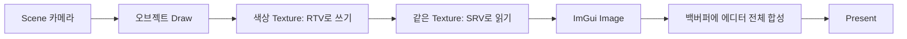
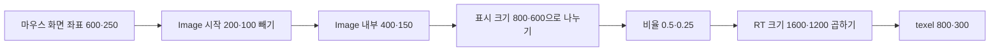

## 카메라 화면을 어떻게 ImGui 창 안에 넣을까요?

지금까지는 스왑체인의 백버퍼에 삼각형이나 스프라이트를 그렸습니다. 그런데 에디터에서는 화면 일부에 Scene을 놓고, 옆에는 Inspector를 배치하고 싶습니다. Scene 창을 옮겨도 카메라 화면이 그 창 안에 따라다녀야 합니다.

해결 방법은 카메라 결과를 먼저 **별도의 텍스처**에 그리는 것입니다. 그 텍스처를 ImGui가 일반 이미지처럼 읽어 자기 창 안에 배치합니다. 이번에는 DX11의 색상 타깃 하나와 깊이 타깃 하나로 이 흐름을 직접 연결하겠습니다.

{{M0}}
{{M1}}

위 자료에서는 Scene 창의 내용 영역과 바깥 에디터 UI를 구분해서 봅니다. 창 테두리와 제목은 ImGui가 만들고, 그 안의 카메라 화면은 엔진이 렌더링합니다. 같은 화면에 보이지만 두 번의 그리기 과정을 거칩니다.



RTV와 SRV가 각각 새로운 그림을 가지고 있는 것은 아닙니다. **같은 텍스처에 쓰는 입구와 읽는 입구**입니다. 이 단계 사이에 CPU로 픽셀을 복사할 필요는 없습니다.

## 1. 쓰기도 하고 읽기도 할 색상 텍스처를 만듭니다

아래 코드는 렌더 타겟 생성 부분만 분리한 DX11 학습용 예제입니다. `device`는 초기화한 ID3D11Device이며 `ThrowIfFailed`는 HRESULT가 실패하면 예외를 던지는 프로젝트의 오류 처리 함수로 연결합니다. `ComPtr`은 Microsoft::WRL::ComPtr입니다.

```c++
struct SceneTarget
{
    UINT width = 0, height = 0;
    ComPtr<ID3D11Texture2D> color, depth;
    ComPtr<ID3D11RenderTargetView> rtv;
    ComPtr<ID3D11ShaderResourceView> srv;
    ComPtr<ID3D11DepthStencilView> dsv;
};

SceneTarget CreateSceneTarget(ID3D11Device* device, UINT w, UINT h)
{
    if (w == 0 || h == 0)
        throw std::invalid_argument("Scene target size must be positive");
    SceneTarget target;
    target.width = w;
    target.height = h;

    D3D11_TEXTURE2D_DESC desc{};
    desc.Width = w;
    desc.Height = h;
    desc.MipLevels = 1;
    desc.ArraySize = 1;
    desc.Format = DXGI_FORMAT_R8G8B8A8_UNORM;
    desc.SampleDesc.Count = 1;
    desc.Usage = D3D11_USAGE_DEFAULT;
    desc.BindFlags = D3D11_BIND_RENDER_TARGET | D3D11_BIND_SHADER_RESOURCE;
    ThrowIfFailed(device->CreateTexture2D(&desc, nullptr, &target.color));
    ThrowIfFailed(device->CreateRenderTargetView(
        target.color.Get(), nullptr, &target.rtv));
    ThrowIfFailed(device->CreateShaderResourceView(
        target.color.Get(), nullptr, &target.srv));

    desc.Format = DXGI_FORMAT_D24_UNORM_S8_UINT;
    desc.BindFlags = D3D11_BIND_DEPTH_STENCIL;
    ThrowIfFailed(device->CreateTexture2D(&desc, nullptr, &target.depth));
    ThrowIfFailed(device->CreateDepthStencilView(
        target.depth.Get(), nullptr, &target.dsv));
    return target;
}
```

색상 텍스처의 `BindFlags` 두 개가 핵심입니다. 첫 번째는 오브젝트를 그릴 출력으로 사용할 수 있게 하고, 두 번째는 ImGui 픽셀 셰이더가 읽을 수 있게 합니다. `nullptr` 초기 데이터이므로 생성 직후의 색을 기대하지 말고 그리기 전에 Clear합니다.

깊이 텍스처는 색상과 같은 크기·샘플 수를 사용합니다. 여기서는 깊이 테스트만 하므로 DSV 용도만 설정합니다. 깊이를 셰이더에서 읽는 효과나 MSAA resolve는 이 단순한 타깃에서 자동으로 생기지 않습니다. 먼저 single-sample RGBA8 표시를 확인한 뒤 별도 기능으로 확장합니다.

## 2. Scene 카메라가 이 타깃에 그리도록 바꿉니다

출력 타깃을 바꾸는 것과 viewport를 바꾸는 것은 별개입니다. 800×600 타깃을 바인딩해 놓고 이전 1600×900 viewport를 유지하면 화면이 잘리거나 기대한 위치에 나타나지 않습니다.

```c++
void BeginSceneTarget(ID3D11DeviceContext* context, SceneTarget& target)
{
    // 이 예제에서 ImGui가 사용한 PS t0 읽기 바인딩을 해제합니다.
    ID3D11ShaderResourceView* nullSRV = nullptr;
    context->PSSetShaderResources(0, 1, &nullSRV);

    ID3D11RenderTargetView* output = target.rtv.Get();
    context->OMSetRenderTargets(1, &output, target.dsv.Get());
    D3D11_VIEWPORT viewport{0, 0,
        float(target.width), float(target.height), 0, 1};
    context->RSSetViewports(1, &viewport);

    const float clear[4] = {0.08f, 0.10f, 0.15f, 1.0f};
    context->ClearRenderTargetView(output, clear);
    context->ClearDepthStencilView(target.dsv.Get(),
        D3D11_CLEAR_DEPTH | D3D11_CLEAR_STENCIL, 1.0f, 0);
}
```

이후 메시·셰이더·상수 버퍼를 바인딩하고 Draw하면 Scene 텍스처에 기록됩니다. 투영 행렬의 종횡비도 `width / height`로 맞춥니다. RTV만 바뀌고 카메라의 종횡비가 이전 값이면 창을 넓힐 때 물체가 늘어나 보일 수 있습니다.

같은 subresource를 출력 RTV와 입력 SRV에 동시에 바인딩하면 충돌합니다. 예제는 ImGui의 PS t0만 사용한다고 한정했습니다. 엔진의 다른 stage나 슬롯에도 이 SRV를 연결했다면 그 바인딩까지 관리해야 합니다. DX11 런타임의 충돌 해제에 기대어 두 용도로 동시에 쓰려 하면 디버그 경고와 검은 이미지의 원인이 됩니다.

## 3. Image는 실제 픽셀을 지금 그리는 함수가 아닙니다

`ImGui::Image()`는 현재 UI draw list에 이미지 명령을 추가합니다. 실제 DX11 명령은 나중에 `ImGui_ImplDX11_RenderDrawData()`가 기록합니다. 따라서 그때까지 SRV와 텍스처가 살아 있어야 하며, 출력은 Scene 타깃에서 **백버퍼**로 바뀌어 있어야 합니다.

```c++
// SceneTarget sceneTarget과 카메라는 프레임을 넘어 보관합니다.
// ImGui NewFrame 이후, Render 이전의 Scene 창 내부입니다.
if (ImGui::Begin("Scene"))
{
    const ImVec2 size = ImGui::GetContentRegionAvail();
    const ImVec2 imageTopLeft = ImGui::GetCursorScreenPos();
    if (size.x >= 1.0f && size.y >= 1.0f)
    {
        const UINT w = static_cast<UINT>(size.x);
        const UINT h = static_cast<UINT>(size.y);
        if (sceneTarget.width != w || sceneTarget.height != h)
        {
            // 이전 프레임의 UI 제출이 끝난 뒤, 이번 Image 등록 전에 교체합니다.
            context->OMSetRenderTargets(0, nullptr, nullptr);
            ID3D11ShaderResourceView* nullSRV = nullptr;
            context->PSSetShaderResources(0, 1, &nullSRV);
            sceneTarget = CreateSceneTarget(device, w, h);
        }

        BeginSceneTarget(context, sceneTarget);
        // 여기에 Scene 카메라의 종횡비 갱신과 씬 Draw를 호출합니다.
        // 모든 오브젝트에 같은 Scene 카메라의 View/Projection을 전달합니다.

        context->OMSetRenderTargets(0, nullptr, nullptr);
        ImGui::Image((ImTextureID)(intptr_t)sceneTarget.srv.Get(), size);
        // imageTopLeft와 size를 다음 기즈모/마우스 좌표 계산에 보관합니다.
    }
}
ImGui::End();

// 다른 UI 창도 제출한 뒤, 에디터 전체를 백버퍼에 합성합니다.
ImGui::Render();
context->OMSetRenderTargets(1, &backBufferRTV, backBufferDSV);
ImGui_ImplDX11_RenderDrawData(ImGui::GetDrawData());
// Multi-viewport를 켰다면 backend의 추가 창 렌더링도 완료한 뒤 Present합니다.
```

카메라/씬 호출을 주석으로 남긴 이유는 프로젝트별 함수 이름이 다르기 때문입니다. 그 자리에는 앞에서 만든 SpriteRenderer 등의 Render 경로를 연결합니다. 처음에는 Draw를 생략해도 됩니다. Scene 창에 Clear의 짙은 배경색이 보이면 **타깃 생성 → RTV 쓰기 → SRV 읽기 → 백버퍼 합성**이 연결된 것입니다. 그 뒤 삼각형을 추가하면 실패 지점을 좁히기 쉽습니다.

여기서 `backBufferRTV`는 ID3D11RenderTargetView 포인터, `backBufferDSV`는 깊이가 필요 없으면 nullptr입니다. ImGui DX11 backend는 UI용 viewport와 렌더 상태를 설정합니다. UI 이후 직접 다른 패스를 더 그린다면 그 패스에 필요한 viewport·상태를 다시 설정합니다.

## 4. 창 크기와 렌더 타겟 크기의 관계를 계산합니다

ImGui 창의 전체 크기에는 제목 표시줄과 여백이 들어 있습니다. `GetContentRegionAvail()`은 Image를 놓을 수 있는 안쪽 공간을 줍니다. `GetCursorScreenPos()`는 바로 그 Image의 왼쪽 위 화면 좌표입니다. 두 값을 Image 직전에 읽어야 이후 기즈모와 마우스 위치가 어긋나지 않습니다.

예를 들어 Image의 왼쪽 위가 (200, 100), 표시 크기가 800×600이고 마우스가 (600, 250)에 있다면 이미지 안 위치는 (400, 150), 비율은 (0.5, 0.25)입니다. 실제 RT가 1600×1200이면 대응하는 texel은 (800, 300)입니다. 표시 크기와 RT 해상도가 같다는 가정을 하지 않으면 해상도 고정 모드도 다룰 수 있습니다.



좌표가 Image 바깥이면 입력을 처리하지 않고, 오른쪽·아래 경계가 RT 크기와 같은 값이 되지 않도록 유효 범위를 검사합니다. DX11 Image를 기본 UV (0,0)→(1,1)로 표시하는 이 예제에서 y를 무조건 뒤집을 필요는 없습니다. 다른 API 예제의 뒤집기 코드를 그대로 가져오면 오히려 잘못될 수 있습니다.

패널 크기가 변했다고 SwapChain을 재생성하지는 않습니다. Scene용 텍스처 크기만 바꿉니다. OS 창의 WM_SIZE에 대응해 백버퍼를 바꾸는 경로는 별개입니다. 크기가 0인 접힌 패널은 타깃을 만들거나 렌더링하지 않습니다.

## 5. 화면 표시 다음에 붙일 기능을 구분합니다

Scene 창이 이미지를 보여 주는 것과, 화면의 물체를 클릭해서 선택하는 것은 다른 기능입니다. ID 픽킹은 물체마다 정수 ID를 별도 타깃에 쓰고, 클릭 위치의 값을 GPU에서 CPU로 읽어 해당 오브젝트를 찾아야 합니다. 현재 DX12 `ReadPixel()`은 0을 반환하는 빈 구현이므로 호출만으로 픽킹이 완성되지는 않습니다.

드래그 앤 드롭 역시 ImGui payload를 받는 단계와 파일을 읽어 실제 객체를 만드는 단계가 분리됩니다. Prefab·FBX import나 후처리·MRT는 이 글의 색상 표시만으로 만들어지는 기능이 아닙니다. 우선 창을 옮기고 크기를 바꾸어도 Clear 색과 삼각형이 정상적으로 보이고, Scene 입력이 다른 패널 조작을 방해하지 않는지 확인해 봅시다.

DX12에서는 같은 원리 위에 리소스 상태 전환과 descriptor 수명 관리가 추가됩니다. DX11의 SRV 객체 포인터 대신 shader-visible heap의 **GPU descriptor handle**을 Image에 전달하는 다음 구현으로 이어집니다.
<mention-page url="https://www.notion.so/3dc0b1ffa61e814e9e8bd403ca145ebe"/>
