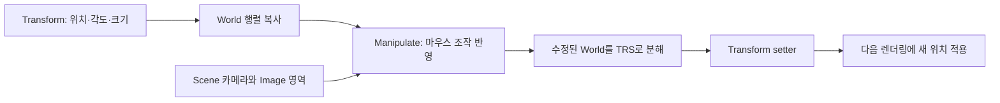

{{M0}}

## 마우스로 움직인 결과를 오브젝트에 남겨 봅시다

Scene 위에 화살표를 표시하는 데서 한 걸음 더 나아가겠습니다. X축 화살표를 끌면 화면의 도구만 움직이는 것이 아니라 선택한 오브젝트의 Position이 바뀌어야 합니다. 다음 프레임에도 그 위치가 유지되려면 ImGuizmo가 수정한 행렬을 엔진의 Transform 데이터에 돌려주어야 합니다.

<columns>
	<column ratio="50">
{{M1}}
	</column>
	<column ratio="50">
{{M2}}
	</column>
</columns>

위 이미지와 영상은 이동·회전·크기 조작을 관찰하는 자료입니다. 화살표는 이동, 원형 고리는 회전에 사용됩니다. 어떤 도구를 선택하든 데이터의 왕복 경로는 같습니다.



이번 예제는 부모 변환이 없는 오브젝트를 대상으로 합니다. 카메라와 Scene RT는 앞 글에서 준비한 것을 사용하고, ImGui 프레임 시작에서 `ImGuizmo::BeginFrame()`을 한 번 호출한 상태입니다.

## 1. Scene 이미지와 도구가 같은 화면을 보게 합니다

기즈모가 오브젝트 옆에 어긋나 보인다면 먼저 행렬 연산보다 Image의 영역을 확인합니다. 창의 제목 표시줄까지 포함한 크기와 실제 이미지 크기는 다릅니다. Image를 놓기 직전 위치와 크기를 기록하고 같은 영역을 ImGuizmo에 전달합니다.

```c++
// Scene 창의 Begin/End 안, Image 직전입니다.
const ImVec2 topLeft = ImGui::GetCursorScreenPos();
const ImVec2 imageSize = ImGui::GetContentRegionAvail();
// 이 자리에 Scene RT를 Image로 표시합니다.

ImGuizmo::SetOrthographic(false); // 실제 Scene 카메라가 원근 투영인 경우
ImGuizmo::SetDrawlist();          // 현재 Scene 창의 draw list
ImGuizmo::SetRect(topLeft.x, topLeft.y, imageSize.x, imageSize.y);
```

`SetOrthographic(false)`는 도구에게 카메라 종류를 알려 줍니다. 카메라의 Projection 자체를 원근 투영으로 바꾸는 함수는 아닙니다. 직교 카메라를 사용한다면 행렬과 이 설정을 함께 맞춥니다. 이미지 크기가 0인 패널에서는 Image와 기즈모를 제출하지 않습니다.

View와 Projection도 그 이미지를 만든 **Scene용 카메라**의 것을 가져옵니다. Game 카메라 행렬을 사용하면 Game과 Scene이 우연히 같은 위치일 때만 도구가 맞고, Scene 카메라를 돌리는 순간 어긋납니다.

## 2. 조작할 World 행렬은 복사본으로 준비합니다

아래는 SceneWindow 안의 선택 객체 처리 부분을 단순화한 코드입니다. `selectedObject`와 `mEditorCamera`를 확인한 뒤 실행하며, 선택 객체가 없을 때도 바깥 ImGui Begin/End는 짝을 맞춥니다.

```c++
ya::Transform* transform = selectedObject->GetComponent<ya::Transform>();
const ya::math::Matrix& view = mEditorCamera->GetViewMatrix();
const ya::math::Matrix& projection = mEditorCamera->GetProjectionMatrix();
ya::math::Matrix world = transform->GetWorldMatrix();
```

카메라 행렬은 읽는 입력입니다. 반면 world는 ImGuizmo가 수정할 입출력 값이라 복사본을 만듭니다. 복사본만 수정하고 끝내면 엔진의 원래 Position·Rotation·Scale은 그대로입니다. 다음 프레임에 원래 값으로 World를 재계산하면서 물체가 되돌아가는 이유가 여기에 있습니다.

## 3. 조작 축과 스냅을 정합니다

WORLD 모드에서 X 화살표는 오브젝트가 회전해 있어도 월드 X 방향을 가리킵니다. LOCAL 모드에서는 오브젝트의 회전된 X축을 따라갑니다. 예를 들어 Y축으로 90도 회전한 물체를 자체 옆 방향으로 옮기려면 LOCAL이 직관적이고, 장면 전체 격자에 맞춰 옮기려면 WORLD가 편합니다.

```c++
const bool snapping = ImGui::GetIO().KeyCtrl;
float snapValue = 0.5f;
if (mGuizmoType == ImGuizmo::ROTATE)
    snapValue = 45.0f;
float snapValues[3] = {snapValue, snapValue, snapValue};

ImGuizmo::Manipulate(
    *view.m, *projection.m,
    static_cast<ImGuizmo::OPERATION>(mGuizmoType),
    ImGuizmo::WORLD,
    *world.m,
    nullptr,
    snapping ? snapValues : nullptr);
```

현재 `ce56f16`의 SceneWindow는 WORLD를 사용합니다. 위 코드를 LOCAL로 바꿔 회전한 객체에서 축 방향을 비교해 볼 수 있습니다. `mGuizmoType == -1`은 기즈모를 끈 상태이므로 이 호출을 생략합니다.

Ctrl을 누르지 않으면 마지막 인자가 nullptr이므로 연속적으로 움직입니다. Ctrl을 누르면 이동·크기는 0.5 단위, 회전은 45도 단위를 사용합니다. 이동 0.5는 화면의 0.5픽셀이 아니라 월드 단위입니다. 회전 스냅에서는 라이브러리가 첫 각도 값을 사용하고, 축별 값이 필요한 조작을 위해 배열은 3개로 준비합니다.

## 4. 수정 결과를 Transform에 돌려줍니다

```c++
if (ImGuizmo::IsUsing())
{
    float position[3], rotationDegrees[3], scale[3];
    ImGuizmo::DecomposeMatrixToComponents(
        *world.m, position, rotationDegrees, scale);
    transform->SetPosition(ya::math::Vector3(position));
    transform->SetRotation(ya::math::Vector3(rotationDegrees));
    transform->SetScale(ya::math::Vector3(scale));
}
```

`IsUsing()`은 사용자가 도구를 조작 중인지 나타냅니다. 분해 결과에서 회전은 **degree**입니다. 현재 Transform도 degree를 보관하고 World 계산 시 radian으로 바꾸므로 그대로 setter에 전달합니다. 여기에 radian 변환을 한 번 더 넣으면 기대한 각도로 돌아가지 않습니다.

현재 소스의 `oldRotation + (newRotation - oldRotation)`은 위처럼 newRotation을 대입하는 것과 대수적으로 같습니다. 이 식이 180도 경계의 오일러 각 점프나 회전 분해 문제를 해결하는 보정은 아닙니다. 0 스케일·음수 스케일·shear도 단순 TRS 분해에서 주의가 필요한 확장 사례입니다.

SimpleMath의 행렬 메모리를 ImGuizmo에 넘기는 경로에 무조건 Transpose를 넣지 않습니다. GPU 상수 버퍼의 행렬 선언과 ImGuizmo의 CPU 행렬 입력은 서로 다른 접점입니다. 현재 엔진은 HLSL에서 `row_major`로 선언하고 CPU 행렬을 그대로 업로드합니다. [실제 SceneWindow 코드](https://github.com/eazuooz/YamYam_Engine/blob/ce56f16dd7a40fd2b4bf03c680790e5b637c7530/Editor_Window/guiSceneWindow.cpp)와 [ImGuizmo의 각도·행렬 API](https://github.com/eazuooz/YamYam_Engine/blob/ce56f16dd7a40fd2b4bf03c680790e5b637c7530/Editor_Window/ImGuizmo.h)를 함께 보면 이 경계를 확인할 수 있습니다.

부모 계층을 도입하면 분해 전에 월드 결과를 로컬로 되돌려야 합니다. 이 엔진의 행벡터 규칙에서는 `local = world × inverse(parentWorld)`입니다. 부모가 없는 현재 예제의 setter 경로를 계층 오브젝트에 그대로 적용하면 부모 변환이 중복됩니다.

## 움직임이 남는지 확인해 봅시다

위치를 (0,0,0)에서 옮긴 뒤 마우스를 놓아도 새 위치가 유지되는지 봅니다. Ctrl을 눌렀을 때 0.5 단위로 이동하고, 회전 모드에서는 45도 간격이 적용되는지 확인합니다. Scene 카메라를 옮기고 창 크기를 바꾸어도 도구가 물체 위에 남아 있어야 합니다.

현재 SceneWindow는 Scene RT를 그린 다음 기즈모의 결과를 Transform에 씁니다. 따라서 수정한 물체의 새 화면은 이후 Transform 갱신과 다음 Scene 렌더링에 반영됩니다. 화면 표시와 데이터 수정의 순서를 알면 이 한 프레임 차이를 잘못된 행렬로 오해하지 않을 수 있습니다.

다음에는 Q/W/E/R 키가 위 코드의 mGuizmoType을 바꾸는 경로를 연결하겠습니다. Undo는 조작 시작 전 값과 종료 후 값을 기록하는 별도 기능이며, 지금의 setter 호출만으로 완성되지는 않습니다.
<mention-page url="https://www.notion.so/18c0b1ffa61e80389ed9c167d4063762"/>
<mention-page url="https://www.notion.so/3dc0b1ffa61e814e9e8bd403ca145ebe"/>
