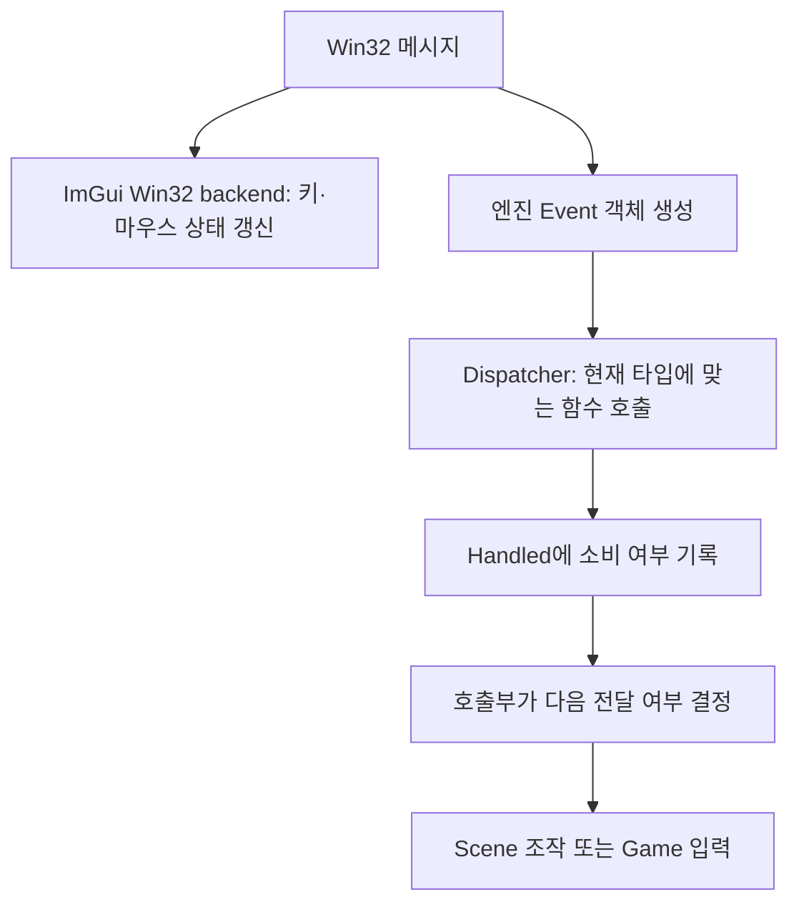
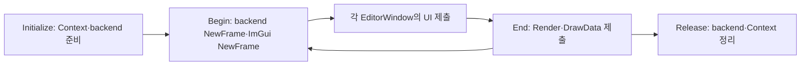

{{M0}}

## Inspector에서 글자를 입력하는데 게임 캐릭터가 움직인다면

에디터와 게임이 같은 키보드를 사용하면 입력을 어디까지 보낼지 정해야 합니다. Inspector의 이름 칸에 W를 입력할 때 캐릭터가 앞으로 움직이거나, Scene의 기즈모 모드까지 바뀌면 작업하기 어렵습니다. 반대로 게임 입력을 막겠다고 ImGui에 키 해제를 전달하지 않으면 UI는 키가 계속 눌린 것으로 볼 수 있습니다.

이번 글에서는 입력을 **받아 상태를 갱신하는 일**과 **게임 또는 에디터가 그 입력을 소비하는 일**을 나누겠습니다. Event, Window, ImguiEditor를 클래스 목록으로 외우기보다, 실제 사건 하나가 어떤 데이터를 거쳐 가는지 따라가 보겠습니다.



이 그림에서 Event 객체는 사건의 내용이고 Dispatcher는 그 내용을 적절한 함수에 전달하는 도구입니다. 이벤트를 만들었다고 자동으로 모든 객체에 방송되거나 다음 프레임까지 저장되는 것은 아닙니다.

## 1. 창 크기 변경을 데이터로 표현합니다

창을 1280×720에서 1000×600으로 바꿨다고 가정하겠습니다. 렌더러는 “창이 바뀌었다”는 사실만으로 새 타깃을 만들 수 없습니다. 새 가로·세로 값이 함께 필요합니다. WindowResizeEvent가 그 값을 보관합니다.

```c++
class WindowResizeEvent : public Event
{
public:
    WindowResizeEvent(unsigned int width, unsigned int height)
        : mWidth(width), mHeight(height) {}
    unsigned int GetWidth() const { return mWidth; }
    unsigned int GetHeight() const { return mHeight; }
    EVENT_CLASS_TYPE(SetWindowResize)
    EVENT_CLASS_CATEGORY(EventCategoryApplication)
private:
    unsigned int mWidth, mHeight;
};
```

이벤트의 정확한 종류는 `SetWindowResize`이고, 큰 분류는 Application입니다. MouseMoved는 정확한 종류 하나이면서 Mouse와 Input 카테고리에 함께 속할 수 있습니다. 종류는 특정 핸들러를 고를 때, 카테고리는 “모든 마우스 입력을 UI가 소비할 것인가”처럼 묶어서 판단할 때 사용합니다.

위 매크로는 숨겨진 등록 시스템이 아닙니다. `EVENT_CLASS_TYPE`은 GetStaticType, GetEventType, GetName 함수를 만들고, `EVENT_CLASS_CATEGORY`는 분류 비트를 반환하는 함수를 만듭니다. 공통 부모 Event에는 `bool Handled = false`가 있어 해당 사건의 소비 상태를 보관합니다. [실제 Event 정의](https://github.com/eazuooz/YamYam_Engine/blob/ce56f16dd7a40fd2b4bf03c680790e5b637c7530/YamYamEngine_CORE/yaEvent.h)에서 매크로를 펼쳐 읽을 수 있습니다.

## 2. Window는 새 크기를 보관하고 콜백에 알립니다

현재 `Window::SetWindowResize`의 핵심은 다음과 같습니다.

```c++
void Window::SetWindowResize(UINT width, UINT height)
{
    mData.Width = width;
    mData.Height = height;
    WindowResizeEvent event(width, height);
    if (mData.EventCallback)
        mData.EventCallback(event);
}
```

먼저 WindowData의 현재 크기를 바꾼 뒤 같은 값을 담은 이벤트를 전달합니다. 크기·HWND·콜백을 WindowData에 함께 두면 OS 창과 연결된 상태를 한 곳에서 찾을 수 있습니다. 다만 필드가 있다는 이유만으로 값이 갱신되지는 않습니다. 위처럼 메시지를 받아 값을 쓰는 경로가 있어야 합니다.

EventCallback은 `std::function<void(Event&)>`입니다. Window는 그래픽 디바이스의 구체적인 함수를 직접 알 필요 없이 등록된 콜백을 호출합니다. 받는 쪽은 Resize 이벤트인지 확인하고 0 크기 최소화 상태인지 판단한 뒤 필요한 리사이즈를 요청합니다. 백버퍼의 안전한 교체 시점은 렌더러가 관리합니다.

`event`는 지역 변수이므로 함수가 끝나면 사라집니다. 콜백은 호출 중 값을 읽을 수 있지만 Event의 주소를 다음 프레임까지 보관하면 안 됩니다. 지연 처리가 필요하다면 데이터를 복사하거나 소유권을 가진 큐 이벤트를 따로 만들어야 합니다. Window보다 오래 살아 있는 콜백이 이미 파괴된 Application의 this를 참조하지 않도록 연결의 수명도 맞춥니다.

## 3. Dispatch의 true는 “처리했다”와 다릅니다

현재 Dispatcher 코드를 한 줄씩 따라가 보겠습니다.

```c++
template<typename T, typename F>
bool Dispatch(const F& func)
{
    if (mEvent.GetEventType() == T::GetStaticType())
    {
        mEvent.Handled |= func(static_cast<T&>(mEvent));
        return true;
    }
    return false;
}
```

먼저 실제 이벤트 종류와 T가 나타내는 종류를 비교합니다. 같을 때만 T로 변환해 콜백을 **지금 호출**합니다. 콜백의 bool은 Handled에 OR하고, Dispatch 자체는 타입이 맞았다는 의미로 true를 반환합니다.

예를 들어 창 크기 변경을 로그에만 남기고 렌더러에도 전달하고 싶다면 핸들러는 false를 반환할 수 있습니다.

```c++
WindowResizeEvent event(1000, 600);
EventDispatcher dispatcher(event);
const bool matched = dispatcher.Dispatch<WindowResizeEvent>(
    [](WindowResizeEvent& resize)
    {
        // resize.GetWidth()/GetHeight()를 로그로 관찰만 합니다.
        return false; // 다른 대상도 이 사건을 처리할 수 있게 둡니다.
    });
// matched == true, event.Handled == false
```

반대로 핸들러가 true를 반환하면 Handled가 true가 됩니다. 이미 true였으면 나중 핸들러가 false를 반환해도 OR 연산 때문에 true를 유지합니다. 하지만 **Dispatch 함수에는 Handled 검사 자체가 없습니다.** 전파를 멈추려면 호출부가 `if (!event.Handled)`로 다음 대상을 호출할지 결정해야 합니다.

이 구조는 리스너를 저장하는 Subscribe가 아닙니다. `Dispatch<T>`를 호출할 때마다 전달한 함수를 한 번 실행할지 판단합니다. 여러 구독자·등록 해제 토큰·지연 큐는 별도 구조입니다.

## 4. ImGui의 입력 수집과 엔진 이벤트 차단을 구별합니다

Win32의 `WndProc`는 먼저 `ImGui_ImplWin32_WndProcHandler`에 플랫폼 메시지를 전달합니다. 이 backend가 마우스 위치, 눌린 키, 해제된 키 등 ImGui 입력 상태를 갱신합니다. 엔진의 `ImguiEditor::OnEvent`는 그와 다른 역할을 합니다. 이미 수집된 ImGui 상태를 보고 엔진 이벤트를 소비할지 결정합니다.

```c++
// 실제 OnEvent의 조건을 논리 AND로 풀어 쓴 동작 설명입니다.
void ImguiEditor::OnEvent(ya::Event& e)
{
    if (!mBlockEvent)
        return;
    ImGuiIO& io = ImGui::GetIO();
    e.Handled |= e.IsInCategory(ya::EventCategoryMouse)
        && io.WantCaptureMouse;
    e.Handled |= e.IsInCategory(ya::EventCategoryKeyboard)
        && io.WantCaptureKeyboard;
}
```

마우스 이벤트이면서 ImGui가 마우스를 사용하려는 상황이면 Handled를 켭니다. 키보드도 같은 방식입니다. WantCaptureMouse/Keyboard는 단순히 커서가 사각형 안에 있는지 검사한 값과 같지 않습니다. 활성 위젯·팝업 등 ImGui의 상호작용 상태를 반영하므로 임의의 hover 검사만으로 대체하지 않습니다.

Scene과 Game은 ImGui 창 안에 있지만 자체 조작도 필요합니다. 그래서 에디터는 어떤 창이 보이고, 포커스를 가졌고, 마우스가 어디에 있는지를 이용해 mBlockEvent와 Game 입력 허용 정책을 정합니다. UI 입력 수집을 중단해서 이 문제를 해결하지는 않습니다. 특히 눌림을 UI에 보냈다면 해제도 전달되어야 정상 상태로 돌아옵니다.

현재 `EditorApplication::OnEvent`는 키·마우스 디스패치를 먼저 실행하고, Handled가 false일 때만 ImguiEditor::OnEvent를 호출합니다. MouseMoved 핸들러는 본문에 실제 작업이 없어도 true를 반환하며, Scene에 포커스가 있는 OnKeyPressed도 끝에서 true를 반환합니다. 그러므로 현재 코드가 모든 미사용 입력을 정교하게 전달한다고 설명할 수는 없습니다. 입력 전파 정책을 확장할 때 실제로 소비한 이벤트만 true로 표시하도록 이 반환값들을 살펴야 합니다.

## 5. ImguiEditor는 프레임의 경계를 모읍니다

버튼을 그리는 곳마다 ImGui 컨텍스트를 만들 수는 없습니다. Context와 backend는 초기화할 때 준비하고, 한 UI 프레임 안에서 모든 창을 만든 뒤 한 번 렌더링합니다. ImguiEditor는 이 순서를 한 곳에 모읍니다.



DX11 단계에서는 Begin/End 안에서 DX11 backend를 사용합니다. 현재 DX12 경로는 이 위치에 DX12 backend를 연결하고, End에서 백버퍼를 복원하며 descriptor와 GPU 사용 완료까지 관리합니다. 래퍼를 둔다고 GPU의 완료 조건이 사라지지는 않습니다. 대신 UI 창마다 그 초기화·종료 코드를 반복하지 않고 공통 경계에서 처리할 수 있습니다.

## 사건 하나를 따라 확인해 봅시다

창 크기를 바꾸고 WindowData 값과 Resize 이벤트의 값이 함께 바뀌는지 확인합니다. 이어 핸들러가 false를 반환하는 경우와 true를 반환하는 경우에 Dispatch 결과·Handled를 각각 관찰합니다. 마지막으로 Inspector의 텍스트 입력, Scene의 W 키, Game의 W 키가 서로 다른 용도로 소비되는지 확인하면 세 클래스가 왜 필요한지 실제 행동으로 연결할 수 있습니다.

키 입력에서 기즈모 모드로 이어지는 다음 글과, CPU 이벤트보다 더 오래 남을 수 있는 DX12 리소스의 수명 설명을 이어 읽습니다.
<mention-page url="https://www.notion.so/18c0b1ffa61e80389ed9c167d4063762"/>
<mention-page url="https://www.notion.so/3dc0b1ffa61e8153b02fd321cc48e655"/>
