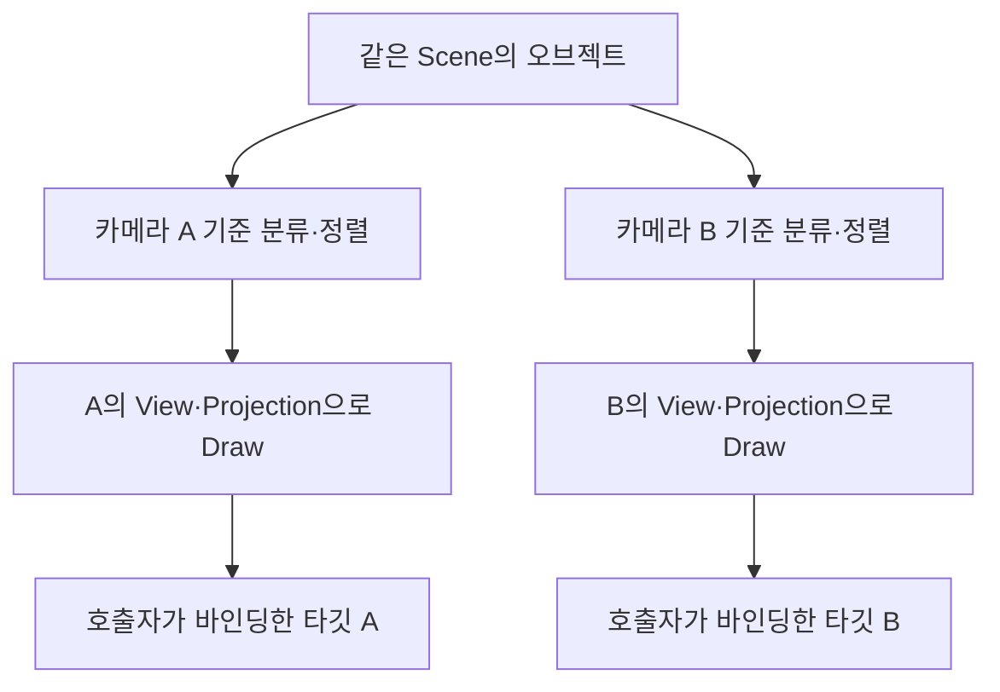
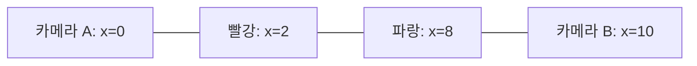

## 같은 씬을 두 방향에서 보면 그리는 순서도 달라집니다

Scene 창에서는 물체를 옆에서 편집하고 Game 창에서는 플레이어 시점으로 보고 싶습니다. 오브젝트를 두 벌 만들 필요는 없습니다. 같은 오브젝트 목록을 다른 카메라의 View·Projection으로 다시 그리면 됩니다. 다만 행렬만 바꾸고 첫 카메라의 정렬 결과를 재사용하면 반투명 물체가 잘못 겹칠 수 있습니다.

{{M0}}

이번에는 카메라마다 **수집 → 렌더 모드 분류 → 거리 정렬 → Draw**를 수행하는 구조를 만들겠습니다. DX11에서 만들었던 정책이 현재 DX12의 `renderer::RenderSceneFromCamera`로 이어집니다. 영상은 개발 당시 기록이며, 카메라 목록에 등록했다고 각 카메라의 RT가 자동으로 만들어지는 것은 아닙니다.

{{M1}}

두 시점을 비교할 때는 “어떤 카메라로 보았는가”와 “어느 텍스처에 그렸는가”를 따로 봅니다. 카메라는 변환 기준이고 RenderTarget은 출력 저장소입니다. 현재 엔진은 Scene용 RT와 Game용 RT를 따로 가지며, 등록된 게임 카메라들은 Game RT에 차례로 그립니다.

## 1. 카메라 하나의 작업을 함수 하나로 모읍니다

아래는 현재 `ce56f16`의 핵심 흐름입니다. DX11 시절 Scene 안에 있던 분류·정렬 과정을 공통 renderer 함수로 옮겨 Game과 EditorCamera에서 같이 사용합니다.

```c++
void RenderSceneFromCamera(Scene* scene, Camera* camera)
{
    if (!scene || !camera) return;
    camera->SetViewportSize(GetDevice()->GetViewportWidth(),
                            GetDevice()->GetViewportHeight());
    camera->LateUpdate();
    Matrix view = camera->GetViewMatrix();
    Matrix projection = camera->GetProjectionMatrix();
    Vector3 cameraPos = camera->GetOwner()
        ->GetComponent<Transform>()->GetPosition();

    std::vector<GameObject*> opaque, cutout, transparent;
    CollectRenderables(scene, opaque, cutout, transparent);
    SortByDistance(opaque, cameraPos, true);
    SortByDistance(cutout, cameraPos, true);
    SortByDistance(transparent, cameraPos, false);
    RenderRenderables(opaque, view, projection);
    RenderRenderables(cutout, view, projection);
    RenderRenderables(transparent, view, projection);
}
```

호출자는 먼저 원하는 RT와 viewport를 바인딩합니다. 함수는 현재 viewport의 가로·세로를 카메라에 전달해 투영 비율을 맞추고 카메라 행렬을 갱신합니다. 그다음 이 **카메라 위치 기준**으로 세 목록을 정렬합니다. 함수 내부에 RT를 새로 만드는 부분이 없는 점도 확인합니다.

View는 월드 좌표를 카메라 기준으로 바꾸고 Projection은 클립 공간으로 보냅니다. 모든 오브젝트의 World는 달라도 한 번의 카메라 패스에서는 View·Projection이 같습니다. 현재 HLSL은 `row_major` 선언과 행벡터 `mul(position, matrix)`를 사용하고 CPU는 전치 없이 행렬을 보냅니다. 카메라를 바꿀 때 다음 Draw의 상수 데이터도 바뀌어야 합니다.



## 2. 불투명, 구멍 난 표면, 반투명을 구별합니다

Opaque는 벽처럼 뒤를 가리는 물체입니다. 블렌딩을 끄고 깊이 테스트와 깊이 쓰기를 켭니다. 가까운 벽을 먼저 그리면 뒤의 가려진 픽셀을 깊이 테스트로 줄일 기회가 생깁니다. 앞에서 뒤로 정렬하는 것은 이 효율을 위한 선택이며, Early-Z의 실제 실행 조건은 셰이더의 discard·깊이 출력 등에 따라 달라집니다.

CutOut은 “보이거나 완전히 뚫려 있거나”를 선택하는 표면입니다. 철망의 구멍이나 나뭇잎 외곽을 생각해 봅시다.

{{M2}}

그림에서는 텍스처 사각형 전체가 아니라 알파가 남은 부분만 표면이 되는 점을 봅니다. 픽셀 셰이더에서 임계값 아래의 픽셀을 버리고, 살아남은 픽셀은 불투명처럼 색과 깊이를 씁니다.

```c++
// HLSL: 텍스처에서 color를 샘플한 뒤의 CutOut 처리
clip(color.a - 0.01f); // 현재 YamYam의 임계값
return color;
```

`clip`은 인자가 음수이면 픽셀을 버립니다. 알파가 0.5라고 해서 배경과 절반씩 섞는 동작은 아닙니다. 0.01보다 크면 픽셀이 살아남고, 블렌딩이 꺼져 있으면 RGB는 그대로 출력됩니다. 깊이에도 구멍이 생기므로 뒤의 물체가 구멍으로 보입니다.

Transparent는 새 색과 기존 배경색을 섞습니다. 겹치는 순서가 결과에 영향을 주므로 뒤에서 앞으로 그립니다.

{{M3}}

검은 배경 위에 알파 0.5의 파란 유리를 먼저 그리고, 알파 0.5의 빨간 유리를 그 위에 그려 봅시다. RGB 계산은 `새 색 × 알파 + 기존 색 × (1-알파)`입니다. 파랑 뒤 빨강 순서의 결과는 (0.5, 0, 0.25)이고, 빨강 뒤 파랑이면 (0.25, 0, 0.5)입니다. 같은 물체·색·알파여도 순서만 바꾸면 결과가 달라집니다.

| 종류 | 순서 | 깊이 쓰기 | 색 혼합 |
| --- | --- | --- | --- |
| Opaque | 가까운 물체부터 | 켬 | 끔 |
| CutOut | 가까운 물체부터 | 살아남은 픽셀에 기록 | 끔, PS에서 clip |
| Transparent | 먼 물체부터 | 끔 | SrcAlpha / InvSrcAlpha |

## 3. 카메라가 바뀌면 거리를 다시 계산합니다

{{M4}}

한 직선 위에 카메라 A가 x=0, 빨강 물체가 x=2, 파랑 물체가 x=8에 있다고 합시다. A에서 파랑은 8, 빨강은 2만큼 떨어져 있으므로 파랑→빨강 순서입니다. 카메라 B가 x=10에서 반대 방향을 보면 빨강은 8, 파랑은 2이므로 빨강→파랑으로 바뀝니다.



그래서 두 카메라가 같은 Scene을 그리더라도 첫 번째 정렬 결과를 그대로 쓰면 안 됩니다. 정적 오브젝트도 카메라가 움직이면 거리가 달라집니다.

```c++
void SortByDistance(std::vector<GameObject*>& list,
                    const Vector3& cameraPos, bool ascending)
{
    auto compare = [cameraPos, ascending](GameObject* a, GameObject* b)
    {
        float da = Vector3::Distance(
            a->GetComponent<Transform>()->GetPosition(), cameraPos);
        float db = Vector3::Distance(
            b->GetComponent<Transform>()->GetPosition(), cameraPos);
        return ascending ? da < db : da > db;
    };
    std::ranges::sort(list, compare);
}
```

현재 코드는 오브젝트 위치와 카메라 사이의 유클리드 거리로 정렬합니다. 이는 물체 단위의 간단한 정책입니다. 큰 메시 두 개가 서로 교차하면 모든 픽셀을 올바른 순서로 만들 수는 없습니다. 같은 거리일 때의 안정적인 순서도 std::ranges::sort가 보장하지 않습니다. 더 복잡한 장면에서는 뷰 깊이, 명시적 정렬 키, 메시 분할 또는 다른 투명도 기법을 검토할 수 있습니다.

## 4. 정렬과 깊이 테스트는 서로 다른 결정입니다

Transparent를 뒤에서 앞으로 정렬하더라도 깊이 비교 설정에 따라 불투명 벽에 가려질지 달라집니다. 일반적인 3D 유리라면 기존 불투명 깊이에 대해 LessEqual로 비교하면서 깊이 쓰기만 끕니다. 그러면 벽 뒤의 유리는 그려지지 않고 벽 앞의 유리만 섞입니다.

YamYam에서 DX11 때 사용했고 DX12로 복구한 Transparent 정책은 **DepthFunc=Always, 깊이 쓰기 끔**입니다. 따라서 벽 뒤에 있어도 깊이 비교로 가려지지 않습니다. 이는 기존 결과를 유지하기 위한 정책이며 모든 3D 투명 물체의 표준 설정은 아닙니다.

```c++
// DX11 깊이 상태 생성 부분: 기본값을 먼저 채운 뒤 정책을 바꿉니다.
CD3D11_DEPTH_STENCIL_DESC depth(D3D11_DEFAULT);
depth.DepthWriteMask = D3D11_DEPTH_WRITE_MASK_ZERO;
depth.DepthFunc = D3D11_COMPARISON_ALWAYS; // 기존 YamYam Transparent
// 벽의 깊이에 가리는 유리 정책을 실험하려면 LESS_EQUAL로 비교합니다.

CD3D11_BLEND_DESC blend(D3D11_DEFAULT);
auto& rt = blend.RenderTarget[0];
rt.BlendEnable = TRUE;
rt.SrcBlend = D3D11_BLEND_SRC_ALPHA;
rt.DestBlend = D3D11_BLEND_INV_SRC_ALPHA;
rt.BlendOp = D3D11_BLEND_OP_ADD;
rt.SrcBlendAlpha = D3D11_BLEND_ONE;
rt.DestBlendAlpha = D3D11_BLEND_ZERO;
rt.BlendOpAlpha = D3D11_BLEND_OP_ADD;
// CreateDepthStencilState/CreateBlendState 성공 확인 후 Draw 전에 바인딩합니다.
```

RGB와 알파 채널의 식도 나뉩니다. 위 알파 설정은 `새 알파 × 1 + 기존 알파 × 0`이므로 출력 알파는 마지막 픽셀의 알파입니다. 결과 RT를 다시 ImGui로 표시하면 이 알파가 한 번 더 적용될 수 있습니다. 현재 DX12는 표시용 SRV에서 알파를 1로 읽게 해 이미 합성한 색이 다시 어두워지는 문제를 해결했습니다.

## 5. 수집 단계가 SpriteRenderer만 알지 않게 합니다

{{M5}}

BaseRenderer는 “이 오브젝트를 이 카메라로 그려라”는 공통 입구입니다. 수집 단계가 SpriteRenderer, MeshRenderer 등 구체적인 타입마다 분기할 필요를 줄입니다. 현재 소스는 BaseRenderer에서 Material을 얻어 모드를 분류합니다.

```c++
BaseRenderer* renderer = gameObj->GetComponent<BaseRenderer>();
if (renderer == nullptr || renderer->GetMaterial() == nullptr)
    continue;

switch (renderer->GetMaterial()->GetRenderingMode())
{
case graphics::eRenderingMode::Opaque:
    opaqueList.push_back(gameObj); break;
case graphics::eRenderingMode::CutOut:
    cutoutList.push_back(gameObj); break;
case graphics::eRenderingMode::Transparent:
    transparentList.push_back(gameObj); break;
}
```

분류가 끝나면 RenderRenderables는 각 오브젝트에 `Render(view, projection)`을 호출합니다. 실제 SpriteRenderer는 받은 카메라 행렬로 Transform 상수 버퍼를 설정하고 Material과 Mesh를 그립니다. 이 인터페이스가 있다고 스킨 애니메이션, LOD, 프러스텀 컬링 같은 기능까지 구현된 것은 아닙니다. 새 렌더러가 실제 셰이더·리소스·Draw 경로를 제공해야 합니다.

현재 흐름은 [yaRenderer.cpp](https://github.com/eazuooz/YamYam_Engine/blob/ce56f16dd7a40fd2b4bf03c680790e5b637c7530/YamYamEngine_CORE/yaRenderer.cpp)와 [yaBaseRenderer.h](https://github.com/eazuooz/YamYam_Engine/blob/ce56f16dd7a40fd2b4bf03c680790e5b637c7530/YamYamEngine_CORE/yaBaseRenderer.h)에서 확인할 수 있습니다. 카메라 등록은 현재 벡터 순서를 사용하며 자동 우선순위 시스템이나 카메라별 RT 생성 기능은 별도입니다.

## 두 카메라와 두 장의 반투명 사각형으로 확인합니다

빨강·파랑 반투명 사각형을 앞뒤로 놓고 카메라를 반대편으로 옮겨 봅니다. 가까운 색이 나중에 섞이도록 정렬이 바뀌어야 합니다. 앞에 불투명 벽도 놓아 Always와 LessEqual의 차이를 비교하면 “순서가 맞는 것”과 “깊이에 가리는 것”이 별개라는 점이 보입니다.

현재 Game과 Scene은 활성 Scene과 DontDestroyOnLoad를 각각 호출해 렌더링합니다. 각 호출 안에서 세 목록을 정렬하므로 두 Scene의 투명 물체 전체를 합친 전역 정렬은 아닙니다. 서로 겹치는 투명 물체를 두 Scene에 나누어 두면 이 호출 경계도 결과에 영향을 줄 수 있습니다.

## 개발 환경에서 DirectXTex를 함께 확인하기

이 단계에서 사용한 텍스처는 DirectXTex로 파일을 해석합니다. 라이브러리의 .vcxproj를 솔루션에 포함하면 대응하는 소스와 심벌을 준비해 로드 함수 안으로 따라 들어갈 수 있습니다. Debug/Release, x64, CRT 설정과 프로젝트 참조를 맞춰야 하며 소스 파일을 임의로 빼면 링크가 깨질 수 있습니다. 패키지 방식도 일치하는 소스·심벌이 있으면 내부 디버깅이 가능합니다.

파일 로드, 밉맵 생성, 압축은 별도 작업입니다. LoadFromWICFile을 호출했다고 밉맵이 자동 생성되거나 모든 처리가 GPU에서 실행되는 것은 아닙니다. 텍스처 파일에서 SRV까지의 과정은 텍스처 강의에서 이어 볼 수 있습니다.
<mention-page url="https://www.notion.so/c60c5418badf4c85ae0e612979372804"/>

이 렌더 순서를 유지하면서 DX12 Texture·RT·descriptor와 PSO에 연결하는 구현은 다음 두 강의로 이어집니다.
<mention-page url="https://www.notion.so/3dc0b1ffa61e814e9e8bd403ca145ebe"/>
<mention-page url="https://www.notion.so/3dc0b1ffa61e8153b02fd321cc48e655"/>
