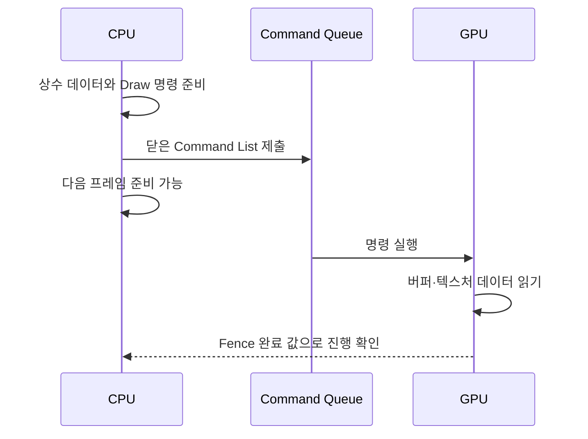

## DX11에서 만들었던 화면을 DX12로 옮겨 봅시다

PART1에서는 정점·텍스처·상수 버퍼로 물체를 그리고, 카메라와 ImGui로 에디터 화면을 만들었습니다. PART2에서도 그려야 할 장면은 같습니다. 바뀌는 것은 **GPU에 작업을 전달하고 그 작업에 쓰인 메모리를 관리하는 방식**입니다.

DX11에서는 Context에 셰이더·버퍼·상태를 설정하고 Draw를 호출했습니다. DX12에서는 먼저 Command List에 그 작업을 기록하고 Queue에 제출합니다. 제출한 순간 CPU 함수는 계속 진행할 수 있지만 GPU가 그 명령을 다 실행했다고 보장할 수는 없습니다. 이 차이를 이해하는 것이 DX12 전환의 출발점입니다.

{{M0}}
{{M1}}

위 자료를 볼 때는 CPU가 명령을 준비하는 부분과 GPU가 실행하는 부분을 나누어 봅니다. DX12는 그 사이의 명령 기록, 리소스 접근, 동기화에 대한 제어를 엔진에 더 많이 줍니다. Direct3D 12는 Windows에서 GPU 렌더링·연산을 제어하는 API이며, Vulkan·Metal도 명시적 관리라는 공통점은 있지만 지원 환경과 세부 구조는 다릅니다.

## 1. Draw를 호출한 뒤 메모리를 바로 덮어쓰면 왜 안 될까요?

빨간 사각형과 파란 사각형을 그릴 때 하나의 상수 버퍼 주소에 빨강을 쓰고 Draw를 기록한 뒤, 같은 주소에 파랑을 덮어쓰고 두 번째 Draw를 기록했다고 합시다. GPU는 나중에 그 주소를 읽습니다. 두 Draw 모두 마지막에 쓴 파랑을 읽을 수 있습니다.

명령을 기록할 때 주소를 전달하는 것과 그 주소의 데이터를 즉시 복사해 두는 것은 다릅니다. 그래서 이번 엔진은 Draw마다 다른 상수 버퍼 영역을 배정하고, 다음 프레임에 그 영역을 재사용할 때 이전 GPU 사용이 끝났는지 확인합니다.

Fence는 “이 작업 지점까지 GPU가 끝냈는가”를 확인합니다. 반면 Barrier는 명령 안에서 “이 텍스처를 이제 출력으로 쓸 것인가, 셰이더에서 읽을 것인가” 같은 접근 전환을 표현합니다. Fence를 만들었다고 리소스 상태가 바뀌지 않고, Barrier를 넣었다고 CPU가 GPU 완료를 기다리지는 않습니다.

## 2. DX11에서 배운 개념에 새 관리 방법을 연결합니다

| DX11에서 했던 일 | DX12에서 연결할 개념 | 같은 화면을 위해 필요한 이유 |
| --- | --- | --- |
| Context에 상태와 Draw 설정 | Allocator·Command List·Queue | 명령을 담고 제출할 경로가 필요합니다 |
| VS·PS·Blend·Depth 상태 바인딩 | PSO | 함께 사용할 파이프라인 상태 조합을 준비합니다 |
| SRV 객체를 셰이더 슬롯에 연결 | Descriptor Heap·Root Signature | GPU가 어떤 리소스를 읽을지 지정합니다 |
| RTV로 그리고 SRV로 읽기 | Resource Barrier | 같은 이미지의 출력·입력 용도 변경을 표현합니다 |
| 다음 프레임 데이터 쓰기 | Fence와 프레임별 메모리 | GPU가 아직 읽는 데이터를 덮어쓰지 않습니다 |

DX11에도 Deferred Context를 이용한 명령 기록이 있습니다. DX12가 멀티스레드 렌더링을 처음 가능하게 한 것은 아닙니다. DX12에서는 여러 스레드가 각자의 Allocator/List에 명령을 기록하고 제출하는 구조를 더 직접적으로 설계할 수 있습니다. 하지만 여러 Queue나 스레드를 만든다고 GPU 작업이 항상 동시에 실행되거나 빨라지는 것은 아닙니다.

우선 한 개의 Direct Queue로 정확한 결과를 만들고, 매 프레임 기다리는 위치와 메모리 재사용 조건을 이해하겠습니다. 이후 병목을 측정해 병렬 기록이나 다른 Queue가 도움이 되는 작업을 분리할 수 있습니다.

## 3. 먼저 기존 Raster 화면을 복구합니다

이번 엔진의 첫 목표는 신기능을 모두 추가하는 것이 아니라, 기존 스프라이트와 Opaque → CutOut → Transparent 순서를 DX12 위에서 다시 동작시키는 것입니다. Scene 카메라와 Game 카메라의 결과를 별도 RenderTarget에 그리고, ImGui가 GPU SRV handle로 그 결과를 표시하도록 연결합니다.

따라서 실제 구현을 따라갈 순서는 초기화, 삼각형과 Raster 파이프라인, 프레임 동기화, Texture·RenderTarget·상수 버퍼, Scene/Game 표시, 렌더 상태·수명 관리입니다. 어느 단계에서든 이전 화면을 기준으로 비교하면 잘못된 출력이 셰이더 문제인지 리소스 연결 문제인지 좁힐 수 있습니다.

## 4. Mesh Shader·Compute·Ray Tracing은 어떤 갈래일까요?

Raster는 정점으로 만든 삼각형을 화면 픽셀로 바꾸는 기본 경로입니다. Mesh Shader는 이 경로의 기하 준비 부분을 GPU 작업 그룹 중심으로 구성할 수 있게 합니다. 전통적인 Vertex Shader 경로와 입력 방식이 다르며 지원 기능을 확인해야 합니다.

{{M2}}

Mesh Shader의 그림은 기하를 준비하는 단계가 어떻게 달라지는지 비교하는 자료입니다. 이를 이해하는 글과 현재 엔진의 구현 완료 상태는 구분합니다. YamYam의 이번 화면 복구는 기존 VS/PS Raster 경로를 사용합니다.

Compute는 삼각형을 그리기보다 작업 그룹에 계산을 배분합니다. 예를 들어 이미지의 각 픽셀 밝기를 바꾸거나 버퍼의 입자 위치를 갱신하는 일을 Dispatch로 실행할 수 있습니다. 계산한 결과를 그래픽 패스가 읽는다면 리소스 상태와 실행 순서를 연결해야 합니다.

Ray Tracing은 픽셀이나 다른 위치에서 광선을 보내 가장 가까운 교차점과 표면 정보를 구합니다. 다음 자료에서는 광선 탐색과 그 결과를 처리하는 셰이더의 역할을 살펴봅니다.

{{M3}}
{{M4}}

DXR에는 가속 구조, Shader Table, RayGeneration·Miss·Hit 계열의 셰이더 연결이 필요합니다. DX12 Device를 만들었다는 사실만으로 DXR이나 Mesh Shader 지원이 보장되지는 않습니다. 각 기능의 지원 여부와 셰이더 모델·인터페이스 조건을 따로 검사합니다.

이 세 갈래는 뒤의 개론에서 원리와 최소 연결을 배웁니다. 현재 YamYam에 Mesh Shader·범용 Compute 효과·DXR 렌더러가 모두 구현되어 있다는 의미는 아닙니다.

## 다음 글에서는 무엇을 만들까요?

먼저 Factory에서 GPU 어댑터를 고르고 Device를 만든 뒤, 명령을 넣을 Queue와 Allocator/List, 결과를 표시할 SwapChain, 재사용을 판단할 Fence를 준비합니다. 각각의 이름보다 “없으면 어떤 작업을 할 수 없는가”를 기준으로 읽어 봅시다. 이후 삼각형을 표시하면서 이 객체들이 한 프레임에서 만나는 지점을 확인하겠습니다.

[Microsoft의 Direct3D 12 프로그래밍 가이드](https://learn.microsoft.com/en-us/windows/win32/direct3d12/directx-12-programming-guide)는 API별 공식 설명을 찾을 때 함께 사용합니다.
<mention-page url="https://www.notion.so/1bd0b1ffa61e80978742dd1613e0efc6"/>
