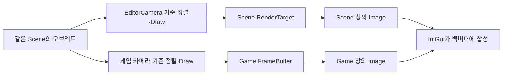

{{M0}}

## 에디터 카메라를 움직여도 플레이어 화면은 그대로 두고 싶습니다

Scene과 Game 창에 같은 이미지를 넣으면 창은 두 개여도 시점은 하나입니다. 개발자가 Scene에서 물체 뒤를 살펴보려 카메라를 돌렸을 때 Game 화면까지 돌아가면 편집 시점과 플레이 시점을 분리한 것이 아닙니다. 두 카메라의 결과를 따로 만들고 각 창에 넣어야 합니다.

이 글은 DX11에서 시작한 Scene/Game 분리의 원리를 설명하고 현재 DX12 연결로 이어 줍니다. 위 영상과 아래 구조 그림은 분리 작업 당시 자료입니다. 최신 실행 캡처와 Texture·descriptor 구현은 끝에 연결한 후속 강의에서 볼 수 있습니다.

{{M1}}
{{M2}}

그림을 읽을 때 같은 Scene의 오브젝트 목록에서 두 경로가 갈라지는 지점을 봅니다. **오브젝트와 Mesh·Material은 공유하고, 카메라의 View·Projection과 출력 RT를 분리**합니다. 두 Scene을 복제해 서로 다른 세계를 만드는 작업이 아닙니다.



## 1. 카메라만 두 개면 충분할까요?

같은 텍스처에 Game을 그린 뒤 Scene을 Clear하고 그리면 Game 결과가 사라집니다. 그 텍스처를 두 Image에서 읽으면 둘 다 마지막 Scene 결과를 보게 됩니다. 두 결과를 동시에 유지하려면 각각의 색상 텍스처가 필요합니다.

{{M3}}

SceneWindow는 EditorCamera의 RenderTarget을 사용하고, Game 창은 renderer::FrameBuffer를 표시합니다. 깊이 버퍼도 각 출력의 크기와 패스에 맞춰 관리합니다. 다음은 이 저장소의 RT 생성 인터페이스를 사용한 핵심 부분입니다.

```c++
using namespace ya::graphics;
RenderTargetSpecification spec{};
spec.Width = width;   // 실제 패널 렌더링 크기, 0보다 큼
spec.Height = height;
spec.Attachments = {eRenderTragetFormat::RGBA8, eRenderTragetFormat::Depth};
mRenderTarget = RenderTarget::Create(spec);
```

색상은 Image에서 읽을 결과이고 깊이는 오브젝트 간 가림을 판단합니다. 이것을 Scene용과 Game용으로 각각 준비합니다. 실제 교체·해제 책임은 소유 클래스가 가지며, DX12에서는 GPU가 사용 중인 이전 리소스와 descriptor를 즉시 재사용하지 않습니다.

다중 게임 카메라가 등록된 경우 현재 Scene::Render는 그 카메라들을 Game RT에 순서대로 그립니다. 등록된 모든 Camera에 개별 RT가 자동으로 붙는 구조는 아닙니다. 미니맵처럼 세 번째 결과를 별도로 보관하려면 그 카메라에 맞는 출력 타깃과 표시 경로를 추가해야 합니다.

## 2. 그 화면을 만든 카메라 행렬을 끝까지 전달합니다

Scene의 물체가 Game과 다른 위치에 보이는 이유는 World가 바뀌어서가 아니라 View·Projection이 다르기 때문입니다. 카메라가 둘이어도 SpriteRenderer가 항상 mainCamera만 읽는다면 두 결과는 여전히 같은 시점이 됩니다. 그래서 Render 함수에 사용할 카메라 행렬을 인자로 전달합니다.

```c++
// 현재 공통 렌더 함수 호출의 개념입니다.
// 각 호출 전에 해당 RT·viewport가 바인딩되어 있어야 합니다.
ya::renderer::RenderSceneFromCamera(scene, gameCamera);
// 출력과 viewport를 Scene RT로 바꾼 다음:
ya::renderer::RenderSceneFromCamera(scene, editorCamera);
```

각 호출은 그 카메라의 위치로 Opaque·CutOut을 가까운 순서, Transparent를 먼 순서로 정렬하고, 같은 카메라의 View·Projection을 오브젝트 Render에 전달합니다. 최종 SpriteRenderer가 자기 World와 전달된 카메라 행렬을 상수 버퍼에 씁니다. DX12에서는 Draw별 업로드 구간이 달라야 두 카메라의 데이터가 서로 덮이지 않습니다.

예를 들어 Game 카메라가 물체 정면에 있고 EditorCamera가 오른쪽에 있으면 Game에는 정면, Scene에는 옆면이 보여야 합니다. 이때 Scene의 기즈모에도 EditorCamera 행렬을 사용해야 물체와 겹쳐 표시됩니다. 기즈모만 mainCamera를 사용하면 화면의 물체 옆으로 어긋날 수 있습니다.

## 3. 텍스처를 UI 이미지로 보여 줍니다

다음은 DX11 단계의 Game 창 표시 부분입니다. FrameBuffer는 이미 게임 카메라가 렌더링한 결과입니다.

```c++
if (ImGui::Begin("Game"))
{
    const ImVec2 size = ImGui::GetContentRegionAvail();
    if (FrameBuffer && size.x >= 1 && size.y >= 1)
    {
        auto* color = FrameBuffer->GetAttachmentTexture(0);
        if (color && color->GetSRV())
            ImGui::Image((ImTextureID)(intptr_t)color->GetSRV().Get(), size);
    }
}
ImGui::End();
```

Image는 Scene을 렌더링하는 함수가 아닙니다. 이미 있는 색상 텍스처의 SRV를 읽도록 UI 명령에 기록합니다. 카메라 Draw가 없으면 Clear 색만 보이고, SRV가 잘못되면 올바른 카메라 결과를 갖고 있어도 창에는 나타나지 않습니다.

DX11에서는 ID3D11ShaderResourceView 포인터를 backend에 전달했습니다. DX12는 shader-visible descriptor heap의 GPU handle을 사용합니다.

```c++
// 현재 DX12 backend용 표시입니다. DX11 포인터 방식과 함께 실행하지 않습니다.
ImGui::Image((ImTextureID)sceneRT->GetDisplaySRV().ptr, sceneSize);
ImGui::Image((ImTextureID)gameRT->GetDisplaySRV().ptr, gameSize);
```

`GetDisplaySRV`는 완성된 RT의 RGB를 읽고 알파를 1로 보게 하는 표시용 SRV입니다. 별도의 픽셀 복사본을 만드는 것이 아니라 같은 색상 리소스를 다르게 읽습니다. 기존 반투명 합성 결과의 알파가 ImGui에서 다시 곱해져 어두워지는 현상을 방지합니다.

실제 UI DrawData를 제출하기 전에는 출력 타깃을 최종 백버퍼로 복원합니다. Scene RT가 출력으로 남아 있으면 에디터 UI가 자기 입력 텍스처에 그려지는 잘못된 구조가 됩니다. DX12에서는 RT를 RENDER_TARGET에서 PIXEL_SHADER_RESOURCE로 전환해 읽기 용도도 맞춥니다.

## 4. 두 창이 공유하는 프레임 안에서 순서를 잡습니다

현재 엔진은 Game 렌더링을 UI 구성 전에 수행합니다. Scene 렌더링은 SceneWindow::Run 안에서 패널의 실제 크기를 읽은 뒤 수행합니다. 각 창마다 별도의 while 루프나 Present를 만드는 방식이 아닙니다. 마지막에 ImGui가 두 이미지를 포함한 에디터 전체를 합성하고 공통 제출·Present·Fence 경로로 마칩니다.

Scene 패널은 이번에 그릴 크기를 알고 RT를 바꿀 수 있지만, Game Image를 구성할 시점에는 그 프레임의 Game Draw가 이미 기록되어 있습니다. 그래서 현재 Game의 Resize 요청은 다음 Game 바인딩에서 반영합니다. UI에서 Image를 기록한 뒤 같은 descriptor를 새 텍스처로 즉시 바꾸는 식으로 크기를 처리하면 GPU가 다른 리소스를 읽을 수 있습니다.

## 5. 포커스와 마우스 위치를 따로 다룹니다

Focused는 키 입력의 대상 창, Hovered는 마우스가 올라간 영역을 나타냅니다. Scene에 포커스가 남아 있는데 마우스가 Inspector 위에 있을 수도 있습니다. Game 입력을 허용할 때는 Game의 가시성·포커스·hover 정책을 따로 확인해야 에디터 조작이 플레이어에게 전달되는 것을 줄일 수 있습니다.

SceneWindow의 ViewportBounds는 실제 Image의 시작 좌표와 끝 좌표입니다. 제목 표시줄까지 포함한 창 좌표를 기즈모에 넣지 않습니다. PROJECT_ITEM 드롭도 받는 단계와 씬 파일을 열어 객체를 만드는 단계는 별개입니다. 현재 OpenScene 본문은 비어 있어 드롭 코드만으로 씬 로드가 완성되지 않습니다.

## 같은 물체가 두 창에서 다르게 보이는지 확인합니다

Game 카메라는 고정하고 Scene 카메라만 움직여 봅니다. Scene 결과만 시점이 달라져야 합니다. Scene에서 오브젝트의 Transform을 바꾸면 공유한 실제 객체가 수정되므로 다음 렌더링에서 Game에도 그 변화가 나타나야 합니다. 이 두 동작을 구별하면 “카메라·출력은 분리하고 장면 데이터는 공유한다”는 구조를 확인할 수 있습니다.

현재 소스와 실행 화면, descriptor·상수 버퍼의 구현을 자세히 연결한 다음 두 강의를 이어 읽습니다.
<mention-page url="https://www.notion.so/3dc0b1ffa61e814e9e8bd403ca145ebe"/>
<mention-page url="https://www.notion.so/3dc0b1ffa61e8153b02fd321cc48e655"/>
