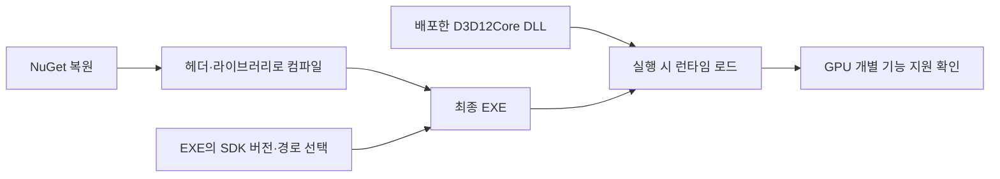

## 헤더가 보이는 것과 실행할 런타임을 고르는 것은 다릅니다

DX12 초기화 코드를 입력했는데 d3dx12.h를 찾지 못하거나, 다른 PC에서 패키지 경로가 달라 빌드가 실패할 수 있습니다. 먼저 팀이 같은 버전의 개발 파일을 복원할 수 있게 준비하겠습니다. 그다음 Agility SDK의 DLL을 실제 실행 프로그램이 선택하는 문제를 구별해 보겠습니다.

{{M0}}

위 영상은 패키지 연결을 진행한 당시 기록입니다. 이 저장소를 따라 할 때 기준은 “현재 최신 패키지”가 아니라 프로젝트에 기록된 버전입니다. 확인한 `ce56f16`의 CORE packages.config는 **Microsoft.Direct3D.D3D12 1.616.1**을 참조합니다.

## 1. Windows SDK와 NuGet 패키지는 무엇을 제공하나요?

Windows SDK에는 기본 Direct3D 12 헤더와 import library가 있습니다. 따라서 DX12를 사용하려면 언제나 별도의 Agility 패키지를 설치해야 하는 것은 아닙니다. Agility SDK는 앱이 사용할 D3D12 런타임을 선택해 함께 배포하는 경로를 제공합니다. OS 기본 런타임과 별도로 관리할 수 있지만 지원 OS 기반 조건·드라이버·GPU 기능 요구가 사라지는 것은 아닙니다.

NuGet은 이 패키지의 버전과 네이티브 프로젝트 설정을 기록하고 복원하는 데 사용합니다. 패키지마다 props/targets가 제공하는 include·라이브러리·DLL 복사 설정이 다르므로 설치 버튼이 모든 프로젝트 구성을 끝내 주었다고 가정하지 않습니다.

| 준비하는 것 | 해결하는 문제 |
| --- | --- |
| packages.config의 고정 버전 | 다른 PC에서도 같은 개발 파일 복원 |
| 프로젝트 include·link 설정 | 컴파일러와 링커가 파일을 찾기 |
| EXE의 SDK 선택과 DLL 배치 | 실행할 때 app-local 런타임 사용 |
| 기능 지원 쿼리 | 그 GPU에서 Mesh Shader·DXR 등 사용 가능 여부 |

WinPixEventRuntime은 PIX 이벤트 마커용 런타임이며 PIX 앱 자체와는 다릅니다. DirectXTex·DirectXTK12·DirectXMath·D3D12MemoryAllocator도 각자 다른 기능을 제공하는 독립 의존성입니다. D3D12 패키지 하나를 설치했다고 이 도구들이 모두 설치되거나 descriptor·동기화가 자동 관리되는 것은 아닙니다.

## 2. CORE 프로젝트에서 고정한 패키지를 복원합니다

Visual Studio의 솔루션 탐색기에서 YamYamEngine_CORE 프로젝트의 NuGet 패키지 관리 화면을 엽니다. 기존 저장소라면 먼저 기록된 패키지를 복원합니다.

{{M1}}

찾아보기에서 사용할 실제 ID는 `Microsoft.Direct3D.D3D12`입니다. 별도의 필수 패키지 `Microsoft.Direct3D.D3D12.Agility`를 찾는 과정으로 이해하지 않습니다. 이 프로젝트를 재현하려면 1.616.1을 맞춥니다. 다른 버전으로 올리는 것은 헤더·런타임·출력 DLL을 함께 확인하는 별도 변경입니다.

{{M2}}

위 이미지는 설치 당시 화면입니다. 설치·복원이 끝나면 이 저장소는 솔루션의 packages 폴더 아래 버전이 포함된 디렉터리를 사용합니다. 실제로 복원된 디렉터리와 vcxproj가 참조한 경로가 같은지 확인합니다. 존재하지 않는 버전 폴더를 include 경로에 적으면 패키지 설치 여부와 상관없이 헤더를 찾지 못합니다.

## 3. include 경로와 include 문장을 한 쌍으로 맞춥니다

소스를 컴파일하는 프로젝트마다 필요한 헤더를 찾을 수 있어야 합니다. CORE에서 패키지를 참조했어도 Window/Editor가 CORE 헤더를 통해 d3dx12.h를 포함한다면 해당 프로젝트의 include 검색 경로도 확인합니다. 속성의 C/C++ → 일반 → 추가 포함 디렉터리를 봅니다.

{{M3}}

현재 vcxproj는 다음 디렉터리를 포함 경로로 사용합니다.

```text
$(SolutionDir)packages\Microsoft.Direct3D.D3D12.1.616.1\build\native\
```

그리고 yaGraphics.h의 helper include는 그 경로 아래를 기준으로 합니다.

```c++
#include <wrl.h>
#include <d3d12.h>
#include <dxgi1_6.h>
#include <d3dcompiler.h>
#include <include\d3dx12\d3dx12.h>

#pragma comment(lib, "d3d12.lib")
#pragma comment(lib, "dxgi.lib")
#pragma comment(lib, "d3dcompiler.lib")
```

검색 경로를 build/native/include/d3dx12까지 내려 잡았다면 include 문장은 d3dx12.h로 달라질 수 있습니다. 두 방식을 섞어 같은 경로를 두 번 붙이지 않는 것이 핵심입니다. 이 글은 저장소의 현재 조합을 그대로 보여 줍니다.

d3d12.h는 GPU API, dxgi1_6.h는 어댑터·스왑체인, d3dcompiler.h는 이 단계에서 사용하는 HLSL 컴파일러 인터페이스입니다. d3dx12.h는 ResourceDesc·Barrier 등을 구성하기 편하게 하는 helper이고 GPU 런타임 자체가 아닙니다. WRL의 ComPtr은 CPU의 COM 참조를 관리하며 GPU 완료를 기다려 주지는 않습니다.

## 4. Agility 런타임 선택을 별도로 연결합니다

실행 시 시스템 d3d12.dll은 로더 역할을 하며 설정에 따라 앱이 배포한 D3D12Core.dll을 사용합니다. 임의의 d3d12.dll로 Windows 시스템 파일을 바꾸는 방식이 아닙니다.

현재 소스에서 확인한 것은 패키지 버전 참조와 include 경로입니다. `D3D12SDKVersion`·`D3D12SDKPath` export 정의는 검색에서 확인하지 못했으므로, 패키지 설치만으로 app-local 런타임이 이미 활성화됐다고 단정할 수 없습니다. 전통적인 EXE export 방식은 다음처럼 연결합니다.

```c++
// 배포 구성 학습 예제입니다. 실제 선택한 DLL과 SDK 버전을 맞춥니다.
// 1.616.x 계열에 대응하는 예시이며 EXE에 정확히 한 번 정의합니다.
extern "C"
{
    __declspec(dllexport) extern const UINT D3D12SDKVersion = 616;
    __declspec(dllexport) extern const char* D3D12SDKPath = ".\\D3D12\\";
}
```

이 경로라면 대응하는 D3D12Core.dll을 EXE 옆 D3D12 하위 폴더에 배포합니다. 정적 라이브러리에만 정의하고 최종 EXE에서 해당 심벌이 빠지면 의도한 선택이 되지 않을 수 있으므로 EXE의 export를 확인합니다. 디버그 레이어 DLL도 같은 SDK 버전을 맞춥니다. 위 코드는 설명용이며 이번 문서 개정에서 엔진 소스에 추가한 변경은 아닙니다.



## 5. 빌드 오류와 실행 기능 오류를 나눠 확인합니다

d3dx12.h를 못 찾는다면 복원된 폴더와 include 조합을 먼저 봅니다. 컴파일은 되는데 링크가 실패하면 해당 프로젝트의 import library·구성·플랫폼을 확인합니다. 실행할 때 원하는 런타임이 선택되는지는 로드한 DLL과 EXE 구성을 확인합니다. 마지막으로 DXR·Mesh Shader 등은 CheckFeatureSupport로 장치 지원을 검사합니다. 헤더에 선언이 보이는 것만으로 실행 기능이 보장되지는 않습니다.

NuGet과 vcpkg 중 하나가 항상 더 좋은 것은 아닙니다. 이 저장소는 NuGet 버전을 기준으로 복원하고, 다른 라이브러리에 vcpkg를 함께 쓴다면 같은 라이브러리를 중복 링크하지 않게 관리합니다. 두 도구 모두 프로젝트별 버전 관리가 가능하며, NuGet을 쓴다고 Direct3D 12가 크로스 플랫폼 API가 되는 것은 아닙니다.

지원 환경과 런타임 배포의 세부 조건은 [Microsoft Agility SDK 시작하기](https://devblogs.microsoft.com/directx/gettingstarted-dx12agility/)와 [공식 다운로드·지원 페이지](https://devblogs.microsoft.com/directx/directx12agility/)에서 확인합니다. DirectStorage는 별도 API/SDK입니다. 다음 글에서는 준비한 개발 환경에서 Device와 첫 삼각형을 엔진의 초기화·프레임 흐름에 연결하겠습니다.
<mention-page url="https://www.notion.so/2170b1ffa61e802b8496fcb17b8beb6a"/>
