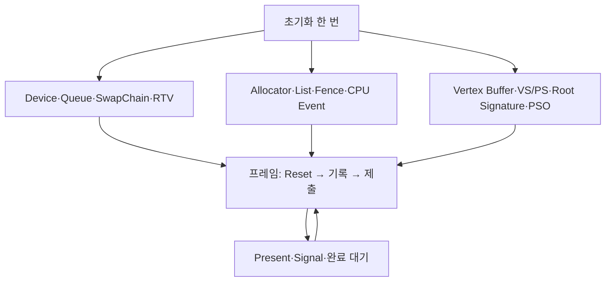

## 엔진 안에서 첫 삼각형까지 한 경로로 연결합니다

Device를 만드는 데 성공해도 삼각형이 자동으로 나타나지는 않습니다. 정점 데이터를 보관할 버퍼, 그 바이트를 읽는 셰이더와 InputLayout, 결과를 쓸 백버퍼, 실행할 명령 목록이 모두 연결되어야 합니다. 이번에는 **위치와 색만 가진 삼각형 하나**를 기준으로 초기화와 프레임을 나눠 보겠습니다.

{{M0}}

영상은 초기 DX12 렌더링을 확인한 개발 기록입니다. 아래 코드는 원리를 따라가기 위한 최소 구성으로, 이후 Texture·상수 버퍼·ImGui가 추가된 현재 엔진의 전체 소스를 대신하지 않습니다. 모든 예제는 single-sample RGBA8 백버퍼와 Direct Queue를 사용합니다. 첫 삼각형에는 Texture·Sampler·상수 버퍼가 필요 없는 셰이더를 골라 연결할 변수를 줄입니다.

## 1. 사용할 GPU를 고르고 Device를 만듭니다

{{M1}}

Device는 GPU 리소스·명령 객체·PSO를 만드는 입구입니다. DXGI는 어댑터를 열거하고 OS 창과 SwapChain을 연결합니다. 그림의 구성 요소는 역할을 설명하며 D3D12CreateDevice가 모든 박스를 순서대로 호출한다는 호출 스택으로 읽지는 않습니다.

{{M2}}

Debug Layer를 사용할 때는 Device 생성 전에 D3D12GetDebugInterface와 EnableDebugLayer를 호출합니다. 이어 CreateDXGIFactory2로 Factory를 얻고 하드웨어 어댑터 중 D3D12CreateDevice의 최소 Feature Level 11_0 조건을 만족하는 것을 선택합니다. 여기서 DX12 API와 Feature Level 12_0은 다른 조건입니다. DedicatedVideoMemory가 0이라고 통합 GPU를 제외하지 않습니다.

```c++
// factory와 선택한 adapter는 ComPtr입니다.
ComPtr<ID3D12Device> device;
ThrowIfFailed(D3D12CreateDevice(adapter.Get(), D3D_FEATURE_LEVEL_11_0,
                               IID_PPV_ARGS(&device)));
```

`ThrowIfFailed`는 실패 HRESULT를 예외로 처리하는 공통 helper입니다. 생성에 실패했다면 다음 초기화나 Draw로 진행하지 않습니다. ComPtr은 CPU의 COM 참조를 보관합니다. WARP를 사용하려면 Factory의 EnumWarpAdapter로 소프트웨어 어댑터를 명시적으로 선택합니다. 이는 하드웨어 없이 경로를 확인할 수 있는 대안이며 특정 GPU와 같은 성능이나 지원 기능을 보장하지는 않습니다.

## 2. 명령을 보낼 Queue와 화면을 담을 SwapChain을 연결합니다

{{M3}}

Command List는 기록물이고 Queue는 그 기록물을 GPU에 제출하는 경로입니다. SwapChain은 표시할 백버퍼들을 관리합니다. CPU에서 명령을 제출한 시간, GPU가 명령을 실행한 시간, 모니터가 표시한 시간은 서로 같지 않습니다.

{{M4}}

처음에는 Direct Queue 하나면 충분합니다. 삼각형 Draw와 필요한 복사 명령을 같은 큐에 기록할 수 있습니다.

```c++
D3D12_COMMAND_QUEUE_DESC queueDesc{};
queueDesc.Type = D3D12_COMMAND_LIST_TYPE_DIRECT;
ComPtr<ID3D12CommandQueue> queue;
ThrowIfFailed(device->CreateCommandQueue(&queueDesc, IID_PPV_ARGS(&queue)));
```

{{M5}}

Compute Queue는 그래픽 Draw를 실행하지 않고, Copy Queue는 복사 중심의 더 제한된 명령을 사용합니다. 여러 큐가 항상 독립된 하드웨어에서 동시에 실행되거나 서로 성능 영향을 주지 않는 것은 아닙니다. 실제 의존성과 하드웨어 실행을 측정한 뒤 작업을 나눕니다.

SwapChain은 유효한 HWND와 이 Queue로 CreateSwapChainForHwnd를 호출해 만듭니다. 이번 설정은 BufferCount=2, Format=R8G8B8A8_UNORM, SwapEffect=FLIP_DISCARD, SampleDesc.Count=1입니다. GetBuffer로 백버퍼 두 개를 얻고 RTV heap의 각 슬롯에 CreateRenderTargetView를 기록합니다. RTV는 그 이미지에 출력할 입구이며 픽셀 저장소 자체와는 다릅니다.

{{M6}}

화면 찢어짐은 모니터의 한 번의 스캔에 서로 다른 프레임의 내용이 보이는 현상입니다. 백버퍼가 두 개라는 사실만으로 없어지는 것은 아닙니다. Present의 동기화 간격, 표시 모드, tearing 허용과 VRR 정책을 함께 봐야 합니다.

{{M7}}

두 백버퍼는 그리는 대상과 표시할 결과를 순환시키는 기반입니다. 매 프레임 사용할 대상은 GetCurrentBackBufferIndex로 얻습니다. 별도로 CPU가 명령을 기록하는 Allocator도 GPU가 사용하는 동안 Reset하지 않아야 합니다. 이 첫 예제는 Allocator 하나를 쓰고 **매 프레임 끝에 완료를 기다리는 단순 경로**로 시작합니다. 뒤의 Frame 강의에서 두 슬롯으로 확장합니다.

## 3. 한 번 만들어 보관할 것과 매 프레임 할 일을 나눕니다



CreateCommandAllocator와 CreateCommandList로 명령 공간을 만듭니다. List는 생성 직후 열린 상태이므로 매 프레임 Reset할 구조라면 초기화 끝에서 Close합니다. Fence는 완료 값 0, 다음 Signal 값은 1로 시작하고 CreateEvent 실패도 검사합니다. 사용한 값이 아직 Signal되지 않았는데 먼저 기다리면 대기가 끝나지 않을 수 있습니다.

초기화한 객체를 함수의 지역 ComPtr에만 남겨 함수 종료와 함께 해제하지 않습니다. 엔진의 그래픽 디바이스 또는 렌더러 멤버가 프레임을 넘어 소유하게 합니다. GPU 완료와 CPU 소유권은 별도로 관리합니다.

## 4. 정점 3개와 색을 GPU 버퍼에 넣습니다

```c++
struct Vertex { float position[3]; float color[3]; };
const Vertex vertices[] = {
    {{ 0.0f,  0.5f, 0.5f}, {1, 0, 0}},
    {{ 0.5f, -0.5f, 0.5f}, {0, 1, 0}},
    {{-0.5f, -0.5f, 0.5f}, {0, 0, 1}},
};
static_assert(sizeof(Vertex) == 24);

const auto props = CD3DX12_HEAP_PROPERTIES(D3D12_HEAP_TYPE_UPLOAD);
const auto bufferDesc = CD3DX12_RESOURCE_DESC::Buffer(sizeof(vertices));
ComPtr<ID3D12Resource> vertexBuffer;
ThrowIfFailed(device->CreateCommittedResource(&props, D3D12_HEAP_FLAG_NONE,
    &bufferDesc, D3D12_RESOURCE_STATE_GENERIC_READ, nullptr,
    IID_PPV_ARGS(&vertexBuffer)));
void* mapped = nullptr;
const D3D12_RANGE noRead{0, 0};
ThrowIfFailed(vertexBuffer->Map(0, &noRead, &mapped));
std::memcpy(mapped, vertices, sizeof(vertices));
const D3D12_RANGE written{0, sizeof(vertices)};
vertexBuffer->Unmap(0, &written);
D3D12_VERTEX_BUFFER_VIEW vbv{vertexBuffer->GetGPUVirtualAddress(),
                            sizeof(vertices), sizeof(Vertex)};
```

위치 12바이트와 색 12바이트로 정점 하나는 24바이트이며 세 개는 72바이트입니다. UPLOAD에 한 번 써 두고 GPU가 정점으로 읽습니다. 이 작은 예제는 별도 DEFAULT 복사를 생략해 이해할 수 있게 했습니다. 정적 대용량 메시의 최종 메모리 정책까지 항상 UPLOAD로 정하는 것은 아닙니다.

VBV의 BufferLocation은 GPU 주소, SizeInBytes는 전체 크기, StrideInBytes는 다음 정점까지의 간격입니다. 이 값들이 있어야 GPU가 바이트를 세 정점으로 구분합니다. VBV는 descriptor heap에 만드는 SRV와 다른 구조체이며 IASetVertexBuffers에 전달합니다.

## 5. 셰이더와 InputLayout을 같은 구조로 맞춥니다

다음 HLSL을 TriangleLesson.hlsl로 준비하는 학습 예제입니다. VS는 위치를 그대로 클립 공간에 보내고 색을 넘깁니다. PS는 보간된 색에 알파 1을 붙입니다.

```c++
// HLSL: TriangleLesson.hlsl
struct VSInput { float3 position : POSITION; float3 color : COLOR; };
struct VSOutput { float4 position : SV_Position; float3 color : COLOR; };
VSOutput VSMain(VSInput input)
{
    VSOutput output;
    output.position = float4(input.position, 1);
    output.color = input.color;
    return output;
}
float4 PSMain(VSOutput input) : SV_Target0
{
    return float4(input.color, 1);
}
```

D3DCompileFromFile로 같은 파일을 VSMain/vs_5_0, PSMain/ps_5_0 조합으로 각각 컴파일합니다. 실패 시 error blob을 출력하고 중단합니다. 얻은 바이트코드를 vs와 ps ComPtr<ID3DBlob>에 보관한다고 하겠습니다. HLSL 컴파일은 Device 생성 기능과 별개입니다.

이 셰이더는 외부 상수·텍스처를 읽지 않으므로 파라미터가 없는 Root Signature를 사용할 수 있습니다. InputLayout은 위치 offset 0, 색 offset 12를 선언합니다.

```c++
D3D12_ROOT_SIGNATURE_DESC rootDesc{};
rootDesc.Flags = D3D12_ROOT_SIGNATURE_FLAG_ALLOW_INPUT_ASSEMBLER_INPUT_LAYOUT;
ComPtr<ID3DBlob> rootBlob, rootError;
ThrowIfFailed(D3D12SerializeRootSignature(&rootDesc,
    D3D_ROOT_SIGNATURE_VERSION_1, &rootBlob, &rootError));
ComPtr<ID3D12RootSignature> root;
ThrowIfFailed(device->CreateRootSignature(0, rootBlob->GetBufferPointer(),
    rootBlob->GetBufferSize(), IID_PPV_ARGS(&root)));

const D3D12_INPUT_ELEMENT_DESC layout[] = {
    {"POSITION", 0, DXGI_FORMAT_R32G32B32_FLOAT, 0, 0,
     D3D12_INPUT_CLASSIFICATION_PER_VERTEX_DATA, 0},
    {"COLOR", 0, DXGI_FORMAT_R32G32B32_FLOAT, 0, 12,
     D3D12_INPUT_CLASSIFICATION_PER_VERTEX_DATA, 0},
};
D3D12_GRAPHICS_PIPELINE_STATE_DESC psoDesc{};
psoDesc.pRootSignature = root.Get();
psoDesc.InputLayout = {layout, 2};
psoDesc.VS = {vs->GetBufferPointer(), vs->GetBufferSize()};
psoDesc.PS = {ps->GetBufferPointer(), ps->GetBufferSize()};
psoDesc.RasterizerState = CD3DX12_RASTERIZER_DESC(D3D12_DEFAULT);
psoDesc.RasterizerState.CullMode = D3D12_CULL_MODE_NONE;
psoDesc.BlendState = CD3DX12_BLEND_DESC(D3D12_DEFAULT);
psoDesc.DepthStencilState = CD3DX12_DEPTH_STENCIL_DESC(D3D12_DEFAULT);
psoDesc.DepthStencilState.DepthEnable = FALSE;
psoDesc.DepthStencilState.StencilEnable = FALSE;
psoDesc.SampleMask = UINT_MAX;
psoDesc.PrimitiveTopologyType = D3D12_PRIMITIVE_TOPOLOGY_TYPE_TRIANGLE;
psoDesc.NumRenderTargets = 1;
psoDesc.RTVFormats[0] = DXGI_FORMAT_R8G8B8A8_UNORM;
psoDesc.SampleDesc.Count = 1;
ComPtr<ID3D12PipelineState> pso;
ThrowIfFailed(device->CreateGraphicsPipelineState(&psoDesc, IID_PPV_ARGS(&pso)));
```

기본값 helper를 사용한 뒤 필요한 차이만 바꿉니다. 첫 삼각형은 깊이와 컬링을 꺼서 연결부터 확인합니다. zero 초기화만 한 Blend·Depth 구조체에는 유효한 enum 기본값이 모두 채워지는 것은 아니므로 helper 또는 명시적인 기본값 설정이 필요합니다.

PSO의 TRIANGLE은 큰 도형 종류입니다. 실제 TRIANGLELIST는 아래 Command List에서 선택합니다. viewport·scissor·출력 RTV도 PSO가 자동으로 바인딩하지 않습니다. Root Signature를 파라미터가 없는 형태로 만들었으므로 여기에 SetGraphicsRootConstantBufferView(0, ...)를 추가해서는 안 됩니다. 상수 버퍼를 도입할 때 root와 셰이더를 함께 바꿉니다.

## 6. 한 프레임의 명령을 기록합니다

다음은 위 객체와 초기화한 allocator, list, swapchain, backBuffers, rtvHeap을 사용하는 프레임 본문입니다. rtvStride는 Device가 알려 준 RTV increment size, width/height는 양수인 클라이언트 크기입니다. 첫 호출에는 사용 중인 명령이 없고 이후 호출은 바로 뒤의 프레임 끝 대기로 보호됩니다.

```c++
ThrowIfFailed(allocator->Reset());
ThrowIfFailed(list->Reset(allocator.Get(), pso.Get()));
const UINT index = swapchain->GetCurrentBackBufferIndex();
ID3D12Resource* backBuffer = backBuffers[index].Get();
auto toRT = CD3DX12_RESOURCE_BARRIER::Transition(backBuffer,
    D3D12_RESOURCE_STATE_PRESENT, D3D12_RESOURCE_STATE_RENDER_TARGET);
list->ResourceBarrier(1, &toRT);
auto rtv = rtvHeap->GetCPUDescriptorHandleForHeapStart();
rtv.ptr += SIZE_T(index) * rtvStride;
list->OMSetRenderTargets(1, &rtv, FALSE, nullptr);
const float clear[] = {0.08f, 0.10f, 0.15f, 1.0f};
list->ClearRenderTargetView(rtv, clear, 0, nullptr);
D3D12_VIEWPORT viewport{0, 0, float(width), float(height), 0, 1};
D3D12_RECT scissor{0, 0, LONG(width), LONG(height)};
list->RSSetViewports(1, &viewport);
list->RSSetScissorRects(1, &scissor);
list->SetGraphicsRootSignature(root.Get());
list->IASetPrimitiveTopology(D3D_PRIMITIVE_TOPOLOGY_TRIANGLELIST);
list->IASetVertexBuffers(0, 1, &vbv);
list->DrawInstanced(3, 1, 0, 0);
auto toPresent = CD3DX12_RESOURCE_BARRIER::Transition(backBuffer,
    D3D12_RESOURCE_STATE_RENDER_TARGET, D3D12_RESOURCE_STATE_PRESENT);
list->ResourceBarrier(1, &toPresent);
ThrowIfFailed(list->Close());
```

DrawInstanced의 3은 정점 개수입니다. 인덱스 버퍼를 사용하지 않는 이 예제에서 정점이 3개인데 6개를 요청하면 안 됩니다. Clear만 보인다면 VBV·InputLayout·셰이더·PSO·viewport를 이 기록 순서로 확인합니다. 마지막 Barrier는 백버퍼를 표시 용도로 돌리고 Close는 기록을 끝냅니다. 아직 CPU가 GPU 완료를 기다린 것은 아닙니다.

## 7. 제출하고 표시한 다음 재사용 조건을 확인합니다

```c++
ID3D12CommandList* lists[] = {list.Get()};
queue->ExecuteCommandLists(1, lists);
ThrowIfFailed(swapchain->Present(1, 0));
const UINT64 submitted = nextFenceValue++; // 최초 값 1
ThrowIfFailed(queue->Signal(fence.Get(), submitted));
if (fence->GetCompletedValue() < submitted)
{
    ThrowIfFailed(fence->SetEventOnCompletion(submitted, fenceEvent));
    if (WaitForSingleObject(fenceEvent, INFINITE) != WAIT_OBJECT_0)
        throw std::runtime_error("Fence wait failed");
}
```

이 예제는 매 프레임 끝에 제출한 작업을 기다리므로 다음 호출의 단일 Allocator Reset이 안전합니다. 단일 Allocator 자체가 무조건 잘못된 설계인 것이 아니라, 완료 전에 재사용하는 것이 문제입니다. 여러 프레임을 겹치려면 Allocator·업로드 데이터·마지막 Fence 값을 프레임 슬롯별로 분리합니다.

Present(1,0)은 표시 refresh 간격에 동기화하는 설정입니다. 모니터 주사율과 작업 시간에 따라 결과가 달라지므로 항상 60fps라는 뜻은 아닙니다. Resize 시에도 이전 백버퍼의 GPU 사용 완료와 참조 해제 후 ResizeBuffers, GetBuffer, RTV 재생성을 수행합니다. 최소화로 크기가 0이면 재생성을 보류합니다.

## 꼭짓점 하나를 바꾸어 연결을 확인합니다

처음에는 위쪽 빨강·오른쪽 아래 초록·왼쪽 아래 파랑이 보간된 삼각형이 보여야 합니다. 정점의 position만 바꾸면 모양이, color만 바꾸면 색이 변합니다. 초기화 때 업로드한 데이터는 CPU 배열을 나중에 바꾸는 것만으로 갱신되지 않으므로 GPU 버퍼에 다시 써야 합니다. 다시 쓸 때도 이전 GPU 읽기가 끝났는지 확인합니다.

이제 이 작은 경로에 상수 버퍼를 넣어 Transform을 전달하고, 인덱스 버퍼로 사각형을 만들고, ImGui를 마지막 그리기 단계에 연결할 수 있습니다. 현재 엔진의 GraphicDevice_DX12와 renderer는 이런 책임을 나누어 관리하며, 최종 Editor 경로는 프레임 슬롯·Scene/Game RT·추가 플랫폼 창까지 포함합니다. 다음 두 강의에서 그 확장을 이어갑니다.
<mention-page url="https://www.notion.so/2170b1ffa61e8020bbabf7b4b7ce390b"/>
<mention-page url="https://www.notion.so/3400b1ffa61e8054a80bc1d4b575b515"/>
